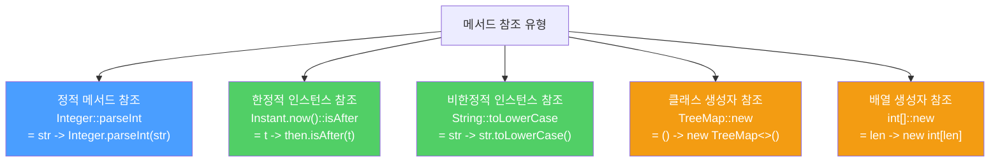

람다는 익명 클래스보다 간결하지만, 메서드 참조는 람다보다도 더 간결합니다. 단, 항상 메서드 참조가 더 좋은 것은 아닙니다.

---

## 1. 메서드 참조란?

비유하자면 **"저 사람이 하는 방식대로 해줘"라고 이름만 알려주는 것**입니다. 람다에서 매개변수를 받아 그대로 다른 메서드에 넘기기만 한다면, 그 메서드를 직접 가리키는 참조로 대체할 수 있습니다.

```java
// 람다 — 매개변수 count, incr이 단지 더하기를 수행할 뿐
map.merge(key, 1, (count, incr) -> count + incr);

// 메서드 참조 — Integer.sum이 정확히 같은 일을 함
map.merge(key, 1, Integer::sum);
```

`Map.merge`는 키가 없으면 `{키, 값}` 쌍을 저장하고, 이미 있으면 현재 값과 주어진 값에 세 번째 인수 함수를 적용합니다. `Integer::sum`은 `(a, b) -> a + b`와 동일하지만 훨씬 짧습니다.

---

## 2. 메서드 참조가 람다보다 나쁜 경우

비유하자면 **주소가 긴 건물 이름보다 "여기"라고 손으로 가리키는 게 더 빠른 상황**입니다. 메서드와 람다가 같은 클래스 안에 있을 때는 람다 쪽이 더 간결합니다.

```java
// 클래스 이름이 길면 메서드 참조가 오히려 더 길다
service.execute(GoshThisClassNameIsHumongous::action);

// 람다가 더 짧고 명확
service.execute(() -> action());
```

마찬가지로 `Function.identity()` 대신 `(x -> x)`가 더 짧고 명확합니다.

---

## 3. 메서드 참조의 다섯 가지 유형



**정적 메서드 참조** — 가장 흔한 유형

```java
Integer::parseInt          // str -> Integer.parseInt(str)
```

**한정적 인스턴스 참조** — 수신 객체가 고정됨. 정적 참조와 비슷하게, 함수 객체가 받는 인수와 참조 메서드가 받는 인수가 같습니다.

```java
Instant then = Instant.now();
Instant.now()::isAfter     // t -> then.isAfter(t)
```

**비한정적 인스턴스 참조** — 수신 객체가 고정되지 않음. 적용 시점에 수신 객체를 첫 번째 매개변수로 받습니다. 스트림 파이프라인의 매핑·필터 함수에 주로 사용됩니다.

```java
String::toLowerCase        // str -> str.toLowerCase()
```

**클래스 생성자 참조**

```java
TreeMap<K,V>::new          // () -> new TreeMap<>()
```

**배열 생성자 참조**

```java
int[]::new                 // len -> new int[len]
```

---

## 4. 람다로 할 수 없는 한 가지 — 제네릭 함수 타입

제네릭 함수 타입은 메서드 참조 표현식으로는 구현할 수 있지만 람다식으로는 불가능합니다. 제네릭 람다식 문법이 Java에 존재하지 않기 때문입니다.

```java
interface G1 { <E extends Exception> Object m() throws E; }
interface G2 { <F extends Exception> String m() throws Exception; }
interface G extends G1, G2 {}
// G의 함수 타입: <F extends Exception> () -> String throws F
// 메서드 참조로는 표현 가능, 람다식으로는 불가
```

---

## 5. 요약

> 메서드 참조는 람다의 간결한 대안입니다. 메서드 참조 쪽이 짧고 명확하다면 메서드 참조를 쓰고, 그렇지 않을 때만 람다를 사용하세요.

---

> 참조: 이펙티브 자바 3/E — 조슈아 블로크
