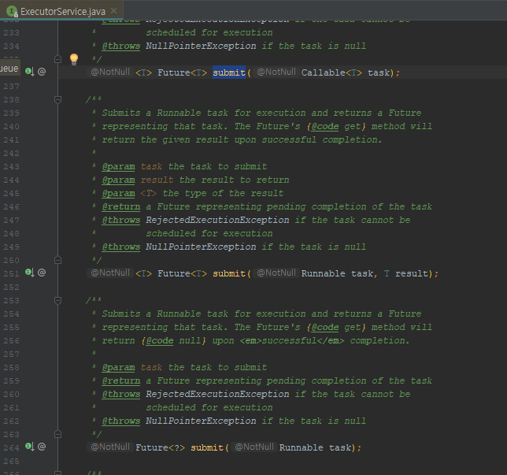

#### 🔗 템플릿 메소드 패턴 매력의 반감 : 람다의 등장

* 자바가 람다를 지원하면서 API를 작성하는 모범 사례도 크게 바뀌었다.

  * ex) 상위 클래스의 기본 메소드를 재정의해 원하는 동작을 구현하는 **템플릿 메서드 패턴의 매력이 크게 줄었다.**

  

  * <span style="color:red">이를 대체하는 현대적인 해법</span>은 같은 효과의 **함수 객체를 받는 정적 팩터리나 생성자를 제공**하는 것이다.

  

  * 이를 일반화해서 말하면 **함수 객체를 매개변수로 받는 생성자와 메서드를 더 많이 만들어야 한다.**
    * 이때 <span style="color:red;">함수형 매개변수 타입을 올바르게 선택</span>해야 한다.


<hr>


💎 **LinkedHashMap **

* 이 클래스의 **protected** 메소드인 **removeEldestEntry를 재정의**하면 <span style="color:red;">캐시로 사용</span> 할 수 있다.


* 맵에 새로운 키를 추가하는 **put** 메서드는 이 메서드를 호출하여 **true**가 반환되면 맵에서 가장 오래된 원소를 제거한다.


* 아래와 같이 **removeEldestry**를 재정의하면 맵에 원소가 100개가 될 때까지 커지다가, 그 이상이 되면 새로운 키가 더해질 때마다 가장 오래된 원소를 하나씩 제거한다.

​		즉, 가작 최근 원소 100개를 유지한다.

```java
protected boolean removeEldestEntry(Map.Entry<K,V> eldest) {
    return size > 100;
}
```


<hr>


💎 **람다를 사용하면 더 잘만들 수 있을걸~?**

* **LinkedHashMap**을 오늘날 **다시 구현한다면** 함수 객체를 받는 <span style="color:red;">정적 팩터리나 생성자를 제공했을 것</span>이다.


* **removeEldestEntry** 선언을 보면 이 함수 객체는 **Map.Entry<K,V>**를 받아 **boolean**을 반환해야 할 것 같지만, <span style="color:red;">꼭 그렇지는 않다.</span>

  * ? 뭔말이여?

  

  * **removeEldestEntry**는 **size()를 호출**해 맵 안의 원소 수를 알아내는데, **removeEldestEntry**가 <span style="color:red;">인스턴스 메서드라서 가능한 방식</span>이다.

  

  * <span style="color:red;">하지만</span> 생성자에 넘기는 함수 객체는 **이 맵의 인스턴스 메서드가 아니다.**

    * 팩토리나 생성자를 호출할 때는 **맵의 인스턴스가 존재하지 않기 때문이다**.

    

    * <span style="color:red;">따라서</span> **맵은 자기 자신도 함수 객체에 건네줘야 한다.**

    

    * 이를 반영한 함수형 인터페이스는 다음처럼 선언할 수 있다.


<hr>


💎 **불필요한 함수형 인터페이스 - 대신 표준 함수형 인터페이스를 사용하라.**

```java
@FunctionalInterface interface EldestEntryRemovalFunction<K,V> {
    boolean remove(Map<K,V> map, Map.Entry<K,V> eldest);
}
```

* 이 인터페이스도 잘 동작하기는 하지만, 굳이 사용할 이유는 없다.


* **자바 표준 라이브러리**에 이미 같은 모양의 인터페이스가 준비되어 있기 때문이다.
  * **java.util.function** 패키지를 보면 다양한 용도의 **표준 함수형 인터페이스가 담겨있다.**


* 필요한 용도에 맞는게 있다면, 직접 구현하지말고 **표준 함수형 인터페이스를 활용하라.**

  * 그러면 API가 다루는 개념의 수가 줄어들어 익히기 더 쉬워진다.

  

  * 또한 <span style="color:red;">표준 함수형 인터페이스</span>들은 **유용한 디폴트 메소드를 많이 제공**하므로 **다른 코드와의 상호 운용성도 크게 좋아질 것이다.**

  

  * ex) **Predicate** 인터페이스는 predicate들을 조합하는 메서드를 제공한다.
    * 앞의 **LinkedHashMap** 예에서는 직접 만든 **EldestEntryRemovalFunction** 대신 표준 인터페이스인 **BiPredicate<Map<K,V>, Map<Entry<K,V>>**를 사용할 수 있다.


<hr>


##### 💎 java.util.function 패키지에서 <span style="color:red;">이것만은 기억하자 !</span>  기본 인터페이스 6가지


* **Operator** 인터페이스 - 반환값과 인수의 **타입이 같은 함수**

  * 인수가 1개인 UnaryOperator, 인수가 2개인 BinaryOperator

  

* **Predicate** 인터페이스 - 인수 하나를 받아 **boolean을 반환하는 함수**


* **Function** 인터페이스 - 인수와 **반환 타입이 다른 함수**


* **Supplier** 인터페이스 - **인수를 받지 않고 값을 반환**하는(혹은 제공)하는 함수


* **Consumer** 인터페이스 - **인수를 하나 받고 반환값은 없는**(특히 인수를 소비하는) 함수

<br>

| 인터페이스          | 함수 시그니처       | 예                  |
| ------------------- | ------------------- | ------------------- |
| `UnaryOperator<T>`  | T apply(T t)        | String::toLowercase |
| `BinaryOperator<T>` | T apply(T t1, T t2) | BigInteger::add     |
| `Predicate<T>`      | boolean test(T t)   | Collection          |
| `Function<T,R>`     | R apply(T t)        | Arrays::asList      |
| `Supplier<T>`       | T get()             | Instant::now        |
| `Consumer<T>`       | void accept(T t)    | System.out::println |


* **기본 인터페이스는** 기본 타입인 **int, long, double용**으로 각 3개씩 **변형이 생겨난다.**

  * 그 이름도 기본 인터페이스의 이름 앞에 해당 기본 타입 이름을 붙여 지었다.

  

  * ex) **int**를 받는 **Predicate**는 **IntPredicate**, **long**을 받아 **long**을 반환하는 **BinaryOperator**는 **LongBinaryOperator**

  

  * <span style="color:red;">유일하게</span> **Function**의 변형만 **매개변수화 됐다.**
    * **정확히는 반환 타입만 매개변수화됐는데**, 예를 들어 **LongFunction<int[]>**은 **long** 인수를 받아 **int[]**을 반환한다.


<hr>


💎 **기본 타입을 반환하는 변형 :: Function 인터페이스**

* 인수와 같은 타입을 반환하는 함수는 **UnaryOperator**이므로, **Function 인터페이스의 변형은 입력과 결과의 타입이** <span style="color:red;">항상 다르다.</span>


* **입력과 결과 타입이 모두 기본 타입**이면 <span style="color:red;">접두어로</span> **SrcToResult**를 사용한다.
  * ex) **long**을 받아 **int**를 반환하면 **LongToIntFunction**이 되는 식


* 나머지는 **입력이 객체 참조**이고 **결과가 int, long, double인 변형들**로, 앞서와 달리 **입력을 매개변수화**하고 접두어로 **ToResult**를 사용한다.
  * 즉, **ToLongFunction<int[]>**은 **int[]** 인수를 받아 **long**을 반환한다. 


<br>


💎 **인수를 2개씩 받는 변형 :: 기본 함수형 인터페이스**

* `BiPredicate<T,U>`


* `BiFunction<T,U,R>`  하위에는 기본 타입을 반환하는 세 변형이 있다.

  * `ToIntBiFunction<T,U>`

  

  * `ToLongBiFunction<T,U>`

  

  * `ToDoubleBiFunction<T,U>`


* `BiConsumer<T,U>`

  * `ObjDoubleConsumer<T>`

  

  * `ObjIntConsumer<T>`

  

  * `ObjLongConsumer<T>`


<br>


💎 **BooleanSupplier 인터페이스는 boolean을 반환 - Supplier의 변형**

* 이것이 표준 함수형 인터페이스 중 boolean을 이름에 명시한 유일한 인터페이스지만, Predicate와 그 변형 4개도 boolean값을 변환 할 수 있다.


<hr>


##### 💎 기본 함수형 인터페이스에 박싱된 기본 타입을 넣어 사용하지는 말자

* 표준 함수형 인터페이스 대부분은 기본 타입만 지원한다.
  * 박싱된 기본 타입을 사양하게 되면 계산량이 많을 때는 성능이 처참히 느려질 수 있다.


<hr>


##### 🔗 함수형 인터페이스는 언제 직접 작성해?

* 대부분의 상황에서는 직접 작성하는 것보다 표준 함수형 인터페이스를 사용하는 편이 낫다.


* <span style="color:red;">하지만</span>, 표준 인터페이스 중 **필요한 용도에 맞는게 없다면 직접 작성해야 한다.**

  * 매개변수 3개를 받는 **Predicate**라든가 검사 예외를 던지는 경우가 있을 수 있지만
    구조적으로 똑같은 표준 함수형 인터페이스가 있더라도 직접 작성해야만 할 때가 있다.

  

  * 심지어 자바 라이브러리에 `Comparator<T>`를 추가 할 당시 `ToIntBiFunction<T,U>`가 이미 존재했더라도 `ToIntBiFunction<T,U>`를 사용하면 안 됐다.


<hr>


##### 💎 Comparator가 독자적인 인터페이스로 살아남아야 하는 이유 = 특성

* 이 중 하나 이상을 만족한다면 **전용 함수형 인터페이스를 구현**해야 하는건 아닌지 고민해봐야한다.

  * **첫 번째**, API에서 굉장히 자주 사용하는데, **지금의 이름이 그 용도를 아주 훌륭히 설명**해준다.

  

  * **두 번째**, 구현하는 쪽에서 **반드시 지켜야 할 규약**을 담고 있다.

  

  * **세 번째**, 비교자들을 변환하고 조합해주는 **유용한 디폴트 메소드들을 많이 담고 있다.**


* **전용 함수형 인터페이스를 작성하기로 했다면**, 자신이 작성하는 게 다른 것도 아닌 **'인터페이스'임을 명심**해야 한다.
  * 아주 주의해서 설계해야 한다는 뜻이다.


<hr>


##### 🔗 직접 만든 함수형 인터페이스에는 항상 @FunctionalInterface 애너테이션을 사용하라

* **@FunctionInterface**를 사용하는 이유는 **@Override**를 사용하는 이유와 비슷하다.


* <span style="color:red;">프로그래머의 의도를 명시하는 것</span>으로 다음과 같이 크게 세 가지 목적이 있다.

  * **첫 번째**, 해당 클래스의 코드나 설명 문서를 읽을 이에게 **그 인터페이스가 람다용으로 설계된 것임을 알려준다.**

  

  * **두 번째**, 해당 인터페이스가 **추상 메서드를 오직 하나만** 가지고 있어야 **컴파일되게 해준다.**

  

  * **세 번째**, 그 결과 유지보수 과정에서 **누군가 실수로 메서드를 추가하지 못하게 막아준다.**


<hr>


##### 💎 함수형 인터페이스를 API에서 사용할 때의 주의점

* **서로 다른 함수형 인터페이스를 같은 위치의 인수로 받는** <span style="color:red;">메서드들을 다중정의해서는 안 된다.</span>

  * 클라이언트에게 불필요한 모호함만 안겨줄 뿐이며, 이 모호함으로 인해 실제로 문제가 일어나기도 한다.

    * ex) **ExecutorService**의 **submit** 메서드는 `Callable<T>`를 받는 것과 **Runnable**을 받는 것을 **다중 정의** 했다.

    

    * 그래서 올바른 메서드를 알려주기 위해 형변환해야 할 때가 많이 생긴다.

    

  * 이런 문제를 피하는 가장 쉬운 방법은 서로 다른 함수형 인터페이스를 같은 위치의 인수로 사용하는 다중정의를 피하는 것이다.

    * "다중정의는 주의해서 사용하라"


<hr>


> 입력값과 반환값에 함수형 인터페이스 타입을 활용하라.
>
> 보통은 java.util.function 패키지의 표준 함수형 인터페이스를 사용하는 것이 가장 좋은 선택이다.
>
> 단, 흔치는 않지만 직접 새로운 함수형 인터페이스를 만들어 쓰는편이 나을 수도 있음을 잊지 말자.


```
참조 - 이펙티브 자바 3/E - 조슈아 블로크
```

