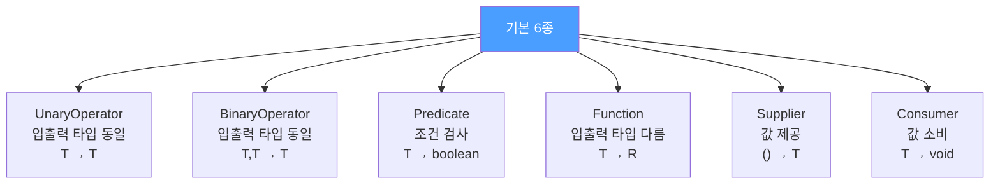
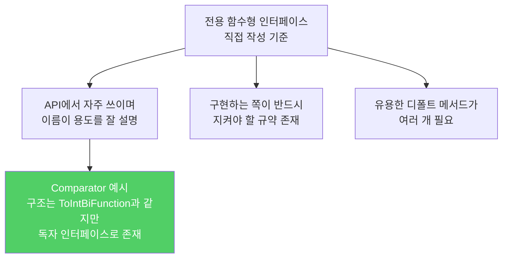

Java가 람다를 지원하면서 함수 객체를 매개변수로 받는 API 설계가 일반화되었습니다. 이때 `java.util.function` 패키지의 표준 함수형 인터페이스를 먼저 검토하세요.

---

## 1. 템플릿 메서드 패턴 대신 함수 객체

비유하자면 **규격을 직접 상속받아 채우던 방식에서, 규격서를 외부에서 건네받는 방식으로 바뀐 것**입니다. `LinkedHashMap`의 `removeEldestEntry`를 재정의하는 대신, 제거 조건을 함수 객체로 받으면 됩니다.

```java
// 기존 방식 — 상속으로 재정의
protected boolean removeEldestEntry(Map.Entry<K,V> eldest) {
    return size() > 100;
}

// 현대적 방식 — 생성자에서 함수 객체를 받음
// 맵 자신을 함수 객체에 넘겨야 하므로 Map도 함께 받아야 함
```

생성자에 넘기는 함수 객체는 맵의 인스턴스 메서드가 아니기 때문에 `size()`를 직접 호출할 수 없습니다. 따라서 맵 자신도 함수 객체에 건네야 합니다.

```java
// 직접 만들 필요 없는 함수형 인터페이스 (표준으로 대체 가능)
@FunctionalInterface
interface EldestEntryRemovalFunction<K,V> {
    boolean remove(Map<K,V> map, Map.Entry<K,V> eldest);
}

// 대신 표준 인터페이스 사용
BiPredicate<Map<K,V>, Map.Entry<K,V>>  // 동일한 구조
```

---

## 2. 기본 함수형 인터페이스 6가지

비유하자면 **도구 상자에 이미 있는 표준 공구들**입니다. 새 공구를 직접 만들기 전에 상자를 먼저 확인하세요.

| 인터페이스 | 함수 시그니처 | 예 |
|---|---|---|
| `UnaryOperator<T>` | `T apply(T t)` | `String::toLowerCase` |
| `BinaryOperator<T>` | `T apply(T t1, T t2)` | `BigInteger::add` |
| `Predicate<T>` | `boolean test(T t)` | `Collection::isEmpty` |
| `Function<T,R>` | `R apply(T t)` | `Arrays::asList` |
| `Supplier<T>` | `T get()` | `Instant::now` |
| `Consumer<T>` | `void accept(T t)` | `System.out::println` |


```mermaid
graph TD
    A["기본 6종"] --> B["UnaryOperator\n입출력 타입 동일\nT → T"]
    A --> C["BinaryOperator\n입출력 타입 동일\nT,T → T"]
    A --> D["Predicate\n조건 검사\nT → boolean"]
    A --> E["Function\n입출력 타입 다름\nT → R"]
    A --> F["Supplier\n값 제공\n() → T"]
    A --> G["Consumer\n값 소비\nT → void"]
    style A fill:#4a9eff,color:#fff
```

---

## 3. 기본 타입 변형과 주의사항

기본 인터페이스 6종은 `int`, `long`, `double`용으로 각 3개씩 변형이 있습니다. 이름 앞에 기본 타입명을 붙입니다.

```java
IntPredicate          // int → boolean
LongBinaryOperator    // long, long → long
LongFunction<int[]>   // long → int[]
LongToIntFunction     // long → int (SrcToResult 패턴)
ToLongFunction<int[]> // int[] → long (ToResult 패턴)
```

**중요 주의사항**: 기본 함수형 인터페이스에 **박싱된 기본 타입을 넣어 사용하지 마세요.** 계산량이 많으면 성능이 크게 저하됩니다.

```java
// 나쁜 예 — 박싱/언박싱 반복
Function<Integer, Integer> f = x -> x + 1;  // Integer 사용

// 좋은 예 — 기본 타입 전용 변형 사용
IntUnaryOperator f = x -> x + 1;            // int 사용
```

---

## 4. 직접 작성해야 하는 경우

표준 인터페이스 중 필요한 용도에 맞는 것이 없거나, 다음 조건 중 하나 이상에 해당하면 전용 함수형 인터페이스를 직접 작성합니다.


```mermaid
graph TD
    A["전용 함수형 인터페이스\n직접 작성 기준"] --> B["API에서 자주 쓰이며\n이름이 용도를 잘 설명"]
    A --> C["구현하는 쪽이 반드시\n지켜야 할 규약 존재"]
    A --> D["유용한 디폴트 메서드가\n여러 개 필요"]
    B --> E["Comparator<T> 예시\n구조는 ToIntBiFunction과 같지만\n독자 인터페이스로 존재"]
    style E fill:#51cf66,color:#fff
```

직접 작성하기로 했다면 반드시 `@FunctionalInterface`를 달아야 합니다. `@Override`와 같은 이유입니다.

```java
@FunctionalInterface  // 세 가지 효과
interface TriFunction<A, B, C, R> {
    R apply(A a, B b, C c);
}
// 1. 람다용으로 설계됐음을 문서화
// 2. 추상 메서드가 하나임을 컴파일러가 강제
// 3. 유지보수 중 메서드 추가 실수 방지
```

---

## 5. API 설계 시 주의점

서로 다른 함수형 인터페이스를 같은 위치의 인수로 받는 메서드를 다중정의하지 마세요.

```java
// 나쁜 예 — ExecutorService.submit의 다중정의
<T> Future<T> submit(Callable<T> task);
Future<?> submit(Runnable task);
// 클라이언트가 올바른 메서드를 고르기 위해 형변환해야 하는 상황 발생
```

---

## 6. 요약

> 입력값과 반환값에 함수형 인터페이스 타입을 활용할 때는, `java.util.function` 패키지의 표준 함수형 인터페이스를 우선 사용하세요. 직접 새 함수형 인터페이스를 만들어야 한다면 `@FunctionalInterface`를 반드시 달아야 합니다.

---

> 참조: 이펙티브 자바 3/E — 조슈아 블로크
