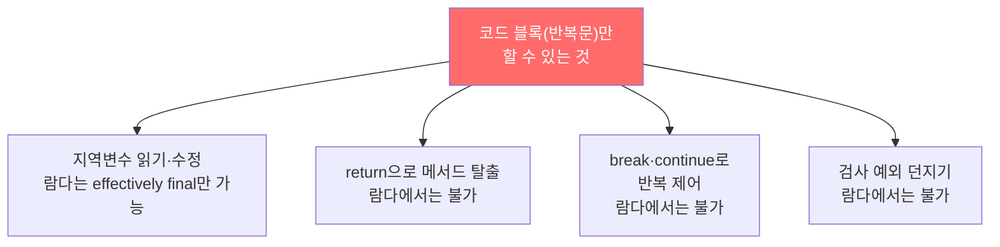
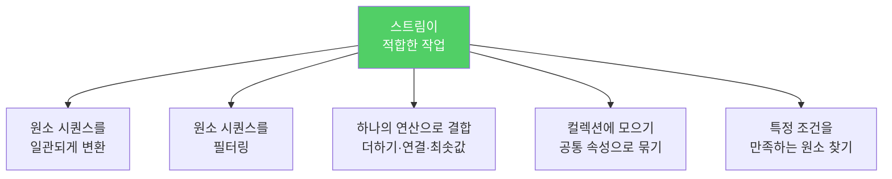

스트림 API는 강력하지만, 모든 반복문을 스트림으로 바꾸는 것이 항상 좋지는 않습니다. 스트림과 반복문 각각에 적합한 상황이 있습니다.

---

## 1. 스트림 파이프라인의 구조

비유하자면 **공장 조립 라인**입니다. 원자재(소스 스트림)가 들어오고, 각 단계(중간 연산)에서 가공되고, 최종 출구(종단 연산)에서 완성품이 나옵니다.


**지연 평가**: 종단 연산이 호출될 때까지 중간 연산은 실행되지 않습니다. 덕분에 무한 스트림도 다룰 수 있습니다. 종단 연산이 없는 파이프라인은 아무 일도 하지 않으므로 **종단 연산을 빠뜨리지 마세요.**

---

## 2. 스트림 과용 — 읽기 어려워진다

비유하자면 **모든 문장을 한 줄에 쓰는 것**입니다. 기술적으로 가능하지만 읽는 사람이 해독해야 합니다.

```java
// 스트림을 과하게 사용 — 따라하지 말 것
public class Anagrams {
    public static void main(String[] args) throws IOException {
        Path dictionary = Paths.get(args[0]);
        int minGroupSize = Integer.parseInt(args[1]);

        try (Stream<String> words = Files.lines(dictionary)) {
            words.collect(
                groupingBy(word -> word.chars().sorted()
                    .collect(StringBuilder::new,
                        (sb, c) -> sb.append((char) c),
                        StringBuilder::append).toString()))
                .values().stream()
                .filter(group -> group.size() >= minGroupSize)
                .map(group -> group.size() + ": " + group)
                .forEach(System.out::println);
        }
    }
}
```

```java
// 적절히 활용 — 도우미 메서드로 분리
public class Anagrams {
    public static void main(String[] args) throws IOException {
        Path dictionary = Paths.get(args[0]);
        int minGroupSize = Integer.parseInt(args[1]);

        try (Stream<String> words = Files.lines(dictionary)) {
            words.collect(groupingBy(word -> alphabetize(word)))  // 핵심 로직은 메서드로
                .values().stream()
                .filter(group -> group.size() >= minGroupSize)
                .forEach(g -> System.out.println(g.size() + ": " + g));
        }
    }

    private static String alphabetize(String s) {
        char[] a = s.toCharArray();
        Arrays.sort(a);
        return new String(a);
    }
}
```

도우미 메서드를 적절히 활용하는 것이 스트림 파이프라인에서는 특히 중요합니다. 타입 정보가 명시되지 않아 코드가 무엇을 하는지 이름으로 설명해야 합니다.

---

## 3. char 스트림 — 함정

```java
// 기대: Hello world! 출력
// 실제: 7210111108... (int 값) 출력
"Hello world!".chars().forEach(System.out::print);

// 올바른 방법 — 명시적 형변환 필요
"Hello world!".chars().forEach(x -> System.out.print((char) x));
```

Java는 `char` 전용 스트림을 제공하지 않습니다. `chars()`는 `IntStream`을 반환합니다. char 값들을 처리할 때는 스트림을 삼가는 편이 낫습니다.

---

## 4. 반복문이 더 나은 경우



---

## 5. 스트림이 적합한 경우



---

## 6. 스트림으로 처리하기 어려운 경우

파이프라인의 여러 단계에서 같은 원소의 값에 동시에 접근해야 하는 경우입니다. 스트림은 한 값을 다른 값으로 매핑하면 원래 값을 잃습니다.

```java
// 메르센 소수 — 지수(p)를 출력해야 하지만 종단 연산에서 p에 접근 불가
primes().map(p -> TWO.pow(p.intValueExact()).subtract(ONE))
    .filter(mersenne -> mersenne.isProbablePrime(50))
    .limit(20)
    .forEach(mp -> System.out.println(mp.bitLength() + ": " + mp));
    // 역산으로 우회: bitLength()로 지수를 역으로 계산
```

---

## 7. 애매한 경우 — 데카르트 곱

```java
// 반복 방식
private static List<Card> newDeck() {
    List<Card> result = new ArrayList<>();
    for (Suit suit : Suit.values())
        for (Rank rank : Rank.values())
            result.add(new Card(suit, rank));
    return result;
}

// 스트림 방식 — flatMap 활용
private static List<Card> newDeck() {
    return Stream.of(Suit.values())
        .flatMap(suit -> Stream.of(Rank.values())
            .map(rank -> new Card(suit, rank)))
        .collect(toList());
}
```

둘 다 맞습니다. 팀 내 취향과 스트림 친숙도에 따라 선택하면 됩니다.

---

## 8. 요약

> 스트림과 반복문 중 어느 쪽이 나은지 확신하기 어렵다면 둘 다 해보고 더 나은 쪽을 택하세요. 기존 코드는 스트림을 사용하도록 리팩토링하되, 새 코드가 더 나아 보일 때만 반영하세요.

---

> 참조: 이펙티브 자바 3/E — 조슈아 블로크
