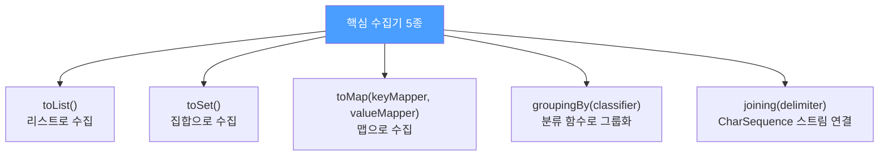

스트림을 올바르게 사용하려면 API를 아는 것만으로는 부족합니다. 함수형 프로그래밍 패러다임까지 받아들여야 합니다.

---

## 1. 스트림 패러다임의 핵심 — 순수 함수

비유하자면 **조립 라인의 각 작업자는 자기 공정만 처리하고 옆 공정에 손대지 않는다**는 원칙입니다. 각 단계는 입력만 받아 결과를 내고, 외부 상태를 바꾸지 않아야 합니다.

```java
// 나쁜 예 — forEach에서 외부 상태(freq)를 수정
Map<String, Long> freq = new HashMap<>();
try (Stream<String> words = new Scanner(file).tokens()) {
    words.forEach(word -> {
        freq.merge(word.toLowerCase(), 1L, Long::sum);  // 외부 상태 수정
    });
}
// forEach가 단순 출력 이상을 하고 있음 — 스트림 코드가 아니라 반복 코드
```

```java
// 좋은 예 — 수집기를 사용해 부작용 없이 처리
Map<String, Long> freq;
try (Stream<String> words = new Scanner(file).tokens()) {
    freq = words.collect(groupingBy(String::toLowerCase, counting()));
}
```

`forEach`는 스트림 계산 결과를 **보고할 때만** 사용하고, **계산 자체에는 쓰지 마세요.**

---

## 2. 수집기(Collector) — 꼭 알아야 할 개념

수집기는 스트림의 원소를 컬렉션이나 다른 형태로 모으는 방법을 캡슐화합니다. `java.util.stream.Collectors`에 43개의 팩터리 메서드가 있지만, 가장 중요한 것은 5개입니다.



---

## 3. toMap — 세 가지 형태

```java
// 형태 1: 키-값 매핑 (각 원소가 고유한 키를 가질 때)
Map<String, Operation> stringToEnum =
    Stream.of(values()).collect(toMap(Object::toString, e -> e));
// 키 충돌 시 IllegalStateException

// 형태 2: 병합 함수 추가 (충돌 처리)
// 각 음악가의 베스트 앨범 — 판매량 최대값으로 병합
Map<Artist, Album> topHits = albums.collect(
    toMap(Album::artist, a -> a, maxBy(comparing(Album::sales))));

// 마지막 값 취하기 (덮어쓰기)
toMap(keyMapper, valueMapper, (oldVal, newVal) -> newVal)

// 형태 3: 맵 팩터리 지정 (특정 맵 구현체 사용)
toMap(keyMapper, valueMapper, mergeFunction, TreeMap::new)
```

---

## 4. groupingBy — 분류와 그룹화

```java
// 기본형: 분류 함수만 지정 → List를 값으로 갖는 맵
words.collect(groupingBy(word -> alphabetize(word)))
// Map<String, List<String>>

// 다운스트림 수집기 지정 → Set을 값으로 갖는 맵
groupingBy(String::toLowerCase, toSet())
// Map<String, Set<String>>

// counting으로 빈도표
words.collect(groupingBy(String::toLowerCase, counting()))
// Map<String, Long>

// 맵 팩터리까지 지정 (TreeMap + TreeSet)
groupingBy(String::toLowerCase, TreeMap::new, toCollection(TreeSet::new))
```

`partitioningBy`는 `groupingBy`의 특수한 형태로, `Predicate`를 받아 `Boolean` 키를 가진 맵을 반환합니다.

---

## 5. joining — 문자열 연결

```java
// 단순 연결
Stream.of("a", "b", "c").collect(joining())           // "abc"

// 구분문자
Stream.of("a", "b", "c").collect(joining(", "))       // "a, b, c"

// 접두·구분·접미
Stream.of("a", "b", "c").collect(joining(", ", "[", "]")) // "[a, b, c]"
```

---

## 6. 빈도표 상위 10개 추출 — 실전 예

```java
// 빈도표에서 가장 흔한 단어 10개를 빈도 내림차순으로 추출
List<String> topTen = freq.keySet().stream()
    .sorted(comparing(freq::get).reversed())  // 빈도 내림차순
    .limit(10)
    .collect(toList());
```

`Collectors` 멤버를 정적 임포트하면 파이프라인 가독성이 크게 좋아집니다.

---

## 7. 요약

> 스트림 파이프라인의 핵심은 부작용 없는 함수 객체입니다. `forEach`는 계산에 쓰지 말고 결과 보고에만 사용하세요. 수집기를 잘 알아두세요. 가장 중요한 수집기 팩터리는 `toList`, `toSet`, `toMap`, `groupingBy`, `joining`입니다.

---

> 참조: 이펙티브 자바 3/E — 조슈아 블로크
