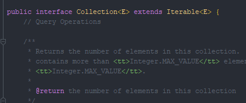

#### 🔗 스트림의 등장 :: 원소 시퀀스 반환 메서드의 반환타입 혼란 유래

* 자바 7까지는 **일련의 원소를 반환하는 메서드의 반환 타입**으로 **Collection**, **Set**, **List** 같은 **컬렉션 인터페이스**, 혹은 **Iterable**이나 **배열을 썼다.**

  * 이 중 가장 적합한 타입을 선택하기란 그다지 어렵지 않았다. **기본은 컬렉션 인터페이스다.**

  

  * **for-each** 문에서만 쓰이거나 **반환된 원소 시퀀스가 일부 Collection 메서드를 구현할 수 없을때**는 **Iterable** 인터페이스를 썼다.

  

  * **반환 원소들이 기본 타입**이거나 <span style="color:red;">성능에 민감한 상황이라면</span> **배열을 썼다.**

  

  * <span style="color:red;">그런데</span> 자바 8이 **스트림**이라는 개념을 들고 오면서 이 선택이 **아주 복잡한 일**이 되어버렸다.

    

<hr>


💎 **스트림은 반복(iteration)을 지원하지 않는다.**

* **스트림과 반복**을 **알맞게 조합해야 좋은 코드**가 나온다.
  * **API**를 스트림만 반환하도록 짜놓으면 반환된 스트림을 **for-each**로 반복하길 원하는 사용자는 당연히 불만을 토로 할 것이다.


* 사실 **Stream** 인터페이스는 **Iterable** 인터페이스가 정의한 추상 메서드를 전부 포함할 뿐만 아니라, **Iterable** 인터페이스가 정의한 방식대로 동작한다.
  * 그럼에도 **for-each**로 스트림을 반복할 수 없는 까닭은 바로 **Stream**이 **Iterable**을 확장(**extends**)하지 않아서다.


* 안타깝게도 반환 타입을 결정하는 문제를 해결해줄 **멋진 우회로는 없다.**
  * 다음과 같이 얼핏 보면 **Stream**의 **iterator** 메서드에 메서드 참조를 건네면 해결될 것 같다.

<br>

💎 **자바 타입 추론의 한계로 컴파일되지 않는다.**

```java
for (ProcessHandle ph : ProcessHandle.allProcesses()::iterator) {
    // 프로세스를 처리한다.
}
```

* 위 코드는 다음과 같은 컴파일 오류를 낸다.

<br>

```java
Test.java:6: error: method reference not expected here 
for (ProcessHandle ph : ProcessHandle.allProcesses()::iterator) {
```

* 위 오류를 바로잡으려면 아래와 같이 메서드 참조를 매개변수화된 **Iterable**로 적절히 **형변환**해줘야 한다.

<br>


💎 **스트림을 반복하기 위한 '끔찍한' 우회 방법**

```java
for (ProcessHandle ph : (Iterable<ProcessHandle>) ProcessHandle.allProcesses()::iterator){
    // 프로세스를 처리한다.
}
```

* 작동은 하지만 실전에 쓰기에는 너무 난잡하고 직관성이 떨어진다.

  * 다행히 어댑터 패턴을 사용하면 상황이 나아진다.

  

  * 자바는 이런 메서드를 제공하지는 않지만 다음 코드와 같이 쉽게 만들어 낼 수 있다.

<br>


💎 `Stream<E>`를 `Iterable<E>`로 **중개해주는 어댑터**

```java
public static <E> Iterable<E> iterableOf(Stream<E> stream) {
    return stream::iterator;
}
```

* 어댑터 패턴을 사용하면 어떤 스트림도 for-each 문으로 반복할 수 있다.

<br>

```java
for (ProcessHandle p : iterablof(ProcessHandle.allProcesses())) {
    // 프로세스를 처리한다.
}
```

* <span style="color:red;">반대로</span> **API**가 **Iterable**만 반환하면 이를 스트림 파이프라인에서 처리하려는 프로그래머가 성을 낼 것이다. 자바는 이를 위한 어댑터도 제공하지 않지만, 역시 다음과 같이 손쉽게 구현할 수 있다.

<br>

💎 `Iterable<E>`를 `Stream<E>`로 **중개해주는 어댑터**

```java
public static <E> Stream<E> streamOf(Iterable<E> iterable) {
    return StreamSupport.stream(iterable.spliterator(), false);
}
```


<hr>


💎 **이것만 확실하면 마음 놓고 스트림을 반환하게 해주자.**

* **객체 시퀀스를 반환하는 메서드를 작성**하는데, 이 메서드가 **오직 스트림 파이프라인에서만 쓰일 걸 안다면** 마음 놓고 스트림을 반환하게 해주자.


* <span style="color:red;">반대로</span> 반환된 객체들이 반복문에서만 쓰일 걸 안다면 Iterable을 안다면 Iterable을 반환하자.

  

* <span style="color:red;">하지만</span> 공개 API를 작성할 때는 스트림 파이프라인을 사용하는 사람과 반복문에서 쓰려는 사람 모두를 배려해야 한다.

  * 사용자 대부분이 한 방식만 사용할 거라는 그럴싸한 근거가 없다면 말이다.


<hr>


💎 **원소 시퀀스를 반환하는 공개 API의 반환 타입에는 Collection이나 그 하위 타입을 쓰는게 일반적으로 최선이다.**

* **Collection** 인터페이스는 **Iterable**의 하위 타입이고 **stream** 메서드도 제공하니 반복과 스트림을 동시에 지원한다.




* **Arrays** 역시 **Arrays.asList**와  **Stream.of** 메서드로 손쉽게 반복과 스트림을 지원 할 수 있다.

  * <span style="color:red;">반환하는 시퀀스의 크기가 메모리에 올려도 안전할 만큼 작다면</span> **ArrayList**나 **HashSet**같은 표준 컬렉션 구현체를 반환하는게 최선 일 수 있다.

  

  * <span style="color:red;">하지만</span> 단지 컬렉션을 반환한다는 이유로 **덩치 큰 시퀀스를 메모리에 올려서는 안된다.**


<hr>


💎  **반환할 시퀀스가 크지만 표현을 간결하게 할 수 있다면 전용 컬렉션을 구현하는 방안을 검토해보자.**

* 주어진 집합의 멱집합(한 집합의 모든 부분집합을 원소로 하는 집합)을 반환하는 상황이다.

  

  * 원소 개수가 n개면 멱집합의 원소 개수는 2^n개가 된다.

  

* <span style="color:red;">그러니</span> 멱집합을 표준 컬렉션 구현체에 저장하려는 생각은 위험하다.


* <span style="color:red;">하지만</span> **AbstractList**를 이용하면 **훌륭한 전용 컬렉션**을 **손쉽게 구현**할 수 있다.

  * 비결은 멱집합을 구성하는 **각 원소의 인덱스를 비트 벡터로 사용**하는 것이다.

  

  * **인덱스의 n번째 비트 값**은 멱집합의 해당 원소가 원래 집합의 n번째 원소를 포함하는지 여부를 알려준다.
    * 따라서 0부터 2^n - 1까지의 이진수와 원소 n개인 집합의 멱집합과 자연스럽게 매핑된다.

<br>

💎 **입력 집합의 멱집합을 전용 컬렉션에 담아 반환한다.**

```java
public class PowerSet {
    public static final <E> Collection<Set<E>> of(Set<E> s) {
        List<E> src = new ArrayList<>(s);
        if (src.size() > 30) {
            throw new IllegalArgumentException(
                "집합에 원소가 너무 많습니다(최대 30개).: " +s);
        }
        
        return new AbstractList<Set<E>>() {
            @Override public int size() {
                //멱집합의 크기는 2를 원래 집합의 원소 수만큼 거듭제곱 것과 같다.
                return 1 << src.size();
            }
            
            @Override public boolean contains(Object o) {
                return o instanceof Set && src.containsAll((Set) o);
            }
            
            @Override
            public Set<E> get(int index) {
                Set<E> result = new HashSet<>();
                for (int i = 0; index != 0; i++, index >>= 1) {
                    if ((index & 1) == 1) {
                        result.add(src.get(i));
                    }
                }
                return result;
            }
        };
    }
}
```

* 입력  집합의 원소 수가 30을 넘으면 **PowerSet.of**가 예외를 던진다.

  * 이는 **Stream**이나 **Iterable**이 아닌 **Collection을 반환 타입으로 쓸 때의 단점**을 잘 보여준다.

  

  * 즉, **Collcetion**의 **size** 메서드가 int 값을 반환하므로 **PowerSet.of**가 반환되는 시퀀스의 최대 길이는 **Integer.MAX_VALUE** 혹은 2^31 - 1로 제한된다.

  

  * **Collection** 명세에 따르면 컬렉션이 더 크거나 심지어 무한대일 때 size가 2^31 -1 을 반환해도 되지만 완전히 만족스러운 해법은 아니다.


<hr>


💎 **이럴때는 컬렉션보다는 스트림이나 Iterable을 반환하는 편이 낫다.**

* **AbstractCollection**을 활용해서 **Collection** 구현체를 작성할 때는 **Iterable**용 메서드 외에 2개만 더 구현하면 된다.

  * **contains**와 **size**이다.

  

  * 이 메서드들은 손쉽게 효율적으로 구현할 수 있다.

  

* **contains와 size를 구현하는게 불가능 할 때는** <span style="color:red;">컬렉션보다는 스트림이나 Iterable을 반환하는 편이 낫다.</span>

  * 원한다면 별도의 메서드를 두어 두 방식을 모두 제공해도 된다.


<hr>


💎 **때론 단순히 구현하기 쉬운 쪽을 선택하기도 해**

* 예컨대 **입력 리스트의 (연속적인) 부분리스트를 모두 반환하는 메서드**를 작성한다고 가정해보자.
  * 필요한 부분리스트를 만들어 표준 컬렉션에 담는 코드는 단 3줄이면 충분하다


* <span style="color:red;">하지만</span> 이 컬렉션은 입력 리스트 크기의 거듭제곱만큼 메모리를 차지한다.

  * 기하급수적으로 늘어나는 멱집합보다는 낫지만, **역시나 좋은 방식이 아님은 명백하다.**

  

  * 멱집합 때 처럼 전용 컬렉션을 구현하기란 지루한 일이다.

    * 특히 자바는 이럴 때 쓸만한 골격 Iterator를 제공하지 않으니 지루함이 더 심해진다

    

* <span style="color:red;">하지만</span> 입력 리스트의 모든 부분리스트를 스트림으로 구현하기는 어렵지 않다. 약간의 통찰만 있으면 된다.

  * **첫 번째 원소를 포함하는 부분리스트**를 그 리스트의 **프리픽스(prefix)**라 해보자.

    * ex) (a, b,c )의 프리픽스는 (a), (a,b), (a,b,c)가 된다.

    

  * **마지막 원소를 포함하는 부분리스트**를 그 리스트의 **서픽스(suffix)**라 하자.

    * ex) (a, b, c)의 서픽스는 (a, b, c), (b, c), (c)가 된다.

    

* 어떤 리스트의 부분리스트는 단순히 그 리스트의 프리픽스의 서픽스(혹은 서픽스의 프리픽스)에 빈 리스트 하나만 추가하면 된다.

<br>


💎 **입력 리스트의 모든 부분리스트를 스트림으로 반환한다.**

```java
public class SubLists {
    public static <E> Stream<List<E>> of(List<E> list) {
        return Stream.concat(Stream.of(Collections.emptyList()),
                            prefixes(list).flatMap(SubLists::suffixes));
    }
    
    private static <E> Stream<List<E>> prefixes(List<E> list) {
        return IntStream.rangeClosed(1, list.size()).mapToObj(end -> 					list.subList(0, end));
    }
    
    private static <E> Stream<List<E>> suffixes(List<E> list) {
        return IntStream.range(0, list.size())
            .mapToObj(start -> list.subList(start, list.size()));
    }
}
```

* **Stream.concat** 메서드는 반환되는 스트림에 빈 리스트를 추가하며, **flatMap** 메서드는 모든 프리픽스의 모든 서픽스로 구성된 하나의 스트림을 만든다.


* 프리픽스들과 서픽스들의 스트림은 **Intstream.range**와 **IntStream.rangeClosed**가 반환하는 연속된 정숫값들을 매핑해 만들었다.

  * 쉽게 말해 이 관용구는 정수 인덱스를 사용한 표준 for 반복문의 스트림 버전이라 할 수 있다.

  

  * 따라서 이 구현은 for 반복문을 중첩해 만든 것과 **취지가 비슷**하다.

<br>

```java
for (int start = 0; start < src.size(); start++) {
    for (int end = start + 1; end <= src.size(); end++ ) {
        System.out.println(src.subList(start, end));
    }
}
```

* 이 반복문은 그대로 스트림으로 변환할 수 있다.
  * 그렇게 하면 앞서의 구현보다 간결해지지만, 아마도 읽기에는 더 안 좋을 것이다.


<hr>


> 원소 시퀀스를 반환하는 메서드를 작성할 때는, 이를 스트림으로 처리하기를 원하는 사용자와 반복으로 처리하길 원하는 사용자가 모두 있을 수 있음을 떠올리고, 양쪽을 다 만족시키려 노력하자.
>
> 
>
> **컬렉션을 반환할 수 있다면 그렇게하라.**
>
> 반환 전부터 이미 원소들을 컬렉션에 담아 관리하고 있거나 컬렉션을 하나 더 만들어도 될 정도로 원소개수가 적다면 **ArrayList 같은 표준 컬렉션에 담아 반환하라.**
>
> 
>
> 그렇지 않으면 앞서의 멱집합 예처럼 전용 컬렉션을 구현할지 고민하라.
>
> 
>
> **컬렉션을 반환하는 게 불가능하다면** 스트림과 Iterable 중 **좀 더 자연스러운 것을 반환하라**.
>
> 
>
> 만약 나중에 Stream 인터페이스가 Iterable을 지원하도록 자바가 수정된다면, 그때는 안심하고 스트림을 반환하면 될 것이다.


```
참조 - 이펙티브 자바 3/E - 조슈아 블로크
```

