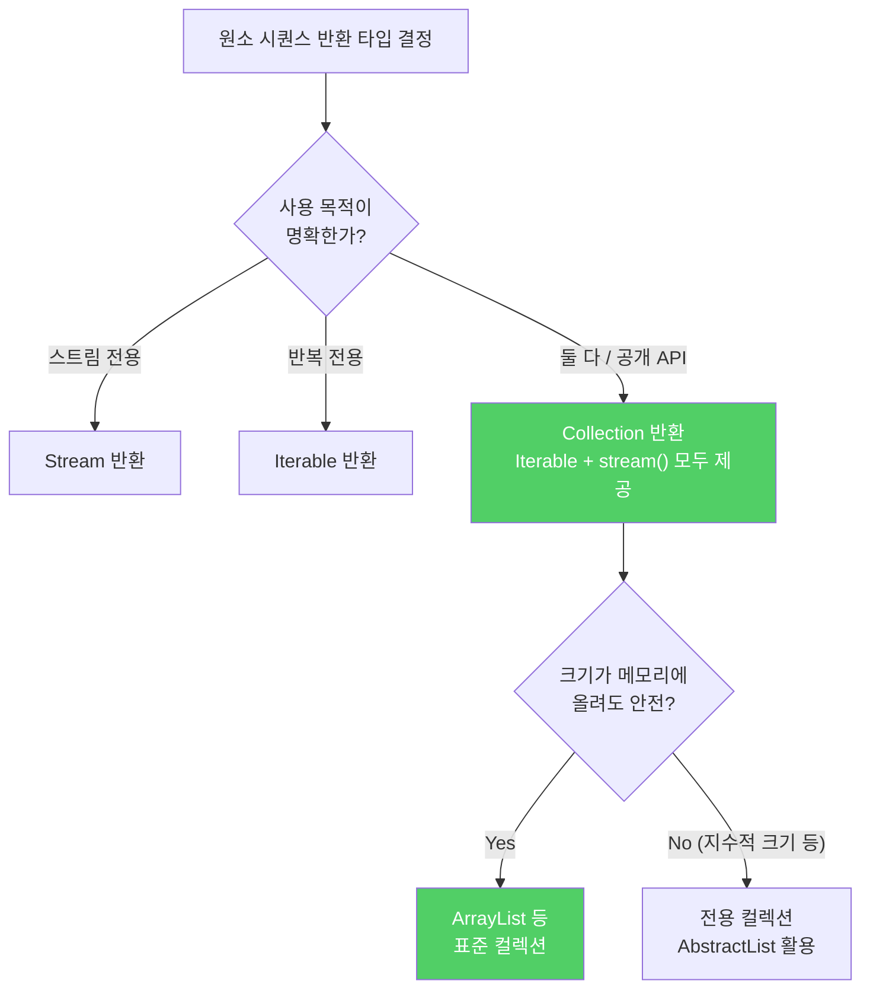

원소 시퀀스를 반환하는 메서드를 작성할 때, 반환 타입을 어떻게 결정해야 할까요? 사용자가 스트림으로도, 반복문으로도 쓸 수 있어야 합니다.

---

## 1. 스트림과 반복문의 불화

비유하자면 **콘센트 규격이 달라 변환 어댑터가 필요한 것**입니다. `Stream`은 `Iterable`의 추상 메서드를 전부 포함하면서도 `Iterable`을 확장하지 않아 for-each 문에서 직접 사용할 수 없습니다.

```java
// 컴파일 오류 — Stream을 for-each로 직접 사용 불가
for (ProcessHandle ph : ProcessHandle.allProcesses()::iterator) { ... }

// 형변환 우회 — 작동하지만 너무 난잡함
for (ProcessHandle ph :
        (Iterable<ProcessHandle>) ProcessHandle.allProcesses()::iterator) { ... }
```

어댑터 메서드로 깔끔하게 처리할 수 있습니다.

```java
// Stream → Iterable 어댑터
public static <E> Iterable<E> iterableOf(Stream<E> stream) {
    return stream::iterator;
}

// Iterable → Stream 어댑터
public static <E> Stream<E> streamOf(Iterable<E> iterable) {
    return StreamSupport.stream(iterable.spliterator(), false);
}

// 사용
for (ProcessHandle p : iterableOf(ProcessHandle.allProcesses())) { ... }
```

---

## 2. 공개 API의 반환 타입 — Collection이 최선

비유하자면 **두 규격 모두 지원하는 멀티탭**입니다. `Collection`은 `Iterable`의 하위 타입이고 `stream()` 메서드도 제공하므로 반복문과 스트림 파이프라인 모두에서 사용할 수 있습니다.


```mermaid
graph TD
    A["원소 시퀀스 반환 타입 결정"] --> B{"사용 목적이\n명확한가?"}
    B -->|"스트림 전용"| C["Stream 반환"]
    B -->|"반복 전용"| D["Iterable 반환"]
    B -->|"둘 다 / 공개 API"| E["Collection 반환\nIterable + stream() 모두 제공"]
    E --> F{"크기가 메모리에\n올려도 안전?"}
    F -->|"Yes"| G["ArrayList 등\n표준 컬렉션"]
    F -->|"No (지수적 크기 등)"| H["전용 컬렉션\nAbstractList 활용"]
    style E fill:#51cf66,color:#fff
    style G fill:#51cf66,color:#fff
```

단, 컬렉션을 반환한다는 이유만으로 덩치 큰 시퀀스를 메모리에 올리면 안 됩니다.

---

## 3. 전용 컬렉션 — 멱집합 예시

원소가 n개인 집합의 멱집합(모든 부분집합)은 2^n개입니다. 표준 컬렉션에 담으면 메모리 폭발이 생깁니다. `AbstractList`를 활용해 각 부분집합을 비트 인덱스로 계산하면 실제 저장 없이 구현할 수 있습니다.

```java
public class PowerSet {
    public static final <E> Collection<Set<E>> of(Set<E> s) {
        List<E> src = new ArrayList<>(s);
        if (src.size() > 30)
            throw new IllegalArgumentException("원소가 너무 많습니다 (최대 30개): " + s);

        return new AbstractList<Set<E>>() {
            @Override public int size() {
                return 1 << src.size();  // 2^n
            }

            @Override public boolean contains(Object o) {
                return o instanceof Set && src.containsAll((Set) o);
            }

            @Override public Set<E> get(int index) {
                Set<E> result = new HashSet<>();
                for (int i = 0; index != 0; i++, index >>= 1)
                    if ((index & 1) == 1)
                        result.add(src.get(i));
                return result;
            }
        };
    }
}
```

`AbstractList`로 `Collection`을 구현하려면 `size()`, `contains()`, `get()`만 구현하면 됩니다. 실제로 2^n개의 집합을 메모리에 만들지 않고도 `Collection`을 반환합니다.

---

## 4. contains/size 구현 불가능할 때 — 스트림 반환

입력 리스트의 모든 부분 리스트를 반환하는 경우, 프리픽스의 서픽스 구조로 스트림으로 표현하면 간결합니다.

```java
public class SubLists {
    public static <E> Stream<List<E>> of(List<E> list) {
        return Stream.concat(
            Stream.of(Collections.emptyList()),
            prefixes(list).flatMap(SubLists::suffixes));
    }

    private static <E> Stream<List<E>> prefixes(List<E> list) {
        return IntStream.rangeClosed(1, list.size())
            .mapToObj(end -> list.subList(0, end));
    }

    private static <E> Stream<List<E>> suffixes(List<E> list) {
        return IntStream.range(0, list.size())
            .mapToObj(start -> list.subList(start, list.size()));
    }
}
```

---

## 5. 요약

> 원소 시퀀스를 반환할 때는 스트림과 반복문 모두를 고려하세요. 컬렉션을 반환할 수 있다면 그렇게 하세요. 반환할 원소가 적다면 `ArrayList` 같은 표준 컬렉션을, 크다면 전용 컬렉션을 구현하는 방안을 검토하세요. 컬렉션 반환이 불가능하다면 스트림과 `Iterable` 중 더 자연스러운 것을 반환하세요.

---

> 참조: 이펙티브 자바 3/E — 조슈아 블로크
