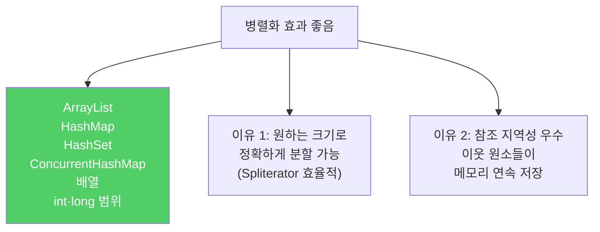
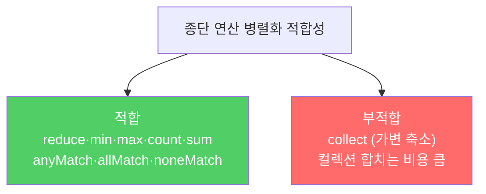
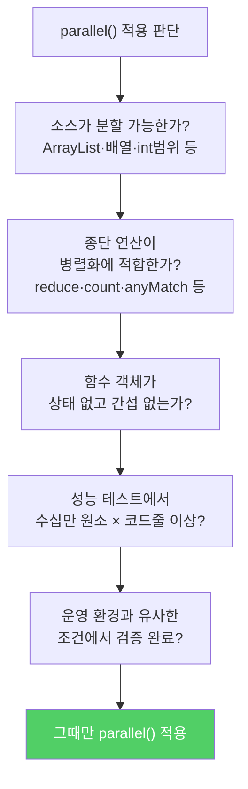

`parallel()`을 호출하는 것은 한 줄이지만, 잘못된 상황에서 쓰면 응답 불가나 결과 오류로 이어집니다. 병렬화는 성능 최적화 수단이므로, 반드시 검증 후 적용해야 합니다.

---

## 1. 무작정 parallel() — 응답 불가

비유하자면 **조립 라인을 무턱대고 여러 팀으로 나눴더니 오히려 서로 기다리다가 공장 전체가 멈추는 것**입니다.

```java
// 처음 20개의 메르센 소수 출력 — 이미 올바르게 동작
primes().map(p -> TWO.pow(p.intValueExact()).subtract(ONE))
    .filter(mersenne -> mersenne.isProbablePrime(50))
    .limit(20)
    .forEach(System.out::println);

// parallel() 추가 — CPU 90% 점유하며 아무것도 출력 안 함 (응답 불가)
primes().map(p -> TWO.pow(p.intValueExact()).subtract(ONE))
    .parallel()  // 절대 하지 말 것
    .filter(mersenne -> mersenne.isProbablePrime(50))
    .limit(20)
    .forEach(System.out::println);
```

원인은 두 가지입니다.
- 소스가 `Stream.iterate` — 스트림 라이브러리가 효율적으로 분할하는 방법을 찾지 못함
- 중간 연산에 `limit` — 병렬화 알고리즘이 원소를 추가로 처리한 후 버리는 방식을 사용하는데, 메르센 소수는 앞 원소보다 뒤 원소가 두 배 이상 오래 걸리므로 끝없이 계산만 함

---

## 2. 병렬화 효과가 좋은 소스



참조 지역성이 낮으면 스레드가 캐시 미스로 인해 메모리 대기 시간을 낭비합니다. **기본 타입 배열이 참조 지역성이 가장 좋습니다.** 데이터 자체가 메모리에 연속 저장되기 때문입니다.

---

## 3. 병렬화에 적합한 종단 연산



---

## 4. 안전 실패 — 잘못된 결과

병렬 파이프라인이 결합법칙을 만족하지 않거나 상태를 가진 함수 객체를 사용하면 순차 실행에서는 맞는 결과가 병렬 실행에서는 틀릴 수 있습니다. 이를 **안전 실패(safety failure)**라 합니다.

출력 순서를 보장하려면 `forEach` 대신 `forEachOrdered`를 사용하세요.

---

## 5. 병렬화가 효과를 발휘하는 경우

```java
// n 이하의 소수 개수 계산 — 범위 스트림, 축소 연산 → 병렬화 적합
static long pi(long n) {
    return LongStream.rangeClosed(2, n)
        .parallel()                          // 적합한 소스 + 적합한 종단 연산
        .mapToObj(BigInteger::valueOf)
        .filter(i -> i.isProbablePrime(50))
        .count();
}
// n = 10^8 기준: 순차 31초 → 병렬 약 9초 (약 3배 향상, 쿼드코어 기준)
```

병렬화 효과 추정: 스트림 원소 수 × 원소당 처리 코드 줄 수 = **수십만 이상**이어야 의미 있는 향상이 기대됩니다.

---

## 6. 무작위 스트림 병렬화

```java
// 나쁜 선택
ThreadLocalRandom.current().ints()  // 단일 스레드용 — 병렬화 효과 없음
Random.ints()                        // 모든 연산 동기화 — 병렬화에 최악

// 올바른 선택
new SplittableRandom()               // 병렬화에 맞게 설계 — 성능 선형 증가
```

---

## 7. 요약



> 스트림을 잘못 병렬화하면 프로그램을 오동작하게 하거나 성능을 급격히 떨어뜨립니다. 계산이 올바르고 성능도 확실히 향상될 것임을 검증한 후에만 병렬화 버전을 운영 코드에 반영하세요.

---

> 참조: 이펙티브 자바 3/E — 조슈아 블로크
