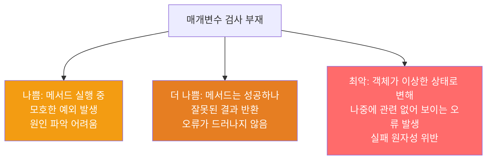

메서드와 생성자는 입력 매개변수에 특정 조건을 요구합니다. 이 조건을 메서드 몸체 실행 전에 검사하면 오류를 빠르고 깔끔하게 잡을 수 있습니다.

---

## 1. 매개변수 검사를 게을리 하면?

비유하자면 **재료 검수 없이 요리를 시작하는 것**입니다. 상한 재료를 처음부터 걸러냈다면 간단히 해결됐을 문제가, 요리 중간 또는 손님 식탁에서 발각됩니다.

매개변수 검사를 제대로 하지 않으면 세 단계로 나쁜 상황이 발생합니다.



---

## 2. 문서화 + 즉시 예외

public과 protected 메서드는 매개변수 제약을 `@throws` 자바독 태그로 문서화하고, 몸체 첫 부분에서 검사해야 합니다.

```java
/**
 * (현재 값 mod m) 값을 반환한다.
 *
 * @param m 계수 (양수여야 한다)
 * @return 현재 값 mod m
 * @throws ArithmeticException m이 0보다 작거나 같으면 발생한다
 */
public BigInteger mod(BigInteger m) {
    if (m.signum() <= 0)
        throw new ArithmeticException("계수(m)는 양수여야 합니다: " + m);
    // ... 계산 로직
}
```

`m`이 `null`이면 `m.signum()` 호출 시 `NullPointerException`이 발생합니다. 이 경우는 `BigInteger` 클래스 수준 주석에서 null 불허를 명시하면 각 메서드마다 반복하지 않아도 됩니다.

---

## 3. Objects.requireNonNull — null 검사의 표준 방법

Java 7부터 제공되는 `Objects.requireNonNull`을 사용하면 수동 null 검사가 필요 없습니다.

```java
// 수동 null 검사 — 낡은 방식
if (strategy == null)
    throw new NullPointerException();
this.strategy = strategy;

// Objects.requireNonNull — 현대적 방식
this.strategy = Objects.requireNonNull(strategy, "전략이 null입니다");
// 값을 그대로 반환하므로 대입과 동시에 검사 가능
```

---

## 4. Java 9 범위 검사 메서드

```java
// 0 이상 size 미만인지 검사
Objects.checkIndex(index, size);

// fromIndex~toIndex 범위가 0~size 안에 있는지 검사
Objects.checkFromToIndex(fromIndex, toIndex, size);
Objects.checkFromIndexSize(fromIndex, size, length);
```

예외 메시지를 직접 지정할 수 없고 리스트와 배열 전용으로 설계된 한계가 있지만, 해당 용도에서는 매우 편리합니다.

---

## 5. public이 아닌 메서드 — assert

공개되지 않은 메서드는 호출 상황을 직접 통제할 수 있습니다. `assert`로 불변식을 문서화하고 검사하면 됩니다.

```java
private static void sort(long[] a, int offset, int length) {
    assert a != null;
    assert offset >= 0 && offset <= a.length;
    assert length >= 0 && length <= a.length - offset;
    // ... 정렬 로직
}
```

`assert`는 두 가지 점에서 일반 유효성 검사와 다릅니다.
- 실패하면 `AssertionError`를 던집니다
- 런타임에 `-ea` 플래그 없이는 성능에 영향을 주지 않습니다 (검사가 비활성화됨)

---

## 6. 나중에 사용하는 매개변수 — 특히 주의

생성자에서 저장만 하고 나중에 사용하는 매개변수는 검사가 더 중요합니다. 나중에 오류가 발생하면 원인을 추적하기 훨씬 어렵습니다.

```java
// 나중에 사용하는 Executor — 생성 시 null 검사 필수
public Job(Executor executor, Task task) {
    this.executor = Objects.requireNonNull(executor, "executor");
    this.task = Objects.requireNonNull(task, "task");
}
```

---

## 7. 예외: 검사 비용이 지나치게 높을 때

유효성 검사 비용이 지나치게 높거나 실용적이지 않을 때, 혹은 계산 과정에서 암묵적으로 검사가 이루어질 때는 예외입니다. 예를 들어 `Collections.sort(List)`는 정렬 과정에서 리스트 안의 객체들이 상호 비교될 때 `ClassCastException`이 자동으로 발생하므로, 사전에 모든 원소를 검사하는 것은 불필요합니다.

---

## 8. 요약

> 메서드나 생성자를 작성할 때는 매개변수에 어떤 제약이 있을지 생각해야 합니다. 그 제약들을 문서화하고, 메서드 코드 시작 부분에서 명시적으로 검사하세요. 오류는 가능한 한 빨리, 발생한 곳에서 잡아야 합니다.

---

> 참조: 이펙티브 자바 3/E — 조슈아 블로크
