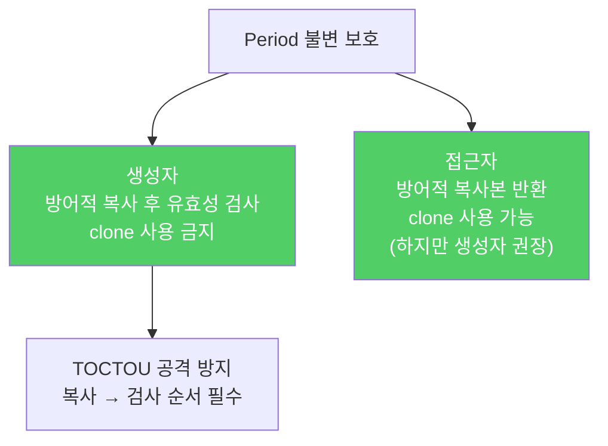

Java는 메모리 안전 언어이지만, 가변 객체를 내부에서 그대로 참조하면 외부에서 조용히 내부 상태를 바꿀 수 있습니다. 방어적 복사로 이를 막아야 합니다.

---

## 1. 불변처럼 보이지만 불변이 아닌 클래스

비유하자면 **자물쇠를 걸었는데 열쇠 복사본을 가진 사람에게 그 방의 내용을 바꿀 권한을 준 것**입니다. `Period` 클래스가 `final` 필드를 가지더라도 `Date`가 가변이면 문제가 생깁니다.

```java
public final class Period {
    private final Date start;
    private final Date end;

    public Period(Date start, Date end) {
        if (start.compareTo(end) > 0)
            throw new IllegalArgumentException(start + "가 " + end + "보다 늦다.");
        this.start = start;
        this.end = end;
    }

    public Date start() { return start; }
    public Date end()   { return end; }
}
```

```java
// 공격 1 — 생성자에 넘긴 Date를 나중에 변경
Date start = new Date();
Date end   = new Date();
Period p   = new Period(start, end);
end.setYear(78);  // p의 내부가 바뀐다!
```

---

## 2. 해결 — 생성자에서 방어적 복사

비유하자면 **손님이 맡긴 짐을 보관할 때 원본이 아닌 복사본을 보관하는 것**입니다.

```java
public Period(Date start, Date end) {
    // 복사 먼저, 유효성 검사는 복사본으로
    this.start = new Date(start.getTime());
    this.end   = new Date(end.getTime());

    if (this.start.compareTo(this.end) > 0)
        throw new IllegalArgumentException(
            this.start + "가 " + this.end + "보다 늦다.");
}
```

**순서가 중요합니다.** 복사 후 유효성 검사를 해야 합니다. 반대로 하면 멀티스레드 환경에서 검사 후 복사 사이에 다른 스레드가 원본을 변경하는 **TOCTOU(time-of-check/time-of-use) 공격**에 노출됩니다.

**`clone`을 쓰지 말아야 하는 이유**: `Date`는 `final`이 아니므로 `clone`이 악의적인 하위 클래스의 인스턴스를 반환할 수 있습니다. 매개변수 타입이 서드파티에 의해 확장될 수 있다면 항상 생성자나 정적 팩터리로 복사하세요.

---

## 3. 접근자도 방어적 복사

생성자를 고쳐도 접근자 메서드가 내부의 가변 객체를 그대로 반환하면 또 다른 공격 경로가 생깁니다.

```java
// 공격 2 — 접근자가 반환한 Date를 변경
p.end().setYear(78);  // 여전히 p의 내부가 바뀐다!

// 해결 — 접근자에서도 방어적 복사 반환
public Date start() { return new Date(start.getTime()); }
public Date end()   { return new Date(end.getTime()); }
```

접근자에서는 `Period`가 보유한 `Date`가 확실히 `java.util.Date`이므로 `clone`을 써도 안전합니다. 그러나 생성자나 정적 팩터리를 쓰는 것이 일반적으로 더 좋습니다.



---

## 4. 방어적 복사의 다른 용도

불변 객체를 만들기 위해서만 방어적 복사가 필요한 것은 아닙니다.

- **내부 자료구조에 보관할 때**: 클라이언트가 건네준 객체를 `Set`의 원소나 `Map`의 키로 사용한다면, 나중에 그 객체가 변경되면 불변식이 깨집니다.
- **내부 객체를 반환할 때**: 길이 1 이상인 배열은 항상 가변입니다. 배열을 클라이언트에 반환할 때는 방어적 복사를 하거나 불변 뷰를 반환하세요.

---

## 5. 복사를 생략해도 되는 경우

방어적 복사에는 성능 비용이 따릅니다. 다음 경우에는 생략할 수 있습니다.

- 같은 패키지 안에서 신뢰하는 코드끼리만 사용
- 클라이언트와 상호 신뢰 관계가 성립할 때
- 가변 객체의 통제권을 명시적으로 이전받는 메서드 (단, 문서화 필수)

---

## 6. 근본적 해결 — 불변 타입 사용

```java
// Date 대신 불변 타입 사용 — 방어적 복사가 필요 없어짐
public final class Period {
    private final Instant start;  // 불변
    private final Instant end;    // 불변
    // ...
}
```

Java 8 이상이라면 `Date` 대신 `Instant`, `LocalDateTime`, `ZonedDateTime`을 사용하세요. 방어적 복사 자체가 필요 없어집니다.

---

## 7. 요약

> 클래스가 클라이언트로부터 받는 혹은 반환하는 구성요소가 가변이라면 반드시 방어적으로 복사해야 합니다. 복사 비용이 너무 크거나 클라이언트를 신뢰한다면, 복사 대신 수정 시 책임이 클라이언트에 있음을 문서에 명시하세요.

---

> 참조: 이펙티브 자바 3/E — 조슈아 블로크
