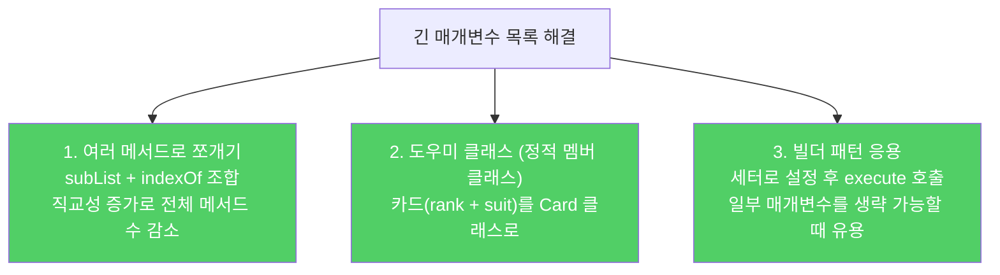

API 설계의 여러 지침을 한데 모은 항목입니다. 메서드 이름, 편의 메서드 수, 매개변수 목록, 매개변수 타입에 관한 규칙입니다.

---

## 1. 메서드 이름을 신중히 짓자

비유하자면 **길 안내판의 이름**입니다. 표준 명명 규칙을 따르고, 같은 패키지의 다른 이름과 일관성을 유지하는 것이 최우선입니다. 자바 라이브러리 API를 참고하되, 긴 이름은 피하세요.

---

## 2. 편의 메서드를 너무 많이 만들지 말자

비유하자면 **식당 메뉴가 너무 많으면 주방도, 손님도 힘들어지는 것**입니다. 메서드가 너무 많은 클래스는 익히고, 사용하고, 문서화하고, 테스트하고, 유지보수하기 어렵습니다.

아주 자주 쓰일 경우에만 별도의 약칭 메서드를 두세요. 확신이 서지 않으면 만들지 마세요.

---

## 3. 매개변수 목록은 4개 이하로

같은 타입의 매개변수가 연달아 나오는 것은 특히 위험합니다. 순서를 바꿔도 컴파일이 통과되고, 의도와 다른 결과만 나옵니다.

```java
// 나쁜 예 — 같은 타입 매개변수가 연달아
void copy(String src, String dst, int srcOffset, int dstOffset, int length);

// 좋은 예 — 도우미 클래스로 묶기
void copy(Range src, Range dst);
```

**긴 매개변수 목록을 줄이는 세 가지 기술:**



`List` 인터페이스의 예: 부분 리스트에서 인덱스를 찾는 기능을 하나의 메서드(매개변수 3개)로 만들지 않고, `subList`와 `indexOf`를 분리해 조합하도록 했습니다.

---

## 4. 매개변수 타입은 클래스보다 인터페이스

비유하자면 **특정 브랜드의 그릇만 사용하도록 강제하는 대신, "그릇"이면 무엇이든 받는 것**입니다.

```java
// 나쁜 예 — 특정 구현체로 고정
void process(HashMap<String, Integer> map);

// 좋은 예 — 인터페이스로 유연하게
void process(Map<String, Integer> map);
// HashMap, TreeMap, ConcurrentHashMap, 심지어 미래의 구현체까지 수용
```

---

## 5. boolean보다 원소 2개짜리 열거 타입

비유하자면 **"냉장" / "냉동" 버튼이 있는 냉장고 vs `true`/`false`만 있는 냉장고**입니다.

```java
// 나쁜 예 — boolean
Thermometer.newInstance(true);  // 무슨 뜻인지 코드만 봐서는 알 수 없음

// 좋은 예 — 열거 타입
public enum TemperatureScale { FAHRENHEIT, CELSIUS }
Thermometer.newInstance(TemperatureScale.CELSIUS);  // 의미가 명확

// 나중에 켈빈온도 추가 시 열거 타입에만 KELVIN 추가 → 메서드 변경 불필요
```

열거 타입을 사용하면 나중에 선택지를 추가하기 쉽고, 온도 변환 로직을 열거 상수 안에 캡슐화할 수도 있습니다.

---

## 6. 요약

- 메서드 이름: 표준 규칙 준수, 일관성, 간결함
- 편의 메서드: 자주 쓰일 때만, 확신 없으면 만들지 않음
- 매개변수 목록: 4개 이하, 같은 타입 연속은 특히 금물
- 매개변수 타입: 클래스보다 인터페이스
- boolean 매개변수: 원소 2개짜리 열거 타입으로 대체

---

> 참조: 이펙티브 자바 3/E — 조슈아 블로크
