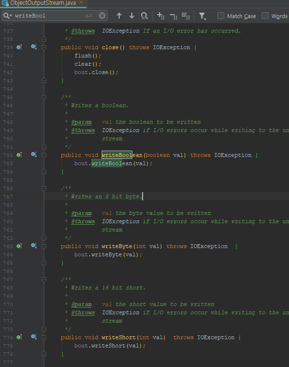
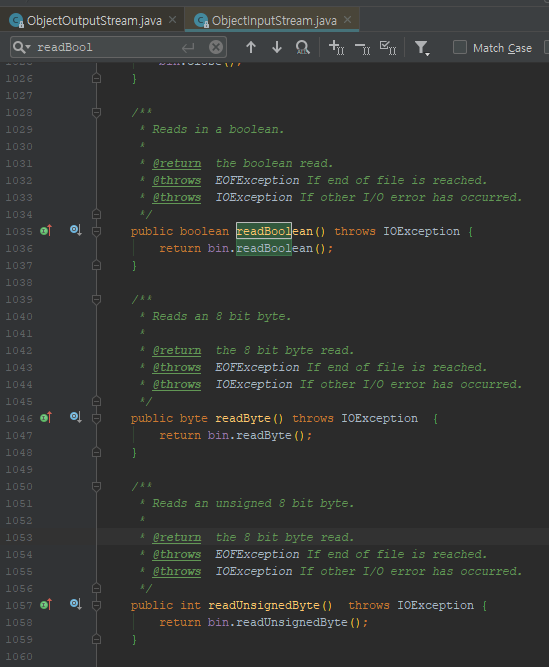
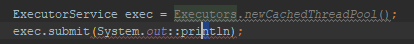
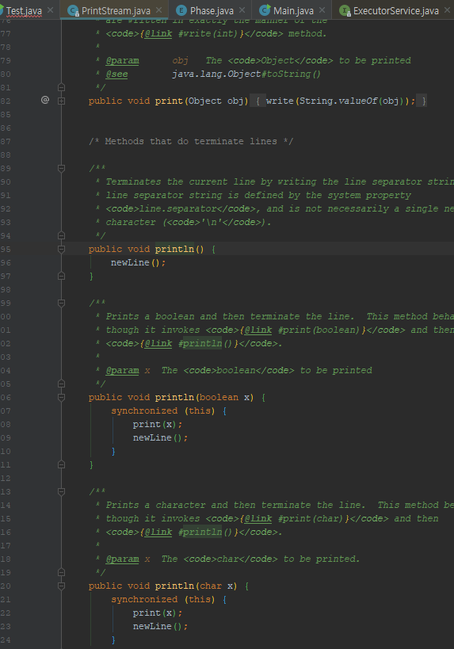
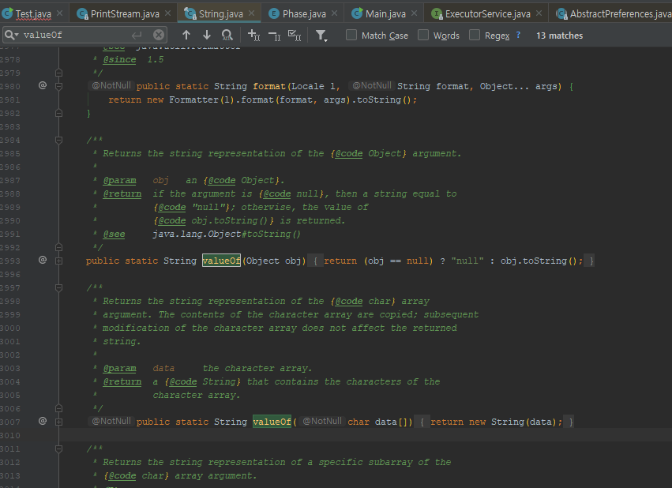

##### 🔗  재정의한 메서드는 동적으로 선택되고, 다중정의한 메서드는 정적으로 선택된다.

* 다음은 컬렉션을 집합, 리스트, 그 외로 구분하고자 만든 프로그램이다.


##### 💎 컬렉션 분류기 - 오류! 이 프로그램은 무엇을 출력할까?

```java
public class CollectionClassifier {
    public static String classify(Set<?> s) {
        return "집합";
    }
    
    public static String classify(List<?> lst) {
        return "리스트";
    }
    
    public static String classify(Collection<?> c) {
        return "그 외";
    }
    
    public static void main(String[] args) {
        Collection<?>[] collections = {
            new HashSet<String>(),
            new ArrayList<BigInteger>(),
            new HashMap<String, Integer>.valuees()
        };
        for (Collection<?> c: collections) {
            System.out.println(classify(c));
        }
    }
}
```

* "집합", "리스트", "그 외"를 차례로 출력할 것 같지만, 실제로 수행해보면 "그 외"만 세번 연달아 출력한다.


* <span style="color:red;">다중정의(overloading, 오버로딩)</span> 된 **세 classify 중 어느 메서드를 호출할지가 컴파일 타임에 정해지기 때문이다.**

  * 컴파일타임에는 **for** 문 안의 **c**는 항상 **Collection<?>** 타입이다.

  

  * 런타임에는 타입이 매번 달라지지만, 호출할 메서드를 선택하는 데는 영향을 주지 못한다.

  

  * <span style="color:red;">따라서</span> 컴파일타임의 매개변수 타입을 기준으로 항상 세 번째 메서드인 **classify(Collection<?>)**만 호출하는 것이다.


* 이처럼 **직관과 어긋나는 이유**는 재정의한 메서드는 동적으로 선택되고, 다중정의한 메서드는 정적으로 선택되기 때문이다.


* **메서드를 재정의했다면** 해당 객체의 **런타임 타입이 어떤 메서드를 호출할지의 기준이 된다.**

  * 모두 알다시피, 메서드 재정의란 상위 클래스가 정의한 것과 똑같은 시그니처의 메서드를 하위 클래스에서 다시 정의한 것을 말한다.

  

  * 메서드를 재정의한 다음 '하위 클래스의 인스턴스'에서 그 메서드를 호출하면 재정의한 메서드가 실행된다.

  

  * 컴파일 타임에 그 인스턴스의 타입이 무엇이었냐는 상관없다.

  

  * 다음 코드는 이러한 상황을 구체적으로 보여준다.


<hr>


##### 💎 재정의된 메서드 호출 메커니즘 - 이 프로그램은 무엇을 호출할까?

```java
class Wine {
    String name() { return "포도주";}
}
class SparklingWine extends Wine {
    @Override String name() { return "발포성 포도주"; }
}
class Champange extends SparklingWine {
    @Override String name() { return "샴페인"; }
}

public class Overriding {
	public static void main(String[] args) {
        List<Wine> wineList = List.of(new Wine(), new SparklingWine(), new Champagne());
        
        for (Wine wine : wineList) {
            System.out.println(wine.name());
        }
    } 
}
```

* **Wine** 클래스에 정의된 **name** 메서드는 하위 클래스인 **SparklingWine**과 **Champagne**에서 재정의된다.


*  예상한 것처럼 이 프로그램은 "포도주", "발포성 포도주", "샴페인"을 차례로 출력한다. **for** 문에서의 컴파일타임 타입이 모두 **Wine**인 것에 무관하게 항상 **'가장 하위에서 정의한'** 재정의 메서드가 실행되는 것이다.


* <span style="color:red;">한편</span>, **다중정의된 메서드 사이에서는 객체의 런타임 타입은 전혀 중요치 않다.**

  * **선택은 컴파일타임에**, <span style="color:red;">오직 매개변수의 컴파일타임 타입에 의해 이뤄진다.</span>

  

  * 위 **CollectionClassifier** 예에서 프로그램의 원래 의도는 매개변수의 런타임 타입에 기초해 적절한 다중정의 메서드로 자동 분배하는 것이었다.

  

  * <span style="color:red;">하지만 다중정의는 이렇게 동작하지 않는다.</span>

  

  * 이 문제는 (정적 메서드를 사용해도 좋다면) 아래와 같이 **CollectionClassifier**의 모든 **classify** 메서드를 하나로 합친 후 **instanceof**로 명시적으로 검사하면 말끔히 해결된다.


<br>


```java
public static String classify(Collection<?> c) {
    return c instanceof Set ? "집합" :
    		c instanceof List ? "리스트" : "그 외";
}
```


<hr>


##### 💎 다중정의가 혼동을 일으키는 상황을 피해야 한다.

* 프로그래머에게는 재정의가 정상적인 동작 방식이고, 다중정의가 예외적인 동작으로 보일 것이다.
  * 즉, 재정의한 메서드는 프로그래머가 기대한 대로 동작하지만, CollectionClassifier 예에서처럼 다중정의한 메서드는 이러한 기대를 가볍게 무시한다.


* **헷갈릴 수 있는 코드는 작성하지 않는게 좋다.**

  * 특히나 <span style="color:red;">공개 API라면 더욱 신경 써야 한다.</span>

  

  * API 사용자가 매개변수를 넘기면서 **어떤 다중정의 메서드가 호출될지를 모른다면 프로그램이 오동작하기 쉽다.**

  

  * 런타임에 이상하게 행동할 것이며 API 사용자들은 문제를 진단하느라 긴 시간을 허비할 것이다.

  

  * <span style="color:red;">그러니 다중정의가 혼동을 일으키는 상황을 피해야 한다.</span>


<hr>


##### 💎 안전하고 보수적으로 가려면 매개변수 수가 같은 다중정의는 만들지 말자.

* 정확히 어떻게 사용했을 때 다중정의가 혼란을 주느냐에 대해서는 논란의 여지가 있다.


* **가변인수를 사용하는 메서드라면** <span style="color:red;">다중정의를 아예 하지말아야 한다.</span>


* 이 규칙만 잘 따르면 **어떤 다중정의 메서드가 호출될 지 헷갈릴 일은 없을 것이다**.
  * 특별히 따르기 어려운 규칙은 아니다.


<hr>

💎 **다중정의하는 대신** <span style="color:red;">메서드 이름을 다르게 지어주는 길도 항상 열려 있다.</span>

* **ObjectOutputStream** 클래스를 살펴보자.

  * 이 클래스는 모든 기본 타입과 일부 참조 타입용 변형을 가지고 있다.

  

  * <span style="color:red;">그런데 다중정의가 아닌</span>, **모든 메서드에 아래와 같이 다른 이름을 지어주는 길을 택했다.**



* writeBoolean(boolean), writeInt(int), writeLong(long) 같은 식이다.


* <span style="color:red;">이 방식이 다중정의보다 나은 또 다른 점</span>은 아래와 같이 read 메서드의 이름과 **짝을 맞추기 좋다는 것이다.**




<hr>


##### 💎 생성자 다중정의를 위한 안전 대책

* **생성자는** 이름을 다르게 지을 수 없으니 **두 번째 생성자부터는 무조건 다중정의가 된다.**

  * <span style="color:red;">하지만</span> 정적 팩터리라는 대안을 활용할 수 있는 경우가 많다.

  

  * 또한 생성자는 재정의할 수 없으니 다중정의와 재정의가 혼용될 걱정은 넣어둬도 된다.

  

  * 그럴 때를 대비해 아래와 같이 <span style="color:red;">안전 대책</span>을 배워두면 도움이 될 것이다.


* 매개변수 수가 같은 다중정의 메서드가 많더라도, 그중 어느 것이 주어진 매개변수 집합을 처리할지가 명확히 구분된다면 헷갈릴 일은 없을 것이다.

  * **즉, 매개변수 중 하나 이상이 "근본적으로 다르다"면 헷갈릴 일이 없다.**

  

  * 근본적으로 다르다는 것은 <span style="color:red;">두 타입의 (null이아닌) 값을 서로 어느 쪽으로든 형변환 할 수 없다는 뜻이다.</span>

  

  * <span style="color:red;">이 조건만 충족하면</span> 어느 다중정의 메서드를 호출할지가 **매개변수들의 런타임 타입만으로 결정된다.** 

  

  * **따라서** 컴파일타임에는 영향을 받지 않게 되고, 혼란을 주는 주된 원인이 사라진다.

    * ex) **ArrayList**에는 **int를 받는 생성자와 Collection을 받는 생성자**가 있는데, 어떤 상황에서든 **두 생성자 중 어느 것이 호출될지 헷갈릴 일은 없을 것이다.**

    

    

<hr>


💎 **오토박싱의 도입 : 평화롭던 타입시대의 막을 내렸다**

* 자바 4까지는 모든 기본 타입이 모든 참조 타입과 근본적으로 달랐지만, 자바 5에서 오토박싱이 도입되면서 평화롭던 시대가 막을 내렸다.
  * 다음 프로그램을 살펴보자.

```java
public class SetList {
    public static void main(String[] args) {
        Set<Integer> set = new TreeSet<>();
        List<Integer> list = new ArrayList<>();
        
        for (int i = -3; i < 3; i++) {
            set.add(i);
            list.add(i);
        }
        
        for (int i = 0; i < 3; i++) {
            set.remove(i);
            list.remove(i);
        }
        System.out.println(set + " " + list);
    }
}
```

* 이 프로그램은 -3부터 2까지의 정수를 정렬된 집합과 리스트에 각각 추가한 다음, 양쪽에 똑같이 **remove 메서드를 세 번 호출한다.**

  

* 그러면 이 프로그램은 음이 아닌 값, **즉 0,1,2를 제거한 후 "[-3,-2,-1] [-3,-2,-1]"을 출력하리라 예상할 것이다.**

  

* <span style="color:red;">하지만</span> 실제로는 집합에서는 음이 아닌 값을 제거하고, 리스트에서는 홀수를 제거한 후 "[-3,-2,-1] [-2,0,2]"를 출력한다.

  * **set.remove(i)의 시그니처는 remove(Object)이다**. **다중정의된 다른 메서드가 없으니** <span style="color:red;">기대한 대로 동작</span>하여 집합에서 0 이상의 수를 제거한다.

  

  * <span style="color:red;">한편</span>, **list.remove(i)**는 다중정의된 **remove(int index)**를 선택한다. 그런데 이 **remove**는 **'지정한 위치'의 원소를 제거하는 기능을 수행**한다.

  

  * 리스트의 처음 원소가 [-3,-2,-1,0,1,2] 이고, 차례로 0번째, 1번째, 2번째 원소를 제거하면 [-2,0,2]가 남는다. 


* 이 문제는 **list.remove의 인수를 Integer로 형변환하여** <span style="color:red;">올바른 다중정의 메서드를 선택하게 하면 해결된다.</span>

  * 혹은 **Integer.valueOf**를 이용해 **i**를 **Integer로 변환**한 후 **list.remove**에 전달해도 된다.

    

  * 어느 방식을 쓰든 원래 기대한 "[-3,-2,-1] [-3,-2,-1]"을 출력한다.

```java
for (int i = 0; i < 3; i++) {
    set.remove(i);
    list.remove((Integer) i);
}
```

* 이 예가 혼란스러웠던 이유는 `List<E>` 인터페이스가 **remove(Object)**와 **remove(int)**를 다중정의했기 때문이다.

  

* 제네릭이 도입되기 전인 자바 4까지의 **List**에서는 **Object**와 **int**가 근**본적으로 달라서 문제가 없었다.**

  * <span style="color:red;">그런데</span> 제네릭과 오토박싱이 등장하면서 **두 메서드의 매개변수 타입이 더는 근본적으로 다르지 않게 되었다.**

  

  * **정리하자면, 자바 언어에 제네릭과 오토박싱을 더한 결과 List 인터페이스가 취약해졌다.**

  

  * 다행히 같은 피해를 입은 API는 거의 없지만, 다중정의시 주의를 기울여야 할 근거로는 충분하다.


<hr>


💎 **다중정의 시의 혼란을 키우다 : 자바 8 람다와 메서드 참조**

```java
//1번. Thread의 생성자 호출
new Thread(System.out::println).start();

//2번. ExecutorService의 submit 메서드 호출
ExecutorService exec = Executors.newCachedThreadPool();
exec.submit(System.out::println);
```

* 1번과 2번이 모습은 비슷하지만, 2번만 **아래와 같이 컴파일 오류가 난다.**


* 넘겨진 인수는 모두 **System.out::println**으로 똑같고, 양쪽 **모두 Runnable을 받는 형제 메서드를 다중정의하고 있다.**




* **ExecutorService**의 **submit**만 실패하는 이유는 바로 **submit** 다중정의 메서드 중에는 `Callable<T>`를 받는 메서드도 있다는데 있다.

  * <span style="color:red;">하지만</span> 모든 **println**이 **void를 반환**하니, **반환값이 있는 Callable과 헷갈릴 리는 없다고 생각할지도 모른다.**

  

  * 합리적인 추론이지만, **다중정의 해소(적절한 다중정의 메서드를 찾는 알고리즘)**는 이렇게 동작하지 않는다.

  

  * <span style="color:red;">만약 println이 다중정의 없이</span> **단 하나만 존재했다면 이 submit 메서드 호출이 제대로 컴파일됐을 것이다.**

  

  * 지금은 참조된 메서드(println)와 호출된 메서드(submit) <span style="color:red;">양쪽 다 다중정의되어</span>, **다중정의 해소 알고리즘이 우리의 기대처럼 동작하지 않는 상황이다.**


<hr>


##### 💎 메서드를 다중정의할 때, <span style="color:red;">서로 다른 함수형 인터페이스라도 같은 위치의 인수로 받아서는 안된다.</span>

* 기술적으로 말하면 System.out::println은 **부정확한 메서드 참조다.**

  * 또한 암시적 타입 람다식이나 부정확한 메서드 참조 같은 인수 표현식은 목표 타입이 선택되기 전에는 그 의미가 정해지지 않기 때문에 적용성 테스트 때 무시된다.

  

  * 컴파일러 제작자를 위한 설명이니 그냥 넘어가자.


* <span style="color:red;">핵심은</span> **다중 정의된 메서드(혹은 생성자)들이 함수형 인터페이스를 인수로 받을 때**, 비록 서로 다른 함수형 인터페이스라도 **인수 위치가 같으면 혼란이 생긴다는 것이다.**
  * 이 말은 서로 다른 함수형 인터페이스라도 서로 근본적으로는 다르지 않다는 뜻이다.
    
  * 컴파일할 때 명령줄 스위치로 -Xlint:overloads를 지정하면 이런 종류의 다중정의를 경고해 줄 것이다.


<hr>


💎 **Object 외의 클래스 타입과 배열 타입은 근본적으로 다르다.**

* **Serializable**과 **Cloneable** 외의 인터페이스 타입과 배열 타입도 근본적으로 다르다.


* <span style="color:red;">한편</span>, **String**과 **Throwable**처럼 상위/하위 관계가 아닌 두 클래스는 '관련 없다'고 한다.


* 그리고 어떤 객체도 관련 없는 두 클래스의 공통 인스턴스가 될 수 없으므로, 관련 없는 두 클래스의 공통 인스턴스가 될 수 없으므로, 관련없는 클래스들끼리도 근본적으로 다르다.


* 다중정의된 메서드 중 하나를 선택하는 규칙은 매우 복잡하며, 자바가 버전업될수록 더 복잡해지고 있어, 이 모두를 이해하고 사용하는 프로그래머는 극히 드물 것이다.


<hr>


##### 💎 다중정의 지침을 어기는 모습

* **이미 만들어진 클래스가 끼어들어 다중정의 지침을 어긴 클래스가 있다.**

  * ex) **String**은 자바 4시절부터 **contentEquals(StringBuffer) 메서드**를 가지고 있었다.

  

  * <span style="color:red;">그런데</span> 자바 5에서 **StringBuffer**, **StringBuilder**, **String**, **CharBuffer** 등의 비슷한 부류의 타입을 위한 공통 인터페이스로 **CharSequence**가 등장하였고, 자연스럽게도 **CharSequence를 받은 contentEquals가 다중정의되었다.**

  

* **다행히 이 두 메서드는 같은 객체를 입력하면 완전히 같은 작업을 수행해주니 해로울 건 전혀 없다.**


* **이처럼 어떤 다중정의 메서드가 불리는지 몰라도 기능이 똑같다면 신경 쓸 게 없다.**
  * 이렇게 하는 가장 일반적인 방법은 상대적으로 더 특수한 다중 정의 메서드에서 덜 특수한 다중정의 메서드로 일을 넘겨버리는(forward)인 것이다.


💎 **인수를 포워드하여 두 메서드가 동일한 일을 하도록 보장한다.**

```java
public boolean contentEquals(StringBuffer sb) {
    return contentEquals((CharSequence) sb);
}
```


<hr>


💎 **자바 라이브러리에서 혼란을 불러 올 수 있는 잘못된 사례**

* **String** 클래스의 **valueOf(char[])**과 **valueOf(Object)**는 같은 객체를 건네더라도 전혀 다른 일을 수행한다.


* 이렇게 해야 할 이유가 없었음에도 혼란을 불러올 수 있는 잘못된 사례로 남게 되었다.




<hr>


> 프로그래밍 언어가 다중정의를 허용한다고 해서 다중정의를 꼭 활용하라는 뜻은 아니다.
>
> **일반적으로 매개변수 수가 같을 떄는 다중정의를 피하는 게 좋다.**
>
> 상황에 따라, 특히 생성자라면 이 조언을 따르기가 불가능할 수 있다.
>
> 그럴 때는 헷갈릴 만한 매개변수는 형변환하여 정확한 다중정의 메서드가 선택되도록 해야 한다.
>
> 이것이 불가능하면, 예컨대 기존 클래스를 수정해 새로운 인터페이스를 구현해야 할 때는 같은 객체를 입력받는 다중정의 메서드들이 모두 동일하게 동작하도록 만들어야 한다.
>
> 그렇지 못하면 프로그래머들은 다중정의된 메서드나 생성자를 효과적으로 사용하지 못할 것이고, 의도대로 동작하지 않는 이유를 이해하지도 못할 것이다.


```
참조 - 이펙티브 자바 3/E - 조슈아 블로크때
```

