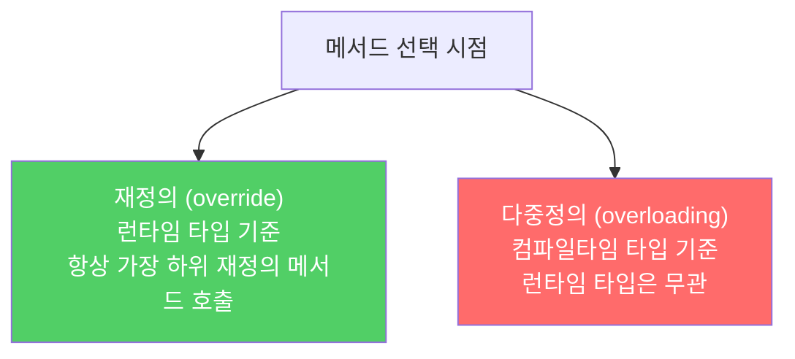
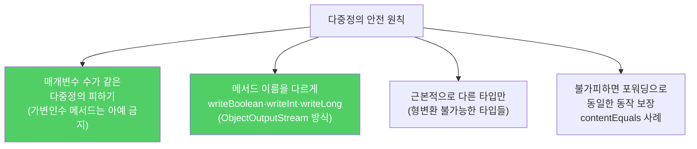

재정의(override)는 런타임 타입으로 메서드가 선택되지만, 다중정의(overloading)는 컴파일타임 타입으로 선택됩니다. 이 차이를 모르면 직관과 어긋나는 버그가 생깁니다.

---

## 1. 다중정의 — 컴파일타임에 결정된다

비유하자면 **계약서를 쓸 때 직책이 아니라 그날 입고 온 옷으로 담당자를 결정하는 것**입니다. 런타임에 누가 오든 상관없이 처음 서명 시점의 외모로만 판단합니다.

```java
// 컬렉션 분류기 — 예상대로 동작하지 않음
public class CollectionClassifier {
    public static String classify(Set<?> s)        { return "집합"; }
    public static String classify(List<?> lst)     { return "리스트"; }
    public static String classify(Collection<?> c) { return "그 외"; }

    public static void main(String[] args) {
        Collection<?>[] collections = {
            new HashSet<String>(),
            new ArrayList<BigInteger>(),
            new HashMap<String, Integer>().values()
        };
        for (Collection<?> c : collections)
            System.out.println(classify(c));  // "그 외" "그 외" "그 외" 출력!
    }
}
```

for 문의 컴파일타임 타입은 항상 `Collection<?>`이므로 세 번째 메서드만 호출됩니다. 런타임 타입은 선택에 영향을 주지 않습니다.

**해결:** 다중정의 대신 instanceof로 명시적 분기

```java
public static String classify(Collection<?> c) {
    return c instanceof Set  ? "집합"   :
           c instanceof List ? "리스트" : "그 외";
}
```

---

## 2. 재정의 vs 다중정의


```mermaid
graph TD
    A["메서드 선택 시점"] --> B["재정의 (override)\n런타임 타입 기준\n항상 가장 하위 재정의 메서드 호출"]
    A --> C["다중정의 (overloading)\n컴파일타임 타입 기준\n런타임 타입은 무관"]
    style B fill:#51cf66,color:#fff
    style C fill:#ff6b6b,color:#fff
```

```java
// 재정의 — 예상대로 동작
for (Wine wine : List.of(new Wine(), new SparklingWine(), new Champagne()))
    System.out.println(wine.name());
// "포도주" "발포성 포도주" "샴페인" — 런타임 타입 기준으로 올바르게 선택
```

---

## 3. 오토박싱과 다중정의 — List.remove 함정

```java
Set<Integer> set   = new TreeSet<>();
List<Integer> list = new ArrayList<>();

for (int i = -3; i < 3; i++) { set.add(i); list.add(i); }

for (int i = 0; i < 3; i++) {
    set.remove(i);    // remove(Object) — 값 0, 1, 2를 제거
    list.remove(i);   // remove(int index) — 0번, 1번, 2번 인덱스를 제거!
}
// 기대: [-3,-2,-1] [-3,-2,-1]
// 실제: [-3,-2,-1] [-2, 0, 2]
```

`List`는 `remove(Object)`와 `remove(int index)`를 다중정의합니다. 오토박싱 이전에는 `int`와 `Integer`가 근본적으로 달라 혼란이 없었지만, 오토박싱 도입 후 혼란이 생겼습니다.

**해결:** 명시적 형변환

```java
list.remove((Integer) i);  // 또는 list.remove(Integer.valueOf(i));
```

---

## 4. 람다·메서드 참조와 다중정의

```java
// 1번 — 컴파일 성공
new Thread(System.out::println).start();

// 2번 — 컴파일 오류
ExecutorService exec = Executors.newCachedThreadPool();
exec.submit(System.out::println);  // Callable<T>와 Runnable 모두 다중정의됨
```

`Thread` 생성자는 `Runnable`만 받지만, `ExecutorService.submit`은 `Callable<T>`와 `Runnable`을 다중정의합니다. `println`도 다중정의되어 있어 다중정의 해소 알고리즘이 의미를 결정하지 못합니다.

**규칙: 서로 다른 함수형 인터페이스라도 같은 위치의 인수로 받는 다중정의는 하지 마세요.**

---

## 5. 안전하게 다중정의하는 방법


```mermaid
graph TD
    A["다중정의 안전 원칙"] --> B["매개변수 수가 같은\n다중정의 피하기\n(가변인수 메서드는 아예 금지)"]
    A --> C["메서드 이름을 다르게\nwriteBoolean·writeInt·writeLong\n(ObjectOutputStream 방식)"]
    A --> D["근본적으로 다른 타입만\n(형변환 불가능한 타입들)"]
    A --> E["불가피하면 포워딩으로\n동일한 동작 보장\ncontentEquals 사례"]
    style B fill:#51cf66,color:#fff
    style C fill:#51cf66,color:#fff
```

어떤 다중정의 메서드가 호출되든 동일하게 동작한다면 혼란이 없습니다. 특수한 다중정의에서 덜 특수한 다중정의로 포워딩하는 방식이 일반적입니다.

```java
// 포워딩으로 동일 동작 보장
public boolean contentEquals(StringBuffer sb) {
    return contentEquals((CharSequence) sb);  // 더 일반적인 메서드로 위임
}
```

---

## 6. 요약

> 일반적으로 매개변수 수가 같을 때는 다중정의를 피하세요. 불가능하다면 헷갈릴 만한 매개변수는 형변환하여 정확한 메서드가 선택되도록 해야 합니다. 같은 객체를 입력받는 다중정의 메서드들이 모두 동일하게 동작하도록 만드세요.

---

> 참조: 이펙티브 자바 3/E — 조슈아 블로크
