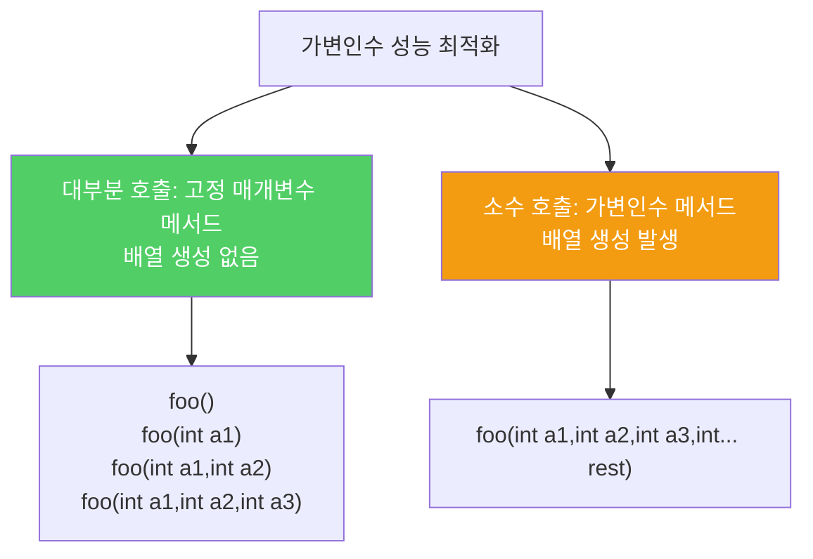

가변인수는 인수 개수가 정해지지 않은 메서드에 유용하지만, 호출할 때마다 배열이 생성되므로 성능 민감한 상황에서는 주의가 필요합니다.

---

## 1. 기본 사용 — 0개 이상

비유하자면 **"몇 명이든 환영합니다" 표지판이 붙은 식당**입니다. 가변인수 메서드를 호출하면 인수 개수만큼의 배열이 자동으로 만들어져 메서드에 전달됩니다.

```java
// 인수 0개 이상을 받아 합산
static int sum(int... args) {
    int sum = 0;
    for (int arg : args) sum += arg;
    return sum;
}

sum(1, 2, 3)  // 6
sum()         // 0
```

---

## 2. 1개 이상 필요할 때 — 잘못된 방법과 올바른 방법

```java
// 잘못된 방법 — 런타임에 실패
static int min(int... args) {
    if (args.length == 0)
        throw new IllegalArgumentException("인수가 1개 이상 필요합니다");
    int min = args[0];
    for (int i = 1; i < args.length; i++)
        if (args[i] < min) min = args[i];
    return min;
}
// min() 호출 시 런타임에서야 오류 발견
```

```java
// 올바른 방법 — 필수 매개변수를 앞에 두기
static int min(int firstArg, int... remainingArgs) {
    int min = firstArg;
    for (int arg : remainingArgs)
        if (arg < min) min = arg;
    return min;
}
// min() 호출 시 컴파일 오류 — 즉시 발견
```

필수 매개변수를 가변인수 앞에 두면 컴파일 시점에 인수 부족을 잡아낼 수 있습니다.

---

## 3. 성능 최적화 패턴

비유하자면 **95%는 소형 트럭으로, 5%만 대형 트럭으로 처리하는 물류 시스템**입니다. 가변인수 메서드는 호출할 때마다 배열을 생성하므로, 대부분의 호출이 적은 인수를 쓴다면 다중정의를 활용해 배열 생성 비용을 줄일 수 있습니다.

```java
// 95%가 인수 3개 이하라고 가정할 때
public void foo() {}
public void foo(int a1) {}
public void foo(int a1, int a2) {}
public void foo(int a1, int a2, int a3) {}
public void foo(int a1, int a2, int a3, int... rest) {}
// 배열이 생성되는 호출은 전체의 5%뿐
```

`EnumSet.of`가 이 기법을 사용합니다. 비트 필드를 대체하면서 성능까지 유지해야 하므로 가장 적절한 활용 예입니다.



---

## 4. 요약

> 인수 개수가 일정하지 않은 메서드를 정의해야 한다면 가변인수가 반드시 필요합니다. 필수 매개변수는 가변인수 앞에 두고, 성능 문제도 고려하세요.

---

> 참조: 이펙티브 자바 3/E — 조슈아 블로크
