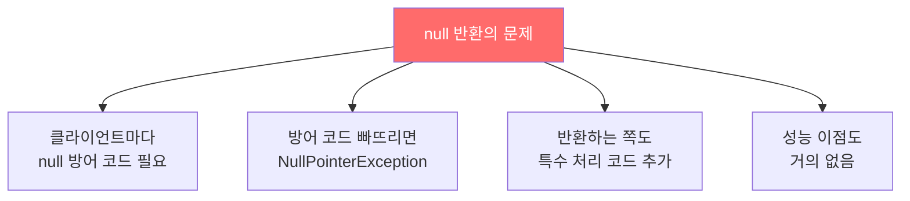

컬렉션이나 배열이 비었을 때 null을 반환하는 습관은 클라이언트 코드를 복잡하게 만들고 오류를 유발합니다. 빈 컬렉션이나 배열을 반환하세요.

---

## 1. null 반환 — 클라이언트에게 짐을 떠넘기는 것

비유하자면 **빈 그릇 대신 "그릇 없음"이라는 메모를 건네는 것**입니다. 받는 쪽은 매번 "메모인지 그릇인지" 확인해야 합니다.

```java
// 나쁜 예 — null 반환
public List<Cheese> getCheeses() {
    return cheesesInStock.isEmpty() ? null
        : new ArrayList<>(cheesesInStock);
}

// 클라이언트 — null 방어 코드 강제
List<Cheese> cheeses = shop.getCheeses();
if (cheeses != null && cheeses.contains(Cheese.STILTON)) {
    System.out.println("좋았어, 바로 그거야.");
}
// null 체크를 빠뜨리면 NullPointerException 발생
```



---

## 2. 올바른 방법 — 빈 컬렉션 반환

```java
// 대부분의 상황 — 그냥 반환
public List<Cheese> getCheeses() {
    return new ArrayList<>(cheesesInStock);
    // 비어있으면 빈 ArrayList 반환 — null 없음
}
```

빈 컬렉션 할당이 성능 문제가 된다면 불변 빈 컬렉션을 재사용하면 됩니다.

```java
// 성능 최적화 버전 — 빈 불변 컬렉션 재사용
public List<Cheese> getCheeses() {
    return cheesesInStock.isEmpty() ? Collections.emptyList()
        : new ArrayList<>(cheesesInStock);
}
// Collections.emptySet(), Collections.emptyMap()도 동일 방식
```

단, 이 최적화는 실제로 성능 저하가 측정되었을 때만 적용하세요.

---

## 3. 배열도 마찬가지

```java
// 올바른 방법 — 길이 0인 배열도 괜찮음
public Cheese[] getCheeses() {
    return cheesesInStock.toArray(new Cheese[0]);
}

// 성능 최적화 — 길이 0 배열을 상수로 미리 선언
private static final Cheese[] EMPTY_CHEESE_ARRAY = new Cheese[0];

public Cheese[] getCheeses() {
    return cheesesInStock.toArray(EMPTY_CHEESE_ARRAY);
    // 비어있으면 EMPTY_CHEESE_ARRAY 자체를 반환
}
```

주의: `toArray`에 건네는 배열을 미리 원소 수만큼 할당하는 것은 성능에 오히려 해롭습니다.

```java
// 나쁜 예 — 미리 할당하면 오히려 성능 저하
return cheesesInStock.toArray(new Cheese[cheesesInStock.size()]);
```

---

## 4. 요약

> null이 아닌 빈 배열이나 컬렉션을 반환하세요. null을 반환하는 API는 사용하기 어렵고 오류 처리 코드도 늘어납니다. 성능이 좋지도 않습니다.

---

> 참조: 이펙티브 자바 3/E — 조슈아 블로크
