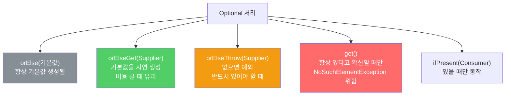
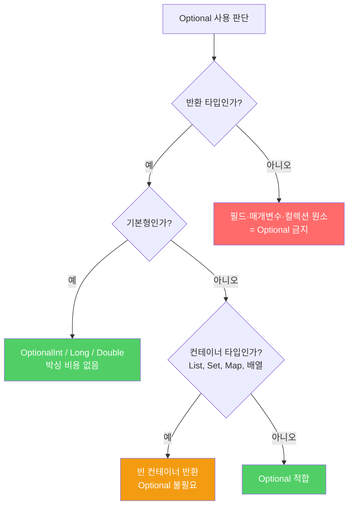

값이 없을 수도 있는 메서드를 설계할 때, Java 8 이전에는 null 반환이나 예외 던지기밖에 방법이 없었습니다. Optional은 세 번째 선택지를 제공하지만, 잘못 쓰면 오히려 더 큰 혼란을 만듭니다.

---

## 1. Optional이 없던 시절 — 두 가지 나쁜 선택

비유하자면 **"오늘 특선 메뉴 있어요?" 물었을 때 "없으면 그냥 빈 접시 드릴게요(null)"거나 "없으면 소리 지를게요(예외)"라고 답하는 것**입니다. 둘 다 손님 입장에선 당황스럽습니다.

```java
// 방법 1 — null 반환 (클라이언트가 null 체크를 빠뜨리면 NPE)
public static <E extends Comparable<E>> E max(Collection<E> c) {
    if (c.isEmpty()) return null;
    E result = null;
    for (E e : c) if (result == null || e.compareTo(result) > 0) result = e;
    return result;
}

// 방법 2 — 예외 던지기 (빈 컬렉션은 예외적 상황이 아닌데 억지로 예외를 씀)
public static <E extends Comparable<E>> E max(Collection<E> c) {
    if (c.isEmpty())
        throw new IllegalArgumentException("빈 컬렉션");
    E result = null;
    for (E e : c) if (result == null || e.compareTo(result) > 0) result = e;
    return result;
}
```

---

## 2. Optional로 해결 — 세 번째 선택지

비유하자면 **"특선 메뉴가 있으면 드리고, 없으면 '없음 쪽지'를 드리는 것"**입니다. 쪽지를 받은 손님은 자신이 원하는 방식으로 처리할 수 있습니다.

```java
// Optional 반환 — 빈 경우와 값이 있는 경우를 명확히 표현
public static <E extends Comparable<E>> Optional<E> max(Collection<E> c) {
    if (c.isEmpty()) return Optional.empty();
    E result = null;
    for (E e : c) if (result == null || e.compareTo(result) > 0) result = Objects.requireNonNull(e);
    return Optional.of(result);
}

// 스트림을 쓴다면 한 줄로
public static <E extends Comparable<E>> Optional<E> max(Collection<E> c) {
    return c.stream().max(Comparator.naturalOrder());
}
```

`Optional.of(value)`에 null을 넣으면 즉시 `NullPointerException`이 납니다. null이 들어올 수 있다면 `Optional.ofNullable(value)`를 쓰세요. 옵셔널을 반환하는 메서드에서 null을 직접 반환하는 것은 옵셔널의 취지를 완전히 무시하는 행위입니다.

---

## 3. Optional을 받았을 때 — 다섯 가지 활용법

비유하자면 **쪽지를 받은 손님이 선택할 수 있는 행동**입니다. 기본 메뉴로 바꾸거나, 떠나거나, 직접 요리하거나.

```java
Optional<String> opt = findUserName(id);

// 1. 기본값 제공 — 항상 기본값 객체가 생성됨
String name = opt.orElse("이름 없음");

// 2. 기본값을 생성하는 비용이 클 때 — Supplier로 지연 평가
String name = opt.orElseGet(() -> computeExpensiveDefault());

// 3. 없으면 예외 (예외 팩터리를 건네므로 실제 예외 발생 전까지 비용 없음)
String name = opt.orElseThrow(IllegalStateException::new);

// 4. 항상 값이 있다고 확신할 때 — 잘못 판단하면 NoSuchElementException
String name = opt.get();

// 5. 있을 때만 동작 실행
opt.ifPresent(n -> System.out.println("안녕하세요, " + n));
```



---

## 4. isPresent + get 조합은 피하라

비유하자면 **선물 상자를 받아 "상자가 있나요?"만 확인하고 절대 열지 않는 것**입니다. isPresent + get 조합은 null 체크와 다를 바 없습니다.

```java
// 나쁜 예 — isPresent + get 조합 (null 검사와 다를 바 없음)
Optional<ProcessHandle> parentProcess = ph.parent();
System.out.println("부모 PID: " + (parentProcess.isPresent()
    ? String.valueOf(parentProcess.get().pid())
    : "N/A"));

// 좋은 예 — map + orElse로 간결하게
System.out.println("부모 PID: " + ph.parent()
    .map(h -> String.valueOf(h.pid()))
    .orElse("N/A"));
```

---

## 5. Java 9 — Optional.stream()

비유하자면 **쪽지들을 펼쳐서 실제 내용이 있는 것만 골라 줄 세우는 것**입니다.

```java
// Java 8 — filter + map 으로 번거롭게 처리
streamOfOptionals
    .filter(Optional::isPresent)
    .map(Optional::get)

// Java 9 — flatMap(Optional::stream) 으로 간결하게
// 값이 있으면 단일 원소 스트림, empty면 빈 스트림으로 변환
streamOfOptionals
    .flatMap(Optional::stream)
```

---

## 6. Optional을 쓰면 안 되는 곳

비유하자면 **배달 박스 안에 또 다른 배달 박스를 넣는 것**입니다. 박스가 두 겹이라 열기만 더 힘들어집니다.

```java
// 나쁜 예 1 — 컨테이너 타입을 Optional로 감싸기
Optional<List<User>> users = findUsers();  // 그냥 빈 리스트를 반환하면 된다

// 나쁜 예 2 — Map의 값으로 Optional 사용
Map<String, Optional<Integer>> scores;
// Map.get()은 이미 null을 반환함 — 키 없음을 나타내는 방법이 두 가지가 되어 혼란

// 나쁜 예 3 — 컬렉션 원소나 배열 원소로 Optional 사용
List<Optional<String>> names;             // 필요 없이 복잡해짐

// 나쁜 예 4 — 성능 민감한 기본형을 Optional<Integer>로 감싸기
Optional<Integer> count;  // 값을 두 겹으로 감싸므로 전용 타입을 쓸 것
```

기본형 전용 Optional을 사용하면 박싱 비용이 없습니다.

```java
OptionalInt    count   = OptionalInt.of(42);
OptionalLong   total   = OptionalLong.of(1_000_000L);
OptionalDouble average = OptionalDouble.of(3.14);
```



---

## 7. 요약

> 값을 반환하지 못할 수도 있는 메서드는 Optional을 반환하세요. 단, 성능이 중요한 상황에서는 null 반환이나 예외 던지기가 나을 수 있으며, 컨테이너 타입·기본형·컬렉션 원소·Map 키/값으로는 Optional을 쓰지 마세요.

---

> 참조: 이펙티브 자바 3/E — 조슈아 블로크
