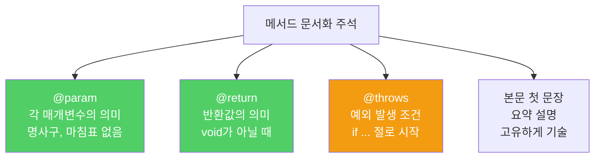
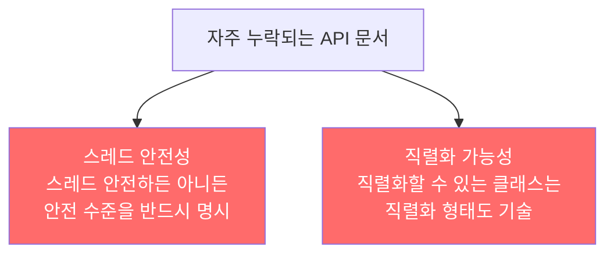

API를 쓸모 있게 하려면 잘 작성된 문서도 곁들여야 합니다. 코드만큼이나 문서도 설계의 일부입니다. 자바독(Javadoc)은 소스 코드 안의 특수 주석을 HTML API 문서로 자동 변환해줍니다.

---

## 1. 문서화 주석의 기본 원칙

비유하자면 **식당 메뉴판**입니다. 요리사가 재료와 조리법을 알더라도, 메뉴판에 설명이 없으면 손님은 뭘 주문해야 할지 모릅니다. 공개 API는 반드시 문서화 주석을 달아야 합니다.

공개된 모든 클래스, 인터페이스, 메서드, 필드 선언에 문서화 주석을 달아야 합니다. 직렬화할 수 있는 클래스라면 직렬화 형태도 적어야 합니다. 기본 생성자는 주석을 달 방법이 없으므로, 공개 클래스는 기본 생성자를 사용하면 안 됩니다.

---

## 2. @param, @return, @throws — 계약을 명시하라

비유하자면 **부동산 계약서**입니다. 임차인(클라이언트)이 지켜야 할 전제조건, 집주인(메서드)이 보장하는 사후조건을 빠짐없이 적는 것입니다.

```java
/**
 * 이 리스트에서 지정한 위치의 원소를 반환한다.
 *
 * <p>이 메서드는 상수 시간에 수행됨을 보장하지 <i>않는다</i>. 구현에 따라
 * 원소의 위치에 비례해 시간이 걸릴 수도 있다.
 *
 * @param  index 반환할 원소의 인덱스; 0 이상이고 리스트 크기보다 작아야 한다
 * @return 이 리스트에서 지정한 위치의 원소
 * @throws IndexOutOfBoundsException {@code index < 0 || index >= this.size()}이면
 */
E get(int index);
```

규칙을 정리하면 다음과 같습니다.

- `@param`: 매개변수가 뜻하는 값을 명사구로 설명 (마침표 없음)
- `@return`: 반환값을 명사구로 설명. 메서드 설명과 같을 때는 생략 가능
- `@throws`: `if`로 시작하여 예외를 던지는 조건을 설명 (마침표 없음)
- 비검사 예외는 `@throws`로 전제조건을 암시적으로 기술



---

## 3. {@code}와 {@literal} — 특수문자 처리

비유하자면 **법률 문서에서 특정 용어를 따옴표로 강조하는 것**입니다. 코드처럼 보이게 하거나, HTML 메타문자가 문서에서 깨지지 않도록 보호합니다.

```java
// {@code} — 코드 폰트로 렌더링 + HTML 태그 무시
@throws IndexOutOfBoundsException {@code index < 0 || index >= this.size()}이면

// 여러 줄 코드 예시 — <pre>{@code ... }</pre>
/**
 * <pre>{@code
 * List<String> list = new ArrayList<>();
 * list.add("hello");
 * }</pre>
 */

// {@literal} — HTML 메타문자 보호 (코드 폰트 아님)
// {@code |r| < 1}이면 기하 수열이 수렴한다.

// 요약 설명의 마침표 문제 해결
/**
 * 머스타드 대령이나 {@literal Mrs. 피콕} 같은 용의자.
 */
```

요약 설명이 끝나는 기준은 `{마침표}{공백}{대문자로 시작하는 단어}` 패턴입니다. "Mrs. 피콕"처럼 이름 중간에 마침표가 있으면 `{@literal}`로 감싸야 요약 설명이 잘리지 않습니다.

---

## 4. @implSpec — 상속 계약을 따로 명시하라

비유하자면 **프랜차이즈 가맹점 운영 매뉴얼**입니다. 고객(클라이언트)용 안내와, 가맹점주(하위 클래스 개발자)용 지침은 다릅니다.

```java
/**
 * 이 컬렉션이 비었다면 true를 반환한다.
 *
 * @implSpec
 * 이 구현은 {@code this.size() == 0}의 결과를 반환한다.
 *
 * @return 이 컬렉션이 비었다면 true, 그렇지 않으면 false
 */
public boolean isEmpty() { ... }
```

`@implSpec`은 하위 클래스 개발자에게 "이 메서드를 재정의하거나 super로 호출할 때 어떻게 동작하는지"를 알려주는 계약입니다. 일반 주석이 클라이언트와의 계약이라면, `@implSpec`은 상속 계약입니다.

---

## 5. 요약 설명 규칙

비유하자면 **신문 헤드라인**입니다. 첫 문장만 읽어도 무슨 내용인지 알 수 있어야 합니다.

```java
// 메서드·생성자 — 동사구 (주어 없이)
// ArrayList(int initialCapacity): Constructs an empty list with the specified initial capacity.
// Collection.size(): Returns the number of elements in this collection.

// 클래스·인터페이스·필드 — 명사절
// Instant: 타임라인상의 특정 순간(지점)
// Math.PI: 원주율(pi)에 가장 가까운 double 값
```

같은 클래스 안에서 요약 설명이 똑같은 멤버가 둘 이상이면 안 됩니다. 특히 다중정의된 메서드에서 주의하세요.

---

## 6. 제네릭, 열거 타입, 애너테이션 문서화

비유하자면 **세트 메뉴 구성품 하나하나에도 설명을 붙이는 것**입니다. 전체 설명만 있고 구성 요소 설명이 없으면 불완전합니다.

```java
// 제네릭 — 타입 매개변수에 @param 태그 필요
/**
 * 키와 값을 매핑하는 객체. 맵은 키를 중복해서 가질 수 없다.
 *
 * @param <K> 이 맵이 관리하는 키의 타입
 * @param <V> 매핑된 값의 타입
 */
public interface Map<K, V> { ... }

// 열거 타입 — 상수 하나하나에 주석
/**
 * 심포니 오케스트라의 악기 세션.
 */
public enum OrchestraSection {
    /** 플루트, 클라리넷, 오보에 같은 목관악기. */
    WOODWIND,
    /** 프렌치 호른, 트럼펫 같은 금관악기. */
    BRASS,
    /** 탐파니, 심벌즈 같은 타악기. */
    PERCUSSION,
    /** 바이올린, 첼로 같은 현악기. */
    STRING;
}

// 애너테이션 타입 — 멤버 하나하나에 주석
/**
 * 이 애너테이션이 달린 메서드는 명시한 예외를 던져야만 성공하는
 * 테스트 메서드임을 나타낸다.
 */
@Retention(RetentionPolicy.RUNTIME)
@Target(ElementType.METHOD)
public @interface ExceptionTest {
    /**
     * 이 테스트 메서드가 성공하려면 던져야 하는 예외.
     * (이 클래스의 하위 타입 예외는 모두 허용된다.)
     */
    Class<? extends Throwable> value();
}
```

---

## 7. 반드시 문서화해야 하는 두 가지

비유하자면 **식품 알레르기 성분 표시**입니다. 법적 의무는 아니더라도, 모르면 사고가 납니다.



---

## 8. 만약 문서화를 소홀히 한다면?

비유하자면 **설명서 없는 가전제품**입니다. 사용자가 임의로 작동시키다 고장을 냅니다.

- 잘못된 매개변수로 호출 → 예상치 못한 예외 발생
- 스레드 안전 여부 모름 → 동시성 버그
- 전제조건 모름 → NPE나 IllegalStateException
- 계약 불명확 → 하위 클래스가 잘못 재정의

---

## 9. 요약

> 공개 API라면 빠짐없이 문서화 주석을 달아야 합니다. 메서드는 @param, @return, @throws로 계약을 명시하고, 상속용 메서드는 @implSpec으로 구현 계약을 추가하세요. 스레드 안전성과 직렬화 형태는 반드시 문서화해야 합니다.

---

> 참조: 이펙티브 자바 3/E — 조슈아 블로크
