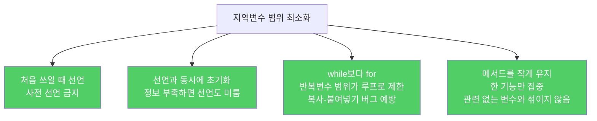

지역변수의 범위를 줄이면 코드 가독성이 높아지고, 오류를 예방할 수 있습니다. 가장 강력한 기법은 처음 쓰일 때 선언하는 것입니다.

---

## 1. 미리 선언하면 생기는 문제

비유하자면 **주방에서 쓸 도구를 아침에 일어나자마자 식탁에 다 꺼내 놓는 것**입니다. 요리 전부터 식탁이 어지럽고, 정작 필요할 때 뭘 꺼냈는지 기억도 안 납니다.

```java
// 나쁜 예 — 아직 쓰지도 않을 변수를 미리 선언
String result;           // 아직 쓰이지 않음
int count;               // 나중에 쓰임
doSomeOtherWork();       // 한참 뒤...
result = compute();      // 이제서야 씀
count = result.length(); // 변수 타입과 초깃값이 기억나지 않을 수 있음

// 좋은 예 — 처음 쓰는 시점에 선언과 동시에 초기화
doSomeOtherWork();
String result = compute();
int count = result.length();
```

변수는 선언된 지점부터 그 블록이 끝날 때까지 살아있습니다. 실제 사용 블록 바깥에 선언하면 범위 밖에서 실수로 접근할 위험이 생깁니다.

---

## 2. 선언과 동시에 초기화하라

비유하자면 **배달 음식을 시키면서 동시에 테이블을 차리는 것**입니다. 음식이 도착할 때 바로 먹을 수 있도록 준비합니다.

```java
// 초기화 식이 예외를 던질 수 있는 경우 — try 블록 안에서 초기화
// try 바깥에서도 쓰인다면 try 앞에서 선언 (정확한 초기화는 try 안에서)
Connection conn = null;  // try 블록 밖에서도 finally에서 쓰여야 함
try {
    conn = DriverManager.getConnection(url);
    // conn 사용
} finally {
    if (conn != null) conn.close();
}
```

---

## 3. while보다 for문이 나은 이유

비유하자면 **업무 폴더를 파일 하나 처리할 때마다 자동으로 닫아주는 것**입니다. 처리가 끝나면 폴더도 사라지므로, 다른 파일을 처리할 때 이전 폴더를 실수로 열 수 없습니다.

```java
// while 문의 함정 — 복사-붙여넣기 버그
Iterator<Element> i = c.iterator();
while (i.hasNext()) {
    doSomething(i.next());
}

Iterator<Element> i2 = c2.iterator();
while (i.hasNext()) {          // 버그! i2가 아니라 i를 씀
    doSomethingElse(i2.next()); // i는 이미 끝났으므로 루프 즉시 종료
}
// 컴파일 오류 없음 — 조용히 c2를 순회하지 않음
```

```java
// for문 — 첫 번째 루프의 i는 두 번째 루프에서 보이지 않음
for (Iterator<Element> i = c.iterator(); i.hasNext(); ) {
    Element e = i.next();
    // e와 i 사용
}

for (Iterator<Element> i2 = c2.iterator(); i.hasNext(); ) {  // 컴파일 오류!
    // i는 이미 범위 밖 — 즉시 발견
}
```



---

## 4. for 관용구 두 가지

```java
// 컬렉션 순회 — for-each 권장
for (Element e : c) {
    // e 사용
}

// 반복자가 필요할 때 (remove 등)
for (Iterator<Element> i = c.iterator(); i.hasNext(); ) {
    Element e = i.next();
    // e와 i 사용
}

// 루프 한계값을 미리 계산해 변수에 저장 — 반복마다 재계산 방지
for (int i = 0, n = expensiveComputation(); i < n; i++) {
    // i 사용
}
```

마지막 관용구에서 `n`은 `i`와 범위가 정확히 일치하므로, 루프 밖에서 실수로 `n`을 쓸 수 없습니다.

---

## 5. 메서드를 작게 유지하라

비유하자면 **주방, 홀, 계산대를 한 사람이 동시에 담당하는 것**입니다. 업무가 뒤섞이면 주방 변수(재료 상태)가 계산대 코드에서 보이게 됩니다.

한 메서드에서 여러 기능을 처리하면, 기능 A와 관련된 지역변수가 기능 B 코드에서도 접근 가능한 범위에 있게 됩니다. 해결책은 메서드를 기능별로 쪼개는 것입니다.

---

## 6. 요약

> 지역변수는 처음 쓰일 때 선언하고, 선언과 동시에 초기화하세요. 반복문은 while보다 for를 쓰고, 루프 한계값은 변수에 저장해 재계산을 피하세요. 메서드를 작게 유지하면 지역변수 범위도 자연스럽게 최소화됩니다.

---

> 참조: 이펙티브 자바 3/E — 조슈아 블로크
