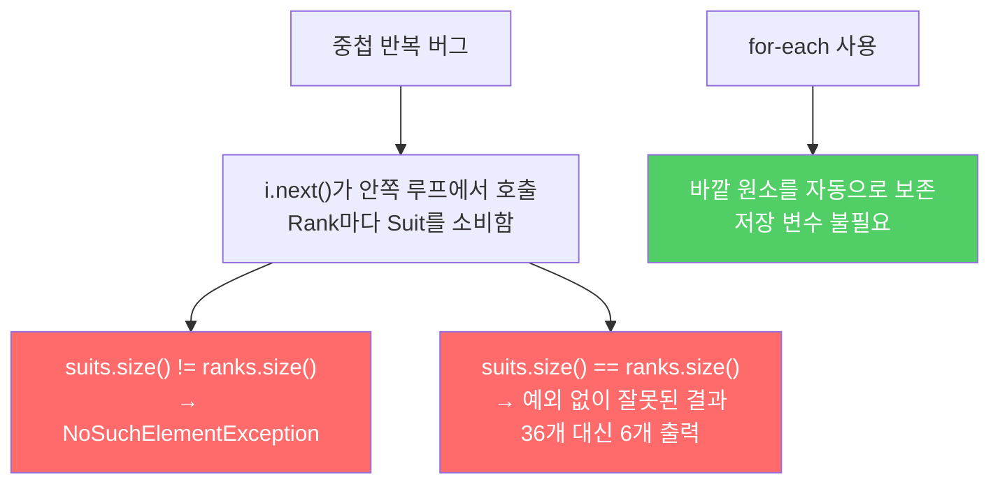

전통적인 for 문은 반복자나 인덱스 변수를 다루느라 코드가 지저분해지고 실수할 여지도 많습니다. for-each 문은 이 모든 문제를 깔끔하게 해결합니다.

---

## 1. 전통적인 for 문의 문제

비유하자면 **도서관에서 책을 찾으러 갈 때 서가 번호, 층수, 열 번호를 모두 직접 관리하는 것**입니다. 진짜 필요한 건 책인데, 관리해야 할 변수가 너무 많습니다.

```java
// 컬렉션 순회 — 반복자가 세 번 등장
for (Iterator<Element> i = c.iterator(); i.hasNext(); ) {
    Element e = i.next();
    // e 사용
}

// 배열 순회 — 인덱스가 네 번 등장
for (int i = 0; i < a.length; i++) {
    // a[i] 사용
}
```

반복자나 인덱스 변수를 잘못 쓰더라도 컴파일러가 잡아주리라는 보장이 없습니다. 컬렉션이냐 배열이냐에 따라 코드 형태도 달라집니다.

---

## 2. for-each 문으로 해결

비유하자면 **사서가 책을 하나씩 직접 꺼내서 건네주는 것**입니다. 서가 위치 같은 내부 사정은 신경 쓰지 않아도 됩니다.

```java
// 컬렉션이든 배열이든 같은 형태로 순회
for (Element e : elements) {
    // e 사용
}
```

for-each 문이 만들어내는 바이트코드는 손으로 최적화한 전통적인 for 문과 사실상 동일합니다. 성능 손실 없이 가독성만 높아집니다.

---

## 3. 중첩 반복에서 더욱 빛나는 for-each

비유하자면 **카드 덱을 만들 때 "무늬마다 숫자를 모두 조합"하는 작업**입니다. 반복자를 직접 쓰면 실수할 여지가 커집니다.

```java
// 잘못된 코드 — i.next()가 안쪽 루프에서 호출되어 너무 많이 소비됨
for (Iterator<Suit> i = suits.iterator(); i.hasNext(); ) {
    for (Iterator<Rank> j = ranks.iterator(); j.hasNext(); ) {
        deck.add(new Card(i.next(), j.next()));  // i.next()가 Rank마다 한 번씩 호출!
    }
}
// 결과: suits 원소가 바닥나면 NoSuchElementException 발생
// 운 나쁘면 예외도 없이 잘못된 결과 (suits.size() == ranks.size()인 경우)
```

```java
// 임시방편 수정 — suit 변수를 바깥 루프에서 저장
for (Iterator<Suit> i = suits.iterator(); i.hasNext(); ) {
    Suit suit = i.next();  // 저장
    for (Iterator<Rank> j = ranks.iterator(); j.hasNext(); ) {
        deck.add(new Card(suit, j.next()));
    }
}

// for-each — 처음부터 올바르고 간결
for (Suit suit : suits) {
    for (Rank rank : ranks) {
        deck.add(new Card(suit, rank));
    }
}
```



---

## 4. for-each를 쓸 수 없는 세 가지 상황

비유하자면 **사서가 책을 건네는 도중 책을 제거하거나, 내용을 수정하거나, 두 서가를 동시에 봐야 하는 경우**입니다. 이럴 때는 직접 관리해야 합니다.

```java
// 1. 파괴적인 필터링 — 순회 중 원소 제거
// Java 8+ : removeIf 사용
list.removeIf(e -> e.isExpired());
// 또는 반복자의 remove() 직접 사용

// 2. 변형 — 순회 중 원소 값 교체
for (int i = 0; i < list.size(); i++) {
    list.set(i, transform(list.get(i)));
}

// 3. 병렬 반복 — 두 컬렉션을 같은 위치씩 동시에 순회
for (Iterator<A> ia = as.iterator(), Iterator<B> ib = bs.iterator();
     ia.hasNext() && ib.hasNext(); ) {
    process(ia.next(), ib.next());
}
```

---

## 5. Iterable을 구현한 타입이라면 모두 for-each 가능

비유하자면 **"순서대로 꺼낼 수 있는 것"이면 무엇이든 for-each로 순회할 수 있는 것**입니다.

```java
public interface Iterable<E> {
    Iterator<E> iterator();  // 메서드 하나뿐인 인터페이스
}
```

원소들의 묶음을 표현하는 타입을 작성한다면 `Collection`을 구현하지 않더라도 `Iterable`만 구현해두면 for-each를 지원할 수 있습니다.

---

## 6. 요약

> for-each 문은 전통적인 for 문보다 명료하고, 유연하고, 버그를 예방하며 성능 저하도 없습니다. 가능한 모든 곳에서 for-each를 사용하되, 파괴적 필터링·변형·병렬 반복의 세 경우에만 전통적인 for 문을 쓰세요.

---

> 참조: 이펙티브 자바 3/E — 조슈아 블로크
