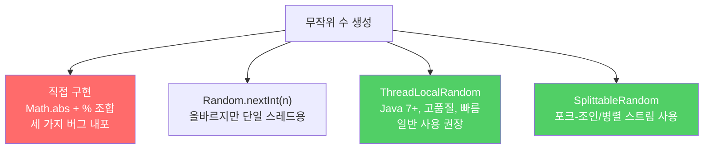

표준 라이브러리를 쓰면 전문가의 지식과 수백만 개발자의 경험을 공짜로 얻을 수 있습니다. 이미 있는 바퀴를 다시 발명하지 마세요.

---

## 1. 직접 구현의 함정 — 무작위 수 생성 예시

비유하자면 **전화기를 직접 만들어 쓰려는 것**입니다. 만들 수는 있지만, 전문가가 수십 년간 다듬은 제품보다 나을 수 없고 버그만 잔뜩 생깁니다.

```java
// 흔하지만 문제가 많은 직접 구현
static Random rnd = new Random();

static int random(int n) {
    return Math.abs(rnd.nextInt()) % n;
}
```

이 코드에는 세 가지 결함이 있습니다.

1. n이 2의 제곱수이면 얼마 지나지 않아 같은 수열이 반복됩니다.
2. n이 2의 제곱수가 아니면 일부 숫자가 더 자주 반환됩니다.
3. `rnd.nextInt()`가 `Integer.MIN_VALUE`를 반환하면 `Math.abs`도 음수를 반환하고, `%` 연산 결과도 음수가 됩니다.

```java
// 검증 — 중간값보다 낮은 쪽이 2/3에 가깝게 나옴
public static void main(String[] args) {
    int n = 2 * (Integer.MAX_VALUE / 3);
    int low = 0;
    for (int i = 0; i < 1_000_000; i++) {
        if (random(n) < n / 2) low++;
    }
    System.out.println(low);  // 약 666,666 출력 (이상적이면 500,000이어야 함)
}
```

---

## 2. 해결책은 이미 있다

비유하자면 **이미 공인된 저울을 쓰는 것**입니다. 알고리즘 전문가가 설계하고 수백만 명이 검증한 라이브러리를 쓰면 됩니다.

```java
// 올바른 방법 — Random.nextInt(int) 사용
int result = ThreadLocalRandom.current().nextInt(n);

// Java 7+ : ThreadLocalRandom이 Random보다 고품질, 빠름
// 포크-조인 풀 / 병렬 스트림에서는 SplittableRandom 사용
```



---

## 3. 표준 라이브러리를 쓰는 다섯 가지 이점

비유하자면 **직접 도로를 닦는 대신 기존 고속도로를 이용하는 것**입니다. 도로를 만드는 데 시간을 쓰지 않고 목적지에 집중할 수 있습니다.

1. **전문가의 지식**: 알고리즘 전문가가 설계하고 검증한 코드를 활용합니다.
2. **핵심 집중**: 애플리케이션 기능 개발에 집중하고, 하부 공사에 시간을 쓰지 않습니다.
3. **지속적 성능 개선**: 라이브러리는 릴리스마다 최적화됩니다. 내 코드는 자동으로 혜택을 받습니다.
4. **기능 추가**: 부족한 기능은 커뮤니티에서 논의되고 다음 릴리스에 추가됩니다.
5. **가독성**: 라이브러리 코드는 다른 개발자에게 낯익어 유지보수가 쉽습니다.

```java
// Java 9 InputStream.transferTo — 예전에는 직접 구현해야 했던 기능
public static void main(String[] args) throws IOException {
    try (InputStream in = new URL(args[0]).openStream()) {
        in.transferTo(System.out);  // URL 내용을 표준 출력으로 전송
    }
}
```

---

## 4. 만약 직접 구현한다면?

비유하자면 **지도 앱이 있는데도 직접 길을 외워서 다니는 것**입니다. 익숙한 곳은 괜찮지만, 낯선 곳에서는 길을 잃습니다.

```java
// 나쁜 예 — URL 내용 가져오기 직접 구현 (Java 9 이전 방식)
try (InputStream in = new URL(url).openStream();
     ByteArrayOutputStream out = new ByteArrayOutputStream()) {
    byte[] buf = new byte[8192];
    int n;
    while ((n = in.read(buf)) != -1) {
        out.write(buf, 0, n);
    }
    return out.toByteArray();
}
// 직접 구현: 버퍼 크기, EOF 처리, 예외 처리 모두 직접 해야 함
```

---

## 5. 어떤 라이브러리를 알아야 할까

비유하자면 **최소한 시내 주요 도로는 알아야 하는 것**입니다. 모든 도로를 외울 필요는 없지만 기본 도로망은 알아야 합니다.

자바 프로그래머라면 최소한 다음 패키지는 숙지해야 합니다.

- `java.lang` — 기본 클래스 (String, Math, System 등)
- `java.util` — 컬렉션 프레임워크, 스트림, 날짜/시간
- `java.io` — 입출력
- `java.util.concurrent` — 멀티스레드 고수준 편의 기능

표준 라이브러리에서 원하는 기능을 찾지 못하면, Google Guava 같은 고품질 서드파티 라이브러리를 다음 선택지로 고려하세요.

---

## 6. 요약

> 바퀴를 다시 발명하지 마세요. 표준 라이브러리에는 전문가의 지식과 수백만 개발자의 경험이 담겨 있습니다. 라이브러리에 기능이 있는지 모를 수 있으니, 메이저 릴리스마다 추가된 기능을 살펴보는 습관을 기르세요.

---

> 참조: 이펙티브 자바 3/E — 조슈아 블로크
