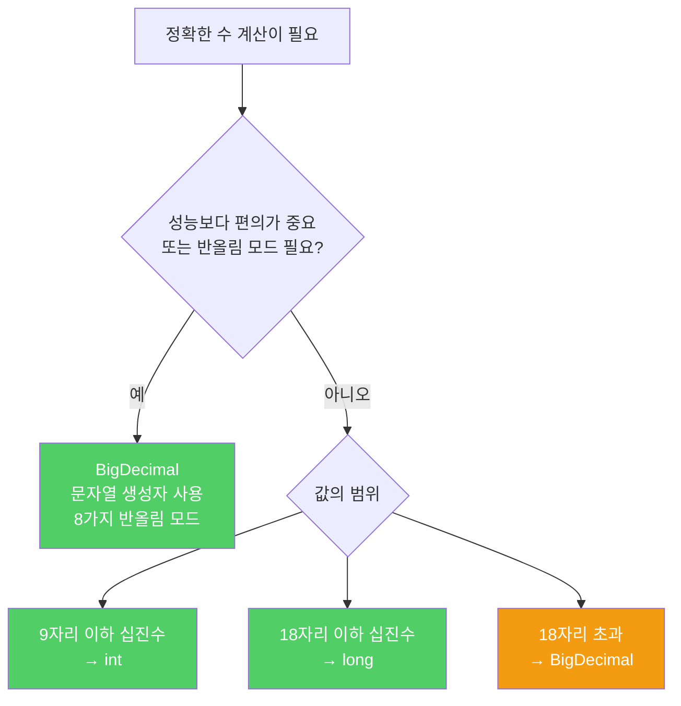

float와 double은 넓은 범위를 빠르게 근사값으로 계산하도록 설계되었습니다. 정확한 답이 필요한 금융 계산에는 절대 쓰면 안 됩니다.

---

## 1. float·double의 함정

비유하자면 **줄자 대신 눈대중으로 거리를 재는 것**입니다. 공학 계산에서는 충분히 가깝지만, 돈 계산에서는 1센트라도 틀리면 안 됩니다.

```java
System.out.println(1.03 - 0.42);   // 0.6100000000000001 출력
System.out.println(1.00 - 9 * 0.10); // 0.09999999999999998 출력
```

이 문제는 특수한 사례가 아니라 이진 부동소수점의 본질적인 특성입니다.

```java
// 사탕 가게 문제 — 1달러로 10센트짜리부터 차례로 구입
public static void main(String[] args) {
    double funds = 1.00;
    int itemsBought = 0;
    for (double price = 0.10; funds >= price; price += 0.10) {
        funds -= price;
        itemsBought++;
    }
    System.out.println(itemsBought + "개 구입");       // 3개 구입 (4개여야 함)
    System.out.println("잔돈(달러): " + funds);         // 0.3999...달러 (0.00이어야 함)
}
```

반올림으로 해결하려 해도, 반올림 기준이 틀린 값에 적용되므로 여전히 틀린 결과가 나올 수 있습니다.

---

## 2. BigDecimal — 정확하지만 느리고 불편함

비유하자면 **계산기 대신 주판으로 한 자리씩 직접 계산하는 것**입니다. 정확하지만 속도와 편의성을 희생합니다.

```java
// BigDecimal 사용 — 문자열 생성자로 정확한 값 지정
public static void main(String[] args) {
    final BigDecimal TEN_CENTS = new BigDecimal(".10");

    int itemsBought = 0;
    BigDecimal funds = new BigDecimal("1.00");
    for (BigDecimal price = TEN_CENTS;
         funds.compareTo(price) >= 0;
         price = price.add(TEN_CENTS)) {
        funds = funds.subtract(price);
        itemsBought++;
    }
    System.out.println(itemsBought + "개 구입");  // 4개 구입
    System.out.println("잔돈(달러): " + funds);    // 0.00
}
```

`new BigDecimal(0.10)` 대신 `new BigDecimal(".10")`을 써야 합니다. `double` 값 0.10 자체가 이미 부정확하기 때문입니다.

BigDecimal의 단점: 기본 타입보다 불편하고 느립니다. 장점: 8가지 반올림 모드를 완벽히 제어할 수 있어 법적 반올림이 필요한 비즈니스 계산에 적합합니다.

---

## 3. int·long — 성능이 중요할 때

비유하자면 **달러 대신 센트 단위로 계산하는 것**입니다. 소수점을 제거하고 정수로 다루면 빠르고 정확합니다.

```java
// 센트 단위 정수로 계산
public static void main(String[] args) {
    int itemsBought = 0;
    int funds = 100;  // 1달러 = 100센트
    for (int price = 10; funds >= price; price += 10) {
        funds -= price;
        itemsBought++;
    }
    System.out.println(itemsBought + "개 구입");  // 4개 구입
    System.out.println("잔돈(센트): " + funds);    // 0
}
```

단점: 다룰 수 있는 값의 크기가 제한되고, 소수점을 직접 관리해야 합니다.

---

## 4. 언제 무엇을 쓸까



---

## 5. 만약 float·double을 금융 계산에 쓴다면?

비유하자면 **눈금 없는 막대기로 건물을 짓는 것**입니다. 작은 오차가 쌓여 결국 구조물이 기울어집니다.

- 이자 계산에서 1원 단위 오차 누적
- 세금 계산에서 반올림 기준 불일치
- 재무제표 합계가 맞지 않는 현상
- 법적 정확성이 요구되는 상황에서 소송 위험

---

## 6. 요약

> 정확한 답이 필요한 계산에는 float나 double을 피하세요. 소수점 관리와 반올림 제어가 필요하면 BigDecimal을, 성능이 중요하고 숫자가 크지 않다면 int나 long을 쓰세요. 9자리 이하는 int, 18자리 이하는 long, 그 이상은 BigDecimal입니다.

---

> 참조: 이펙티브 자바 3/E — 조슈아 블로크
