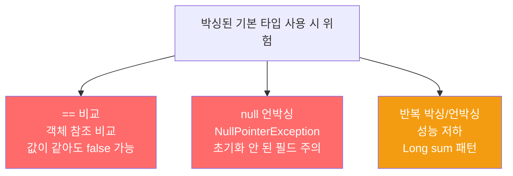

오토박싱과 오토언박싱 덕분에 기본 타입과 박싱된 기본 타입을 구분 없이 쓸 수 있지만, 차이가 사라진 것은 아닙니다. 잘못 쓰면 조용히 버그를 만들거나 성능을 갉아먹습니다.

---

## 1. 세 가지 차이점

비유하자면 **현금(기본 타입)과 상품권(박싱된 기본 타입)**입니다. 둘 다 결제에 쓸 수 있지만, 상품권은 일련번호가 달라 "같은 금액이어도 다른 상품권"으로 구별됩니다. 또 상품권은 없음(null)이 될 수 있지만 현금은 없으면 그냥 0원입니다.

| 구분 | 기본 타입 (int, double …) | 박싱된 기본 타입 (Integer, Double …) |
|------|--------------------------|--------------------------------------|
| 식별성 | 값만 존재 | 값 + 객체 참조(동일 값도 다른 인스턴스일 수 있음) |
| null | 불가 (항상 유효) | 가능 (초기값 null) |
| 성능 | 빠름, 메모리 효율 | 느림, 추가 객체 생성 |

---

## 2. == 비교의 함정

비유하자면 **같은 금액의 두 상품권을 "이 두 장이 동일한 상품권이냐?"고 묻는 것**입니다. 금액은 같지만 일련번호가 다르므로 "다르다"고 답합니다.

```java
// 잘못된 비교자 — 식별성(==) 버그
Comparator<Integer> naturalOrder =
    (i, j) -> (i < j) ? -1 : (i == j ? 0 : 1);

naturalOrder.compare(new Integer(42), new Integer(42));
// 기대값: 0 (같은 값)
// 실제값: 1 (다른 객체 참조이므로 i == j가 false → 1 반환)
```

`i < j`에서는 언박싱이 일어나 값 비교가 되지만, `i == j`에서는 객체 참조 비교가 됩니다. 서로 다른 `Integer` 인스턴스는 값이 같아도 `==`이 false입니다.

```java
// 올바른 해결 — 기본 타입으로 언박싱 후 비교
Comparator<Integer> naturalOrder = (iBoxed, jBoxed) -> {
    int i = iBoxed, j = jBoxed;  // 명시적 언박싱
    return i < j ? -1 : (i == j ? 0 : 1);
};

// 더 나은 방법 — 라이브러리 사용
Comparator<Integer> naturalOrder = Comparator.naturalOrder();
```

---

## 3. null 언박싱 → NullPointerException

비유하자면 **상품권 지갑이 비어있는데 꺼내려는 것**입니다. null인 Integer를 int와 비교하는 순간 언박싱이 일어나 NPE가 발생합니다.

```java
public class Unbelievable {
    static Integer i;  // 초기값 null!

    public static void main(String[] args) {
        if (i == 42) {           // Integer(null)을 int(42)와 비교
            System.out.println("믿을 수 없군!");
        }
        // NullPointerException 발생
        // i == 42에서 i가 null이므로 언박싱 시 NPE
    }
}
```

해결책: `i`를 `int`로 선언하면 끝입니다.

---

## 4. 성능 저하 — 반복 박싱/언박싱

비유하자면 **현금을 상품권으로 바꿨다가, 다시 현금으로 바꾸는 작업을 20억 번 반복하는 것**입니다.

```java
// 끔찍이 느린 코드 — Long 하나 때문에 2^31번 박싱/언박싱 발생
Long sum = 0L;  // Long (박싱)
for (long i = 0; i <= Integer.MAX_VALUE; i++) {
    sum += i;   // long → Long 박싱이 매 반복마다 발생
}
System.out.println(sum);

// 수정: Long → long 으로 바꾸면 수배 빨라짐
long sum = 0L;
```



---

## 5. 박싱된 기본 타입을 써야 할 때

비유하자면 **현금을 직접 넣을 수 없는 봉투(컨테이너)**입니다. 봉투가 상품권만 받는다면 현금을 상품권으로 바꿔 넣을 수밖에 없습니다.

1. **컬렉션의 원소·키·값**: `List<Integer>`, `Map<String, Double>` 등 — 제네릭은 기본 타입 불가
2. **매개변수화 타입/메서드**: `ThreadLocal<Integer>` — `ThreadLocal<int>` 불가
3. **리플렉션을 통한 메서드 호출**: 메서드 인수로 박싱된 기본 타입이 필요

---

## 6. 요약

> 가능하면 기본 타입을 사용하세요. 박싱된 기본 타입을 써야 한다면 세 가지를 주의하세요. 두 박싱된 기본 타입을 ==로 비교하면 식별성 비교가 됩니다. null인 박싱된 기본 타입을 언박싱하면 NPE가 발생합니다. 기본 타입을 반복적으로 박싱하면 성능이 급격히 나빠집니다.

---

> 참조: 이펙티브 자바 3/E — 조슈아 블로크
