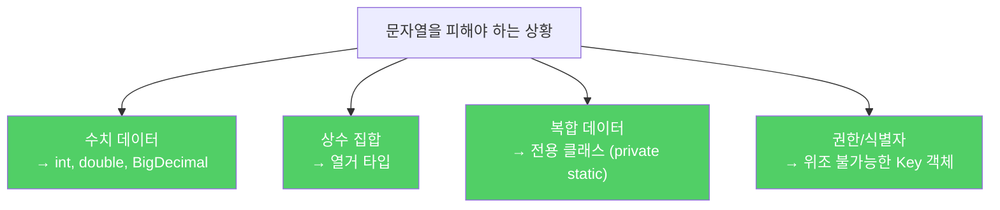

문자열은 텍스트를 표현하는 데 탁월합니다. 그러나 워낙 흔하다 보니 수치, 열거 타입, 혼합 타입, 권한 등 전혀 맞지 않는 곳에도 쓰이곤 합니다.

---

## 1. 문자열은 다른 값 타입을 대신하기에 적합하지 않다

비유하자면 **숫자를 적은 종이 쪽지로 계산기 대신 쓰는 것**입니다. 텍스트로는 보이지만, 수치 연산을 하려면 매번 변환이 필요하고 오류도 납니다.

```java
// 나쁜 예 — 수치 데이터를 문자열로 받음
String temperature = "36.5";
String count = "100";

// 비교, 연산 시마다 파싱 필요
if (Double.parseDouble(temperature) > 37.0) { ... }

// 좋은 예 — 적합한 타입으로 즉시 변환
double temperature = 36.5;
int count = 100;
```

입력이 수치라면 `int`, `double`, `BigInteger`로, 예/아니오라면 `boolean`으로, 그 밖에 적합한 타입이 있다면 반드시 그 타입을 사용하세요.

---

## 2. 문자열은 열거 타입을 대신하기에 적합하지 않다

비유하자면 **신호등 색상을 "red", "green", "yellow" 문자열로 관리하는 것**입니다. 오타("rede")를 컴파일러가 잡아주지 못합니다.

```java
// 나쁜 예 — 문자열 상수
static final String SUIT_CLUBS    = "CLUBS";
static final String SUIT_DIAMONDS = "DIAMONDS";

// 타입 안전성 없음 — 어떤 문자열이든 들어올 수 있음
void playCard(String suit) { ... }

// 좋은 예 — 열거 타입
enum Suit { CLUBS, DIAMONDS, HEARTS, SPADES }
void playCard(Suit suit) { ... }  // Suit 이외의 값은 컴파일 오류
```

---

## 3. 문자열은 혼합 타입을 대신하기에 적합하지 않다

비유하자면 **이름과 나이를 "홍길동#28"처럼 하나의 문자열에 합쳐 관리하는 것**입니다. 구분자가 이름 안에 있으면 파싱이 망가지고, 각 필드에 접근하려면 매번 파싱해야 합니다.

```java
// 나쁜 예 — 혼합 타입을 문자열로 합침
String compoundKey = className + "#" + i.next();
// 문제 1: className에 "#"이 포함되면 파싱 불가
// 문제 2: 파싱이 느리고 오류 가능성 있음
// 문제 3: equals, toString, compareTo 를 제대로 제공하기 어려움

// 좋은 예 — 전용 클래스 사용 (보통 private 정적 멤버 클래스)
private static class CompoundKey {
    final String className;
    final String itemName;

    CompoundKey(String className, String itemName) {
        this.className = className;
        this.itemName = itemName;
    }
    // equals, hashCode, toString 제대로 구현
}
```

---

## 4. 문자열은 권한을 표현하기에 적합하지 않다

비유하자면 **자물쇠 열쇠를 "이름표"로 관리하는 것**입니다. 누군가 같은 이름표를 만들면 남의 자물쇠를 열 수 있습니다.

```java
// 나쁜 예 — 문자열 키로 스레드 지역변수 구분
public class ThreadLocal {
    private ThreadLocal() {}
    public static void set(String key, Object value) { ... }
    public static Object get(String key) { ... }
    // 두 클라이언트가 같은 키를 쓰면 변수를 공유하게 됨
    // 악의적인 코드가 같은 키로 다른 클라이언트 값을 훔칠 수 있음
}

// 좋은 예 — 위조 불가능한 Key 객체 사용
public class ThreadLocal {
    private ThreadLocal() {}
    public static class Key {  // 권한 = 고유 객체
        Key() {}
    }
    public static Key getKey() { return new Key(); }
    public static void set(Key key, Object value) { ... }
    public static Object get(Key key) { ... }
}
```

더 나아가 Key 자체를 ThreadLocal로 만들고 제네릭으로 타입 안전성까지 확보할 수 있습니다.

```java
// 최종 형태 — java.lang.ThreadLocal과 동일한 설계
public final class ThreadLocal<T> {
    public ThreadLocal() {}
    public void set(T value) { ... }
    public T get() { ... }
    // 타입 안전, 위조 불가, 불필요한 파싱 없음
}
```



---

## 5. 요약

> 더 적합한 데이터 타입이 있거나 새로 만들 수 있다면 문자열을 쓰고 싶은 유혹을 뿌리치세요. 문자열은 잘못 사용하면 번거롭고, 덜 유연하고, 느리고, 오류 가능성도 큽니다. 기본 타입, 열거 타입, 혼합 타입이 문자열로 잘못 쓰이는 대표적인 사례입니다.

---

> 참조: 이펙티브 자바 3/E — 조슈아 블로크
