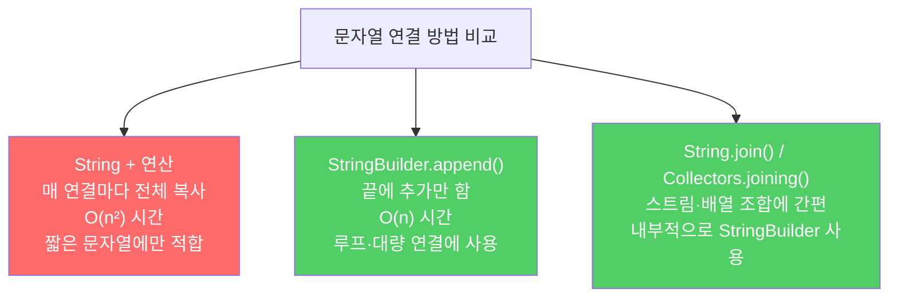

문자열 연결 연산자(+)는 편리하지만, 문자열 n개를 잇는 시간은 n²에 비례합니다. 많은 문자열을 이어야 한다면 StringBuilder를 쓰세요.

---

## 1. 왜 +가 느릴까

비유하자면 **편지를 이어 붙일 때마다 지금까지 쓴 편지 전체를 새 종이에 다시 베껴 쓰는 것**입니다. 편지가 길어질수록 복사 비용이 기하급수적으로 늘어납니다.

String은 불변이므로 두 문자열을 `+`로 연결하면 양쪽 내용을 모두 복사한 새 String을 만듭니다. n번 연결하면 총 복사 횟수는 1 + 2 + 3 + … + n = n(n+1)/2, 즉 O(n²)입니다.

```java
// 나쁜 예 — O(n²) 성능
public String statement() {
    String result = "";
    for (int i = 0; i < numItems(); i++) {
        result += lineForItem(i);  // 매 반복마다 result 전체를 복사
    }
    return result;
}
```

품목이 100개면 수천 번의 문자 복사, 품목이 10만 개면 수십억 번의 복사가 일어납니다.

---

## 2. StringBuilder로 해결

비유하자면 **편지를 길이를 넉넉히 잡아둔 두루마리에 계속 이어 쓰는 것**입니다. 새 종이에 복사할 필요 없이 끝에 추가만 하면 됩니다.

```java
// 좋은 예 — O(n) 성능
public String statement() {
    StringBuilder b = new StringBuilder(numItems() * LINE_WIDTH);  // 미리 크기 추정
    for (int i = 0; i < numItems(); i++) {
        b.append(lineForItem(i));  // 끝에 추가만 함, 복사 없음
    }
    return b.toString();
}
```

예상 크기로 초기화하면 내부 배열 재할당 횟수도 최소화됩니다.



---

## 3. 언제 +를 써도 되나

비유하자면 **편지 한 장짜리라면 그냥 쓰는 것**입니다. 딱 한 줄, 또는 고정된 적은 개수라면 + 연산이 충분히 빠릅니다.

```java
// 이 정도는 + 사용해도 무방
String greeting = "안녕하세요, " + name + "님!";
String header = "[" + code + "] " + message;
```

```java
// 루프나 항목 수가 많다면 반드시 StringBuilder 사용
StringBuilder sb = new StringBuilder();
for (String item : largeList) {
    sb.append(item).append(", ");
}
String result = sb.toString();
```

---

## 4. 요약

> 성능에 신경 써야 한다면 많은 문자열을 연결할 때는 + 연산자를 피하세요. 대신 StringBuilder의 append 메서드를 사용하세요. 단순한 한두 줄 연결이라면 + 연산자도 충분합니다.

---

> 참조: 이펙티브 자바 3/E — 조슈아 블로크
