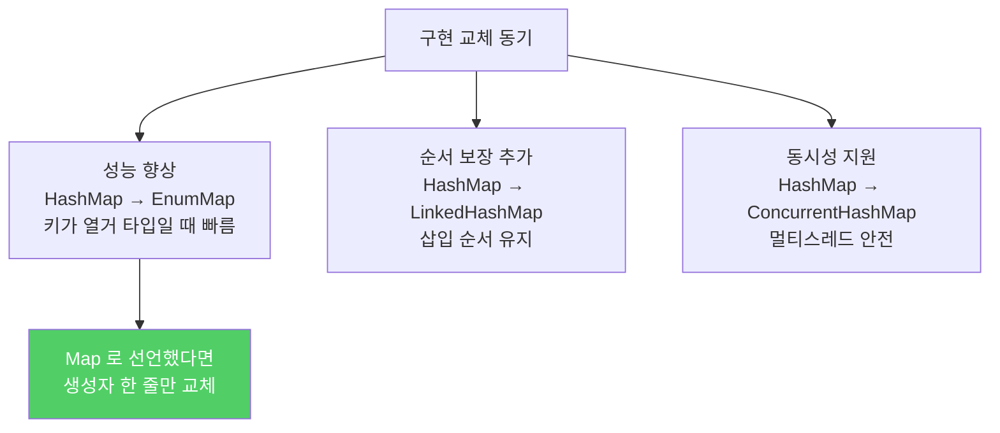

적합한 인터페이스가 있다면 매개변수, 반환값, 변수, 필드 모두 인터페이스 타입으로 선언하세요. 구현 클래스를 타입으로 쓰는 것은 생성자 호출 시 딱 한 번만 허용됩니다.

---

## 1. 인터페이스로 선언하면 유연해진다

비유하자면 **"자동차를 빌려주세요"라고 말하는 것과 "현대 소나타 2023년식을 빌려주세요"라고 말하는 것**입니다. 앞의 요청은 나중에 더 좋은 차로 바꿔줘도 아무 문제없지만, 뒤의 요청은 딱 그 차만 됩니다.

```java
// 좋은 예 — 인터페이스를 타입으로 선언
Set<Son> sonSet = new LinkedHashSet<>();

// 나쁜 예 — 구현 클래스를 타입으로 선언
LinkedHashSet<Son> sonSet = new LinkedHashSet<>();
```

인터페이스로 선언하면 구현 클래스를 교체할 때 생성자 호출 한 줄만 바꾸면 됩니다.

```java
// 나중에 HashSet으로 바꿔야 한다면
Set<Son> sonSet = new HashSet<>();  // 선언 타입은 그대로, 오른쪽만 변경
```

---

## 2. 주의: 특별한 기능에 의존하는 코드가 있다면

비유하자면 **"자동차"로 계약했는데 실제로는 선루프 달린 차를 이미 쓰고 있는 것**입니다. "자동차"로 바꿨더니 선루프가 없어 낭패를 봅니다.

```java
// LinkedHashSet의 순서 보장을 이미 사용 중이라면
// HashSet으로 바꾸면 순서가 보장되지 않아 버그 발생
Set<Son> sonSet = new LinkedHashSet<>();
// ...코드 어딘가에서 순서를 가정한 로직이 있음...

Set<Son> sonSet = new HashSet<>();  // 순서 보장 없음 → 기존 코드 망가짐
```

구현 클래스 교체 전에 원래 클래스가 인터페이스 규약 외의 특별한 기능을 제공하는지 확인하세요.

---

## 3. 구현 교체의 실제 동기

비유하자면 **더 빠른 도로가 생겼을 때 같은 목적지로 경로만 바꾸는 것**입니다.



```java
// 변수를 Map으로 선언 — 구현 교체가 자유로움
Map<Phase, Map<Phase, Transition>> transitionMap = new EnumMap<>(...);
// 나중에 LinkedHashMap으로 바꿔도 선언 타입 변경 불필요
```

---

## 4. 인터페이스가 없다면 — 클래스 계층에서 가장 상위 타입

비유하자면 **특정 브랜드 이름 대신 "전자제품", "가전기기" 등 상위 개념으로 부르는 것**입니다.

인터페이스를 써야 하지만 쓸 수 없는 세 가지 경우:

1. **값 클래스** (`String`, `BigInteger`): 여러 구현이 없고 `final`이 많음 — 클래스 타입 사용 가능
2. **클래스 기반 프레임워크의 객체** (`OutputStream` 등): 인터페이스 대신 추상 클래스를 타입으로 사용
3. **인터페이스에 없는 추가 메서드를 꼭 써야 할 때** (`PriorityQueue.comparator()`): 해당 클래스 타입을 쓰되 최소화

```java
// PriorityQueue.comparator() 는 Queue 인터페이스에 없음
// comparator()를 꼭 써야 한다면 PriorityQueue 타입을 쓸 수밖에 없음
PriorityQueue<Task> queue = new PriorityQueue<>(comparator);
Comparator<Task> c = queue.comparator();  // Queue 인터페이스에 없는 메서드

// 하지만 이런 경우는 최소화해야 함
```

---

## 5. 요약

> 적합한 인터페이스가 있다면 항상 인터페이스 타입으로 선언하세요. 그러면 구현 클래스를 교체할 때 생성자 한 줄만 바꾸면 됩니다. 인터페이스가 없다면 클래스 계층에서 필요한 기능을 만족하는 가장 상위 타입을 사용하세요.

---

> 참조: 이펙티브 자바 3/E — 조슈아 블로크
