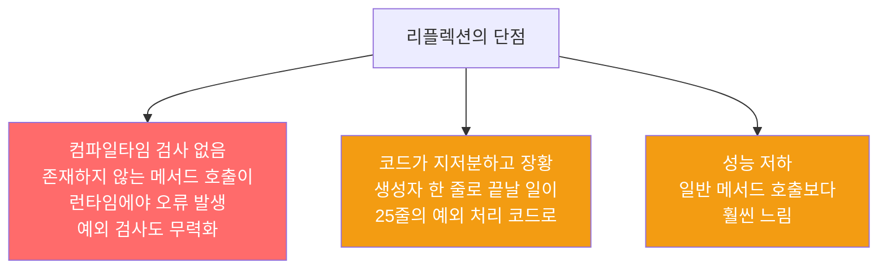

리플렉션은 컴파일 시점에 알 수 없는 클래스도 다룰 수 있는 강력한 도구입니다. 하지만 타입 안전성 상실, 성능 저하, 장황한 코드라는 단점이 있습니다. 인스턴스 생성에만 쓰고 이후에는 인터페이스로 참조하세요.

---

## 1. 리플렉션의 능력

비유하자면 **만능 열쇠**입니다. 어떤 자물쇠든 열 수 있지만, 그만큼 위험하고 다루기 어렵습니다.

```java
// Class.forName으로 런타임에 클래스 로드
Class<?> clazz = Class.forName("com.example.MyClass");

// 생성자 획득 및 인스턴스 생성
Constructor<?> cons = clazz.getDeclaredConstructor();
Object obj = cons.newInstance();

// 메서드 획득 및 호출
Method method = clazz.getMethod("doSomething", String.class);
method.invoke(obj, "인수");

// 필드 접근
Field field = clazz.getDeclaredField("privateField");
field.setAccessible(true);
Object value = field.get(obj);
```

컴파일 당시에 존재하지 않던 클래스도 다룰 수 있습니다. 코드 분석 도구, DI 프레임워크, 테스트 프레임워크가 리플렉션을 활용합니다.

---

## 2. 리플렉션의 세 가지 단점

비유하자면 **만능 열쇠의 대가**입니다. 열쇠 하나에 너무 많은 기능이 있어 다루기 복잡하고, 잘못 쓰면 자물쇠를 망가뜨립니다.



---

## 3. 올바른 사용법 — 인스턴스 생성만 리플렉션으로

비유하자면 **만능 열쇠로 문을 열고 나면 이후에는 평범하게 집을 사용하는 것**입니다. 진입 시에만 특수 도구를 쓰고, 이후 동작은 인터페이스로 처리합니다.

```java
// 리플렉션으로 생성하고 인터페이스로 참조해 활용
public static void main(String[] args) {
    // 1단계: 리플렉션으로 클래스 로드 (런타임에 클래스 이름을 받음)
    Class<? extends Set<String>> cl = null;
    try {
        cl = (Class<? extends Set<String>>) Class.forName(args[0]);
    } catch (ClassNotFoundException e) {
        fatalError("클래스를 찾을 수 없습니다.");
    }

    // 2단계: 리플렉션으로 인스턴스 생성
    Constructor<? extends Set<String>> cons = null;
    try {
        cons = cl.getDeclaredConstructor();
    } catch (NoSuchMethodException e) {
        fatalError("매개변수 없는 생성자를 찾을 수 없습니다.");
    }

    Set<String> s = null;
    try {
        s = cons.newInstance();
    } catch (ReflectiveOperationException e) {
        fatalError("클래스 인스턴스화 실패: " + e);
    } catch (ClassCastException e) {
        fatalError("Set을 구현하지 않은 클래스입니다.");
    }

    // 3단계: 이후는 인터페이스(Set)로 평범하게 사용
    s.addAll(Arrays.asList(args).subList(1, args.length));
    System.out.println(s);
    // java.util.HashSet → 무작위 순서 출력
    // java.util.TreeSet → 알파벳 순서 출력
}
```

이 패턴 덕분에 컴파일 시점에 어떤 `Set` 구현체가 쓰일지 몰라도, 실행 중에 동적으로 선택할 수 있습니다.

---

## 4. 리플렉션이 정말 필요한 경우

비유하자면 **다양한 버전의 소프트웨어를 지원해야 할 때**입니다. 구버전 환경에서도 돌아가도록 컴파일하되, 신버전 기능은 리플렉션으로 런타임에 감지해 사용합니다.

```java
// 버전에 따라 다른 구현을 런타임에 선택
try {
    Method newFeature = SomeClass.class.getMethod("newFeature");
    newFeature.invoke(instance);
} catch (NoSuchMethodException e) {
    // 구버전 — 대체 동작 수행
    fallbackBehavior();
}
```

---

## 5. 요약

> 리플렉션은 복잡한 특수 시스템에서만 필요한 강력한 도구입니다. 컴파일타임에 알 수 없는 클래스를 다뤄야 한다면 리플렉션은 인스턴스 생성에만 쓰고, 생성된 객체는 인터페이스나 상위 클래스로 참조해 사용하세요.

---

> 참조: 이펙티브 자바 3/E — 조슈아 블로크
