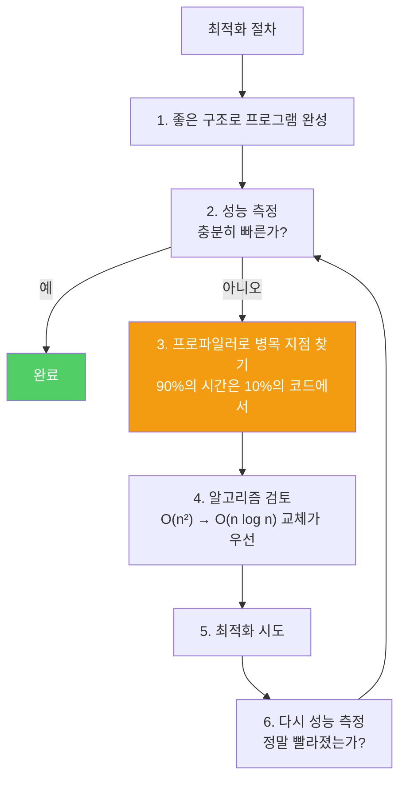

최적화는 좋은 결과보다 해로운 결과로 이어지기 쉽습니다. 섣불리 진행하면 빠르지도 않고, 제대로 동작하지도 않고, 수정하기도 어려운 코드가 탄생합니다.

---

## 1. 세 가지 격언

> 그 어떤 핑계보다 효율성이라는 이름 아래 행해진 컴퓨팅 죄악이 더 많다. — 윌리엄 울프
>
> 자그마한 효율성은 모두 잊자. 섣부른 최적화가 만악의 근원이다. — 도널드 크누스
>
> 최적화를 할 때는: 첫째, 하지 마라. 둘째(전문가 한정), 아직 하지 마라. — M. A. 잭슨

비유하자면 **아직 요리도 안 했는데 그릇부터 예쁘게 정리하는 것**입니다. 진짜 문제(맛)를 해결하기 전에 부차적인 것(속도)에 집착하면 둘 다 망칩니다.

---

## 2. 좋은 프로그램을 먼저 작성하라

비유하자면 **건물을 지을 때 설계 도면을 먼저 잘 그리는 것**입니다. 구조가 좋으면 나중에 엘리베이터 교체나 내부 인테리어 변경이 쉽지만, 설계가 잘못되면 건물 전체를 다시 지어야 합니다.

```java
// 잘못된 사고방식 — 성능을 위해 구조를 희생
// "if문보다 switch가 빠를 것 같으니까 억지로 switch로 바꾸자"
// "객체 생성을 아끼려고 전역 변수로 만들자"

// 올바른 사고방식 — 좋은 구조 먼저, 성능은 나중에 측정
// 정보 은닉 원칙을 따르면 각 구성요소를 독립적으로 재설계 가능
```

구현상의 문제는 나중에 최적화로 해결할 수 있지만, 아키텍처의 결함은 시스템 전체를 다시 작성하지 않으면 해결하기 불가능할 수 있습니다.

---

## 3. 성능을 제한하는 설계를 피하라

비유하자면 **집을 지을 때 창문 크기를 너무 작게 고정해버리는 것**입니다. 나중에 환기가 안 된다고 창문을 크게 바꾸려면 벽을 다 뜯어야 합니다.

완성 후 변경하기 가장 어려운 설계 요소는 컴포넌트끼리, 혹은 외부 시스템과의 소통 방식입니다.

- **API 설계**: 공개 타입을 가변으로 만들면 불필요한 방어적 복사가 쏟아집니다.
- **네트워크 프로토콜**: 한번 배포되면 바꾸기 거의 불가능합니다.
- **영구 저장용 데이터 포맷**: DB 스키마나 파일 포맷은 마이그레이션 비용이 큽니다.

```java
// java.awt.Component.getSize() 의 교훈
// Dimension이 가변이라서 getSize() 호출마다 새 Dimension 생성 강요
Dimension size = component.getSize();  // 방어적 복사 발생

// 더 나은 설계 — 불변 Dimension 이었다면 복사 불필요
// 또는 getWidth(), getHeight()로 기본 타입 직접 반환 (자바 2에서 추가)
int width  = component.getWidth();   // 기본 타입 반환 — 복사 없음
int height = component.getHeight();  // 기본 타입 반환 — 복사 없음
```

---

## 4. 성능을 위해 API를 왜곡하지 마라

비유하자면 **교통 편의를 위해 도로를 뚫었는데 환경이 망가지는 것**입니다. 성능 문제는 다음 버전 JVM에서 사라질 수 있지만, 왜곡된 API는 영원히 지속됩니다.

---

## 5. 측정하고 나서 최적화하라

비유하자면 **의사가 진단도 없이 수술부터 하는 것**입니다. 어디가 아픈지 먼저 확인해야 합니다.



일반적으로 90%의 시간은 단 10%의 코드에서 소비됩니다. 프로파일러 없이 짐작만으로 최적화하면 엉뚱한 곳을 고칩니다.

---

## 6. 요약

> 빠른 프로그램을 만들려 안달하지 마세요. 좋은 프로그램을 작성하다 보면 성능은 따라옵니다. 단, API·네트워크 프로토콜·데이터 포맷을 설계할 때는 성능을 염두에 두세요. 구현이 완료되면 성능을 측정하고, 부족하다면 프로파일러로 병목을 찾아 최적화하세요.

---

> 참조: 이펙티브 자바 3/E — 조슈아 블로크
