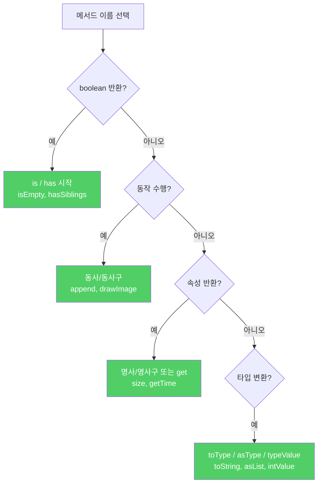

자바의 명명 규칙은 철자 규칙과 문법 규칙으로 나뉩니다. 이 규칙을 어기면 다른 프로그래머가 읽기 불편하고 오해까지 생길 수 있습니다.

---

## 1. 철자 규칙 요약

비유하자면 **교통 표지판 디자인 규격**입니다. 표지판마다 색상, 모양, 글자 크기를 제멋대로 만들면 운전자가 혼란스럽습니다. 표준을 따라야 모두가 즉시 이해합니다.

| 식별자 타입 | 규칙 | 예시 |
|-------------|------|------|
| 패키지·모듈 | 소문자, 점으로 계층 구분, 도메인 역순 | `com.google.common.collect` |
| 클래스·인터페이스 | 대문자 시작 카멜케이스 | `Stream`, `LinkedHashMap`, `HttpClient` |
| 메서드·필드 | 소문자 시작 카멜케이스 | `remove`, `groupingBy`, `getCrc` |
| 상수 필드 | 대문자 + 밑줄 구분 | `MIN_VALUE`, `NEGATIVE_INFINITY` |
| 지역변수 | 소문자 시작, 약어 허용 | `i`, `denom`, `houseNum` |
| 타입 매개변수 | 한 문자 대문자 | `T`, `E`, `K`, `V`, `X`, `R` |

타입 매개변수 관례: `T`(임의 타입), `E`(컬렉션 원소), `K·V`(맵 키·값), `X`(예외), `R`(반환 타입)

약어 표기: `HttpUrl`처럼 첫 글자만 대문자(HTTPURL이 아님). 여러 약어가 혼합되어도 시작과 끝을 명확히 알 수 있습니다.

---

## 2. 문법 규칙 — 클래스와 인터페이스

비유하자면 **간판 이름 짓기**입니다. "갈비집"(명사)인지, "달리는 배달"(동사구)인지, "맛있는 분식"(형용사)인지 용도에 맞게 짓습니다.

```java
// 객체를 생성할 수 있는 클래스 — 단수 명사·명사구
class Thread { }
class PriorityQueue { }
class ChessPiece { }

// 객체를 생성할 수 없는 유틸리티 클래스 — 복수형 명사
class Collections { }
class Arrays { }

// 인터페이스 — 클래스처럼 또는 -able/-ible 형용사
interface Runnable { }
interface Iterable { }
interface Accessible { }
interface List { }
```

---

## 3. 문법 규칙 — 메서드

비유하자면 **버튼 라벨**입니다. "저장"(동사), "크기"(명사), "비었나요?"(질문) 등 버튼이 하는 일을 직관적으로 표현합니다.

```java
// 동작을 수행하는 메서드 — 동사·동사구
void append(String s) { }
void drawImage(Image img) { }

// boolean 반환 메서드 — is/has 시작
boolean isEmpty() { }
boolean isEnabled() { }
boolean hasSiblings() { }

// 속성 반환 메서드 — 명사·명사구 또는 get 접두어
int size() { }
int hashCode() { }
Date getTime() { }  // JavaBeans 호환이 필요할 때

// 타입 변환 메서드
String toString() { }
int[] toArray() { }
List<E> asList() { }   // 뷰(view) 반환
int intValue() { }     // 기본 타입 반환

// 정적 팩터리
LocalDate.of(2024, 1, 1);
Duration.from(days);
Optional.valueOf(str);
```



---

## 4. 요약

> 표준 명명 규칙을 체화하여 자연스럽게 나오도록 하세요. 철자 규칙은 직관적이라 모호한 부분이 적지만, 문법 규칙은 더 복잡하고 유연합니다. 오랫동안 따라온 규칙과 충돌한다면 맹종하지 말고 상식에 따르세요.

---

> 참조: 이펙티브 자바 3/E — 조슈아 블로크
