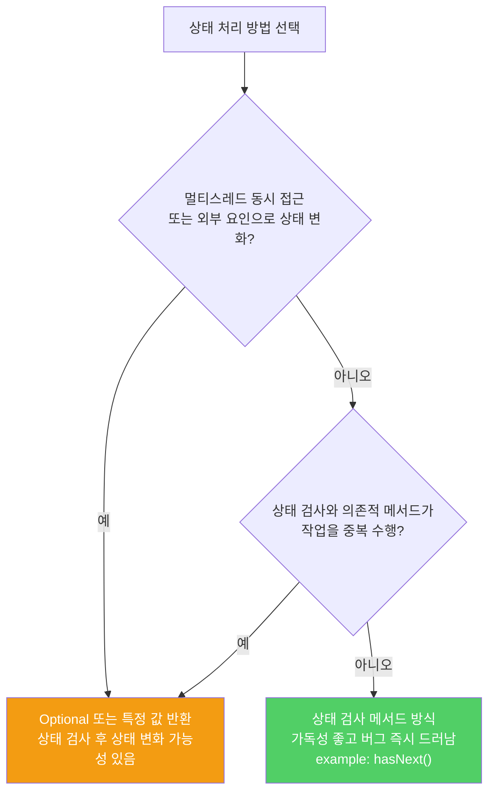

예외는 예외 상황에서만 쓰도록 설계되었습니다. 정상적인 제어 흐름에 예외를 쓰면 코드가 헷갈리고, 성능이 나빠지고, 버그를 숨기는 세 가지 해악이 생깁니다.

---

## 1. 예외를 제어 흐름에 쓰면 안 되는 이유

비유하자면 **신호등이 없어서 자동차를 박을 때마다 멈추는 것**입니다. 충돌이 나지 않으면 계속 가고, 충돌(예외)이 나면 멈추는 방식입니다. 당연히 표준 신호등보다 느리고 위험합니다.

```java
// 나쁜 예 — 예외로 반복문을 종료 (절대 따라하지 말 것)
try {
    int i = 0;
    while (true) {
        range[i++].climb();
    }
} catch (ArrayIndexOutOfBoundsException e) {
    // 배열 끝에 도달했다고 가정하고 종료
}

// 올바른 예 — 표준 관용구 사용
for (Mountain m : range) {
    m.climb();
}
```

잘못된 추론의 세 가지 반박:

1. **JVM은 예외를 빠르게 최적화할 동기가 없습니다.** 일반 경계 검사는 최적화하지만 예외 경로는 그렇지 않습니다.
2. **try-catch 블록 안에서는 JVM 최적화가 제한됩니다.**
3. **표준 for-each 관용구의 경계 검사는 JVM이 알아서 최적화해 없애줍니다.** 중복이 아닙니다.

실제로 예외 기반 반복문은 표준 관용구보다 훨씬 느립니다.

---

## 2. 예외가 버그를 숨기는 방식

비유하자면 **모든 사이렌을 꺼 놓으면 화재가 나도 모르는 것**입니다. 예외를 삼켜버리면 진짜 버그도 함께 숨겨집니다.

```java
// 반복문 몸체 안에서 관련 없는 배열을 잘못 사용하다가
// ArrayIndexOutOfBoundsException이 발생했다고 가정

// 나쁜 예 — 버그가 숨어버림
try {
    while (true) {
        range[i++].climb();  // 여기서 발생한 예외인지
        // 아니면 클라이언트 코드의 다른 배열 접근 오류인지 구분 불가
    }
} catch (ArrayIndexOutOfBoundsException e) {
    // 진짜 버그도 여기서 조용히 삼켜짐
}

// 좋은 예 — 버그가 즉시 드러남
for (Mountain m : range) {
    m.climb();  // 다른 배열 오류면 즉시 스택 트레이스와 함께 스레드 종료
}
```

---

## 3. 잘 설계된 API는 예외를 강요하지 않는다

비유하자면 **냉장고에 음식이 있는지 먼저 확인할 수 있어야 하는 것**입니다. 확인 방법이 없으면 열어봤다가 빈 냉장고에 놀라는 예외가 계속 납니다.

상태 의존적 메서드를 제공하는 클래스는 **상태 검사 메서드**도 함께 제공해야 합니다.

```java
// Iterator의 좋은 설계 — 상태 검사 메서드(hasNext) + 상태 의존적 메서드(next)
for (Iterator<Foo> i = collection.iterator(); i.hasNext(); ) {
    Foo foo = i.next();  // hasNext()로 사전 확인했으므로 안전
}

// hasNext가 없었다면 클라이언트가 이렇게 해야 했을 것
try {
    Iterator<Foo> i = collection.iterator();
    while (true) {
        Foo foo = i.next();  // 끝나면 NoSuchElementException
    }
} catch (NoSuchElementException e) {
    // 장황하고, 느리고, 버그를 숨기는 코드
}
```



---

## 4. 요약

> 예외는 예외 상황에서만 쓰도록 설계되었습니다. 정상적인 제어 흐름에 사용하지 마세요. 잘 설계된 API라면 클라이언트가 정상 흐름에서 예외를 쓸 일이 없어야 합니다. 상태 의존적 메서드가 있다면 상태 검사 메서드를 함께 제공하세요.

---

> 참조: 이펙티브 자바 3/E — 조슈아 블로크
