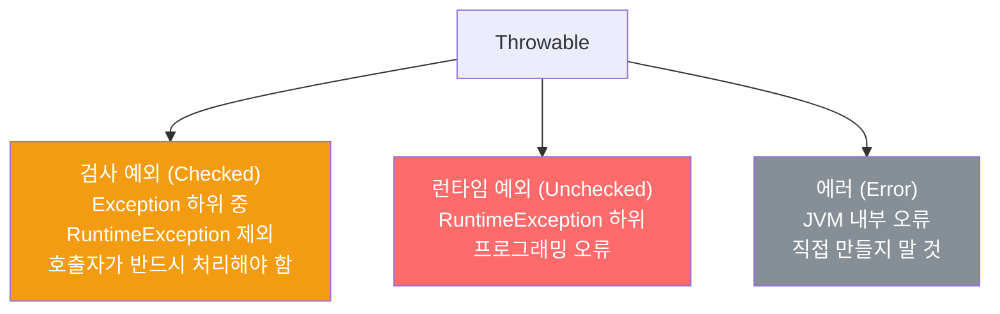

자바의 예외 타입은 검사 예외, 런타임 예외, 에러로 나뉩니다. 어떤 상황에 어떤 타입을 써야 할지는 복구 가능성이 기준입니다.

---

## 1. 세 가지 Throwable 타입

비유하자면 **알람의 종류**입니다. 수동으로 해제해야 하는 알람(검사 예외), 자동으로 꺼지는 알람(런타임 예외), 전기가 나가는 것(에러)입니다.



---

## 2. 검사 예외 — 복구할 수 있는 상황

비유하자면 **"카드 잔액이 부족합니다"라는 알림**입니다. 사용자가 충전하면 복구할 수 있으므로, 알림을 무시하지 않도록 강제합니다.

```java
// 검사 예외: 호출자가 catch로 처리하거나 throws로 전파하도록 강제
public void purchase(Item item) throws InsufficientFundsException {
    if (balance < item.price()) {
        throw new InsufficientFundsException(item.price() - balance);
        // 잔액이 얼마나 부족한지 알려주는 접근자 메서드 포함
    }
    balance -= item.price();
}

// 클라이언트
try {
    shop.purchase(item);
} catch (InsufficientFundsException e) {
    // 복구 가능: 부족한 금액만큼 충전 후 재시도
    charge(e.shortfall());
    shop.purchase(item);
}
```

검사 예외는 복구에 필요한 정보를 알려주는 접근자 메서드도 함께 제공해야 합니다.

---

## 3. 런타임 예외 — 프로그래밍 오류

비유하자면 **"배열 크기가 음수입니다"라는 오류**입니다. 이건 코드 자체의 버그이므로 충전으로 복구할 수 없습니다. 수정이 답입니다.

```java
// 런타임 예외: 전제조건 위배 — 배열 인덱스가 범위를 벗어남
int[] arr = new int[10];
arr[10] = 5;  // ArrayIndexOutOfBoundsException — 버그, 복구 불가
              // 클라이언트가 잘못된 인덱스를 넘겼으니 코드를 고쳐야 함

// 런타임 예외: 전제조건 위배 — null 허용 안 되는 곳에 null
Objects.requireNonNull(param);  // NullPointerException 발생
```

런타임 예외의 대부분은 **전제조건 위배**, 즉 API 명세에 기록된 제약을 클라이언트가 지키지 않았을 때 발생합니다.

---

## 4. 에러 — JVM 내부 오류

비유하자면 **정전**입니다. 프로그래머가 제어할 수 없는 상황입니다.

```java
// 에러: JVM이 던짐 — 직접 만들거나 던지지 말 것
// OutOfMemoryError, StackOverflowError, AssertionError 등
// Error는 상속하지 말고, throw 문으로 직접 던지지도 말 것
// (AssertionError는 예외)
```

---

## 5. 판단이 어려울 때

비유하자면 **자원 고갈이 버그인지 진짜 부족인지 판단하는 것**입니다.

```java
// 자원 고갈의 원인이 무엇이냐에 따라 예외 타입이 다름
// 말도 안 되는 크기 배열 할당 → 프로그래밍 오류 → 런타임 예외
int[] huge = new int[Integer.MAX_VALUE];  // 버그

// 순간적인 자원 부족 → 복구 가능 → 검사 예외
// e.g., 네트워크 연결 실패, 파일 시스템 공간 부족
```

확실하지 않다면 비검사 예외(런타임 예외)를 선택하는 편이 낫습니다.

---

## 6. 직접 만들면 안 되는 것

`Exception`, `RuntimeException`, `Error`를 상속하지 않는 Throwable을 직접 만들면 안 됩니다. 겉보기엔 검사 예외처럼 동작하지만 API 사용자를 혼란스럽게 만들고 이점도 없습니다.

---

## 7. 요약

> 복구할 수 있는 상황이면 검사 예외를, 프로그래밍 오류라면 런타임 예외를 던지세요. 확실하지 않다면 런타임 예외를 선택하세요. 검사 예외라면 복구에 필요한 정보를 알려주는 메서드도 제공하세요.

---

> 참조: 이펙티브 자바 3/E — 조슈아 블로크
