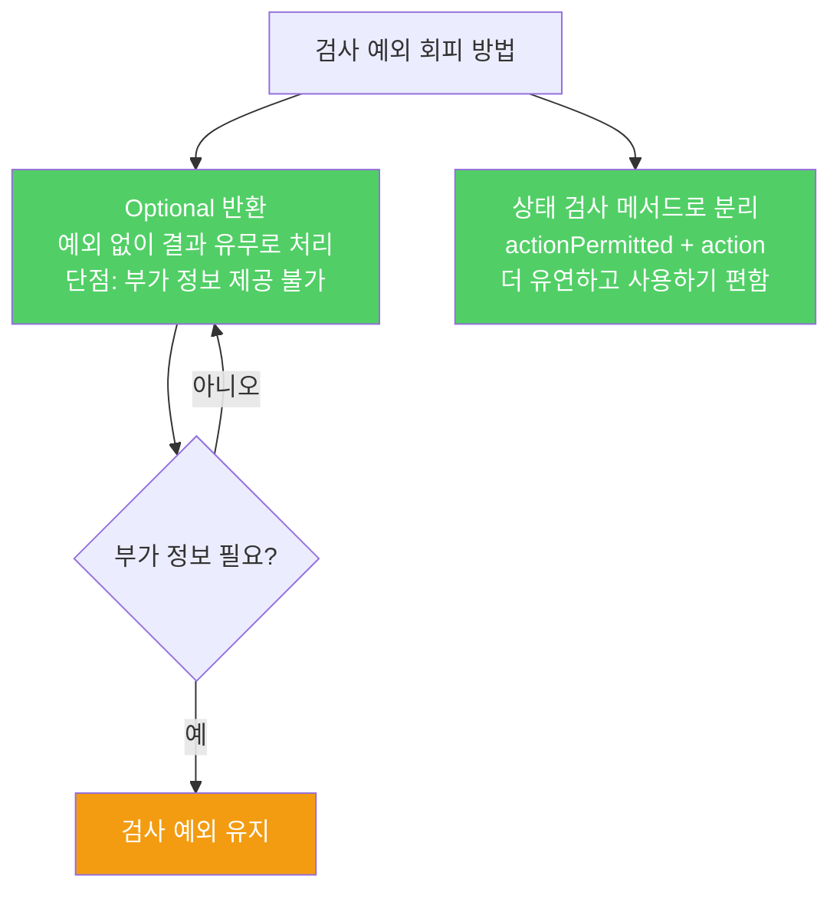

검사 예외는 적절히 쓰면 안전성을 높이지만, 남용하면 쓰기 고통스러운 API가 됩니다. 프로그래머가 예외를 처리해도 아무 조치도 취할 수 없다면 비검사 예외가 낫습니다.

---

## 1. 검사 예외가 부담이 되는 이유

비유하자면 **편의점에서 계산할 때마다 서류를 작성해야 하는 것**입니다. 문제가 생길 가능성을 알려주는 것은 좋지만, 매번 작성이 강제되면 모두가 빈칸만 채우고 형식적으로 처리하게 됩니다.

```java
// 검사 예외: 호출자가 반드시 처리해야 함
try {
    obj.action(args);
} catch (TheCheckedException e) {
    throw new AssertionError();  // 일어날 수 없다!
}

// 또는
try {
    obj.action(args);
} catch (TheCheckedException e) {
    e.printStackTrace();
    System.exit(1);   // 어차피 종료할 거라면 비검사 예외로 충분
}
```

catch 블록에서 아무 의미 있는 조치도 취할 수 없다면 비검사 예외를 선택해야 합니다.

Java 8부터 부담이 더 커졌습니다. 검사 예외를 던지는 메서드는 스트림 안에서 직접 사용할 수 없습니다.

---

## 2. 검사 예외가 단 하나일 때 특히 부담

비유하자면 **서류 작성이 단 하나의 항목 때문에 강제되는 것**입니다.

```java
// 검사 예외가 하나뿐인 메서드 — 이 예외 때문에 try 블록 전체가 강제됨
try {
    result = obj.action(args);  // 검사 예외 하나 때문에
} catch (TheCheckedException e) {
    // 처리
}

// 스트림에서도 직접 사용 불가
list.stream()
    .map(obj::action)  // 컴파일 오류: 검사 예외를 던질 수 없음
    .collect(toList());
```

이미 다른 검사 예외도 던지는 상황이라면 추가 catch 문 하나만 늘어나지만, 단 하나라면 전체 API 사용 패턴이 달라집니다.

---

## 3. 해결책 1 — Optional 반환

비유하자면 **"성공 여부를 쪽지에 담아 반환하는 것"**입니다. 예외 없이 결과 유무로 처리합니다.

```java
// 검사 예외 대신 Optional 반환
public Optional<Result> action(Args args) {
    if (!canPerform(args)) return Optional.empty();
    return Optional.of(performAction(args));
}

// 클라이언트
Optional<Result> result = obj.action(args);
result.ifPresent(r -> process(r));
```

단점: 실패 원인을 담을 수 없습니다. 예외 타입과 접근자 메서드로 제공하던 부가 정보를 전달하기 어렵습니다.

---

## 4. 해결책 2 — 상태 검사 메서드로 분리

비유하자면 **"들어갈 수 있는지 먼저 묻고 나서 들어가는 것"**입니다. 검사 예외를 던지는 메서드를 둘로 쪼갭니다.

```java
// 리팩터링 전 — 검사 예외
try {
    obj.action(args);
} catch (TheCheckedException e) {
    // 예외 상황 처리
}

// 리팩터링 후 — 상태 검사 메서드 + 비검사 예외
if (obj.actionPermitted(args)) {
    obj.action(args);   // 비검사 예외만 던짐
} else {
    // 예외 상황 처리
}
```



단, 상태 검사 메서드 방식은 두 가지 상황에서 적절하지 않습니다.

- 멀티스레드 환경에서 `actionPermitted`와 `action` 호출 사이에 상태가 변할 수 있는 경우
- `actionPermitted`가 `action`의 작업을 중복 수행해 성능 손해가 나는 경우

---

## 5. 요약

> 꼭 필요한 곳에만 검사 예외를 쓰세요. 호출자가 복구할 방법이 없다면 비검사 예외를 던지세요. 복구가 가능하다면 먼저 Optional 반환을 고려하고, 부가 정보가 필요할 때만 검사 예외를 사용하세요.

---

> 참조: 이펙티브 자바 3/E — 조슈아 블로크
