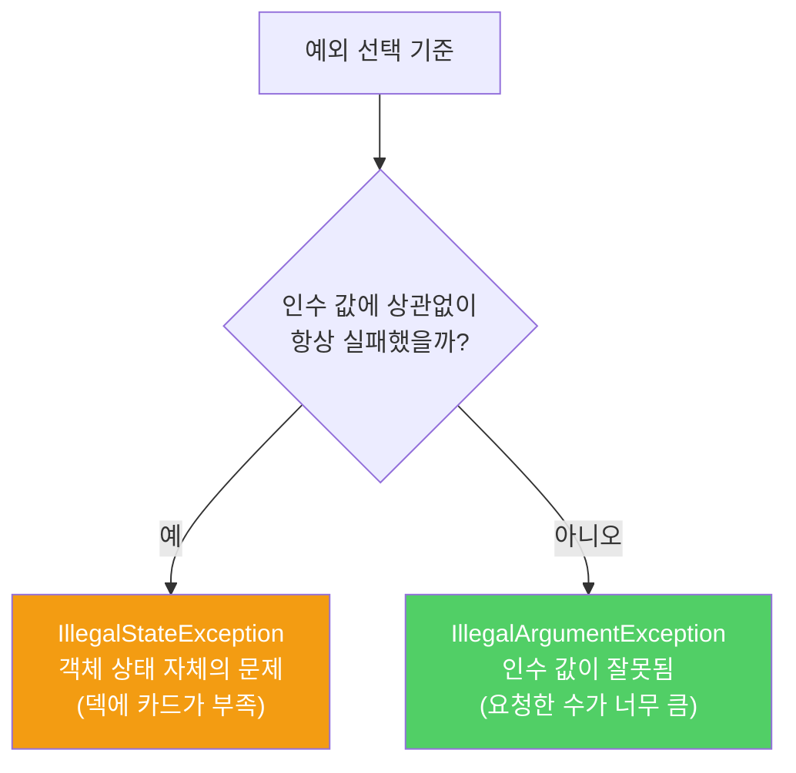

숙련된 프로그래머는 이미 존재하는 것을 재사용합니다. 예외도 마찬가지입니다. 자바 라이브러리는 대부분 상황에 쓰기 충분한 표준 예외를 제공합니다.

---

## 1. 표준 예외를 재사용해야 하는 이유

비유하자면 **표준 도로 표지판을 사용하는 것**입니다. 직접 만든 표지판은 운전자를 혼란스럽게 하지만, 표준 표지판은 모두가 바로 이해합니다.

- API가 다른 사람이 익히고 사용하기 쉬워집니다. 이미 익숙한 규약을 그대로 따르기 때문입니다.
- API를 사용한 프로그램도 낯선 예외를 쓰지 않아 읽기 쉬워집니다.
- 예외 클래스 수가 적을수록 메모리 사용량도 줄고 클래스 적재 시간도 줄어듭니다.

---

## 2. 자주 쓰는 표준 예외

비유하자면 **공구함에 자주 쓰는 공구**입니다. 상황에 맞는 공구를 찾아 쓰는 것이 직접 만드는 것보다 낫습니다.

| 예외 | 주요 쓰임 |
|------|-----------|
| `IllegalArgumentException` | 인수로 부적절한 값을 넘길 때 (음수 횟수 등) |
| `IllegalStateException` | 객체 상태가 메서드 수행에 적합하지 않을 때 (초기화 안 된 객체) |
| `NullPointerException` | null을 허용하지 않는 곳에 null을 건넬 때 |
| `IndexOutOfBoundsException` | 시퀀스 허용 범위를 넘는 인덱스를 건넬 때 |
| `ConcurrentModificationException` | 단일 스레드용 객체를 여러 스레드가 동시에 수정할 때 |
| `UnsupportedOperationException` | 클라이언트가 요청한 동작을 객체가 지원하지 않을 때 |

```java
// 좋은 예 — 표준 예외 사용
void repeat(int times) {
    if (times < 0)
        throw new IllegalArgumentException("반복 횟수는 음수일 수 없습니다: " + times);
    // ...
}

void startEngine() {
    if (!initialized)
        throw new IllegalStateException("초기화가 완료되지 않았습니다");
    // ...
}
```

---

## 3. IllegalArgumentException vs IllegalStateException 구분

비유하자면 **카드 덱에서 인수만큼 카드를 뽑는 메서드**입니다. 덱에 카드가 5장인데 10장을 뽑으라는 상황은 어떤 예외일까요?



```java
// 덱에 5장만 있을 때 10장 요청 → 인수가 문제 → IllegalArgumentException
// 덱에 0장 있을 때 1장 요청 → 상태가 문제 → IllegalStateException
void dealCards(int numCards) {
    if (numCards > deck.size())
        throw new IllegalArgumentException("덱에 카드가 부족합니다");
    if (deck.isEmpty())
        throw new IllegalStateException("덱이 비어있습니다");
}
```

---

## 4. 직접 만들면 안 되는 것

`Exception`, `RuntimeException`, `Throwable`, `Error`는 직접 재사용하지 마세요. 이들은 여러 성격의 예외를 포괄하는 상위 클래스이므로 안정적으로 테스트할 수 없습니다.

더 많은 정보를 제공해야 한다면 표준 예외를 확장(상속)하면 됩니다. 단, 예외는 직렬화될 수 있다는 점을 기억하세요. 직렬화 비용이 부담이 된다면 새 예외를 만들지 않아야 할 이유가 하나 더 늘어납니다.

---

## 5. 요약

> 상황에 부합한다면 항상 표준 예외를 재사용하세요. 예외 이름뿐 아니라 예외가 던져지는 맥락도 일치할 때만 재사용합니다. 더 많은 정보가 필요하다면 표준 예외를 확장하세요.

---

> 참조: 이펙티브 자바 3/E — 조슈아 블로크
