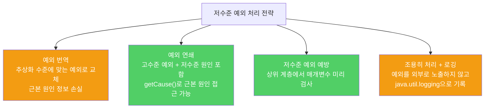

상위 계층에서 저수준 예외가 그대로 전파되면, 구현 세부사항이 API에 노출되어 윗 레벨을 오염시킵니다. 예외 번역으로 추상화 수준에 맞는 예외를 던지세요.

---

## 1. 저수준 예외가 그대로 전파되는 문제

비유하자면 **물류 창고의 재고 관리 오류를 고객에게 "팔레트 리프트 유압 실린더 오작동"으로 통보하는 것**입니다. 고객 입장에서는 전혀 맥락에 맞지 않는 정보입니다.

```java
// 나쁜 예 — 저수준 예외가 그대로 전파됨
// List 구현에서 내부적으로 LinkedList를 쓴다는 사실이 드러남
public String getUserName(int index) throws NoSuchElementException {
    // NoSuchElementException이 밖으로 새어나옴
    // 클라이언트: "User를 가져오는데 왜 NoSuchElement?"
}
```

이것은 단순히 혼란을 주는 데 그치지 않습니다. 다음 릴리스에서 구현을 바꾸면 다른 예외가 나와 기존 클라이언트 코드가 깨집니다.

---

## 2. 예외 번역 — 추상화 수준에 맞게 바꿔 던지기

비유하자면 **고객에게 "주문하신 상품이 일시 품절입니다"라고 번역해서 알리는 것**입니다. 내부 사정은 감추고 고객이 이해할 수 있는 언어로 전달합니다.

```java
// 예외 번역 — 저수준 예외를 잡아 고수준 예외로 교체
try {
    // 저수준 추상화 사용
    return listIterator(index).next();
} catch (NoSuchElementException e) {
    // 추상화 수준에 맞는 예외로 번역
    throw new IndexOutOfBoundsException("인덱스: " + index);
}
```

`AbstractSequentialList.get()`은 실제로 이렇게 구현되어 있습니다. `List<E>` 인터페이스 명세가 `IndexOutOfBoundsException`을 요구하기 때문입니다.

---

## 3. 예외 연쇄 — 근본 원인도 함께 전달

비유하자면 **번역가가 원문도 함께 첨부하는 것**입니다. 고수준 메시지와 저수준 원인을 모두 제공해 디버깅을 돕습니다.

```java
// 예외 연쇄 — 근본 원인(cause)을 고수준 예외에 실어 보냄
try {
    // 저수준 추상화 사용
} catch (LowerLevelException cause) {
    throw new HigherLevelException(cause);  // cause를 생성자에 전달
}

// 예외 연쇄용 생성자
class HigherLevelException extends Exception {
    HigherLevelException(Throwable cause) {
        super(cause);  // Throwable 생성자에 원인 전달
    }
}

// 클라이언트에서 근본 원인 확인
try {
    service.action();
} catch (HigherLevelException e) {
    Throwable rootCause = e.getCause();  // 저수준 예외 접근 가능
    rootCause.printStackTrace();
}
```

대부분의 표준 예외는 예외 연쇄용 생성자를 갖추고 있습니다. 없다면 `Throwable.initCause()`로 원인을 직접 설정할 수 있습니다.



---

## 4. 예외 번역도 남용하면 안 된다

비유하자면 **모든 것을 번역하려다가 원래 말의 뉘앙스를 잃는 것**입니다. 가장 좋은 방법은 저수준 메서드 자체가 성공하도록 만들어 예외가 발생하지 않게 하는 것입니다.

---

## 5. 요약

> 저수준 예외를 그대로 전파하지 마세요. 상위 계층에서는 예외 번역으로 추상화 수준에 맞는 예외를 던지세요. 디버깅이 중요하다면 예외 연쇄로 근본 원인도 함께 제공하세요.

---

> 참조: 이펙티브 자바 3/E — 조슈아 블로크
