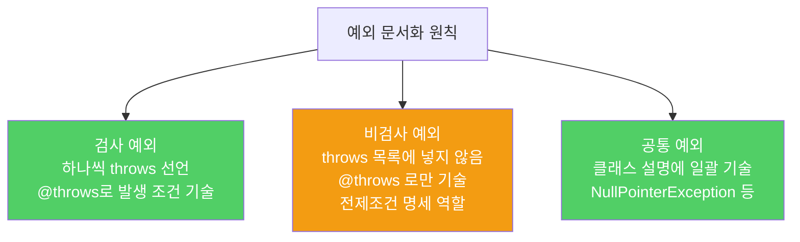

메서드가 던지는 예외는 그 메서드를 올바로 사용하는 데 아주 중요한 정보입니다. 검사 예외는 물론 비검사 예외도 정성껏 문서화해야 합니다.

---

## 1. 검사 예외 — 하나씩 따로 선언하라

비유하자면 **계약서에 각 조항을 구체적으로 적는 것**입니다. "모든 문제 발생 시"처럼 뭉뚱그리면 계약자가 어떤 상황에서 어떻게 대처해야 할지 알 수 없습니다.

```java
// 나쁜 예 — Exception으로 뭉뚱그려 선언
public void process() throws Exception { ... }  // 어떤 예외인지 알 수 없음

// 좋은 예 — 각 예외를 따로 선언하고 @throws로 문서화
/**
 * ...
 * @throws FileNotFoundException 지정된 파일이 없을 때
 * @throws IOException 파일 읽기 중 I/O 오류가 발생했을 때
 */
public void process() throws FileNotFoundException, IOException { ... }
```

`main` 메서드는 예외입니다. JVM만 호출하므로 `Exception`을 던지도록 선언해도 됩니다.

---

## 2. 비검사 예외도 문서화하라

비유하자면 **제품 사용 설명서에 "이런 상황에서는 오작동합니다"를 적는 것**입니다. 강제는 아니지만 사용자가 오류를 예방할 수 있게 됩니다.

```java
/**
 * 지정한 인덱스의 원소를 반환한다.
 *
 * @param index 반환할 원소의 인덱스 (0 이상, size() 미만)
 * @return 해당 위치의 원소
 * @throws IndexOutOfBoundsException index가 범위를 벗어난 경우
 *         ({@code index < 0 || index >= size()})
 * @throws NullPointerException index가 null인 경우
 */
E get(int index);
```

비검사 예외 문서화의 효과: 프로그래머가 자연스럽게 해당 오류가 나지 않도록 코딩하게 됩니다. 잘 정비된 비검사 예외 문서는 사실상 메서드의 **전제조건** 명세가 됩니다.

인터페이스 메서드에서 특히 중요합니다. 인터페이스의 일반 규약으로 자리 잡아 모든 구현체가 일관되게 동작하도록 강제하는 효과가 있습니다.

---

## 3. 비검사 예외는 throws 목록에 넣지 마라

비유하자면 **선택 사항과 필수 사항을 명확히 구분하는 것**입니다.

```java
// 좋은 예 — 검사 예외는 throws에 포함, 비검사 예외는 @throws에만 기술
/**
 * @throws IOException 파일 I/O 오류 (검사 예외 — throws에도 포함)
 * @throws NullPointerException path가 null인 경우 (비검사 예외 — throws에 넣지 않음)
 */
public void readFile(Path path) throws IOException { ... }
//                               ^^^^^^^^^^^^^^^^
// IOException만 throws에 있음 — NullPointerException은 없음
```

Javadoc 유틸리티는 `throws` 절에도 있고 `@throws`에도 있는 예외와, `@throws`에만 있는 예외를 시각적으로 구분해줍니다. 프로그래머가 어느 것이 비검사 예외인지 바로 알 수 있습니다.

---

## 4. 클래스 수준에서 일괄 문서화

비유하자면 **"이 가게의 모든 직원은 반말을 하지 않습니다"처럼 공통 규칙을 한 번에 명시하는 것**입니다.

```java
/**
 * 사용자 서비스.
 *
 * <p>이 클래스의 모든 메서드는 인수로 null이 넘어오면
 * {@link NullPointerException}을 던진다.
 */
public class UserService {
    // 각 메서드마다 NullPointerException을 반복하지 않아도 됨
    public User findById(Long id) { ... }
    public void update(User user) { ... }
}
```



---

## 5. 요약

> 메서드가 던질 수 있는 예외를 모두 문서화하세요. 검사 예외는 하나씩 따로 선언하고 `@throws`로 조건을 기술하세요. 비검사 예외도 `@throws`로 문서화하되 `throws` 절에는 넣지 마세요. 같은 예외가 여러 메서드에 공통이라면 클래스 수준에서 일괄 기술해도 됩니다.

---

> 참조: 이펙티브 자바 3/E — 조슈아 블로크
