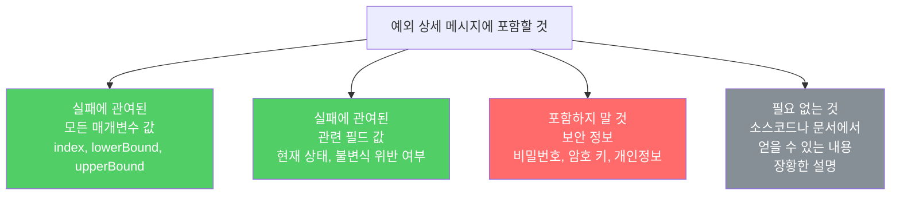

예외를 잡지 못해 프로그램이 실패하면 스택 추적이 유일한 단서입니다. 스택 추적에는 예외의 `toString()` 결과가 포함되므로, 실패 순간의 정보를 최대한 담아야 합니다.

---

## 1. 왜 상세 메시지가 중요한가

비유하자면 **사고 현장 보고서**입니다. 현장에서 측정한 정확한 수치가 없으면 사고 원인 분석이 어렵습니다. 실패를 재현하기 어려운 상황에서 스택 추적은 프로그래머가 가진 유일한 정보입니다.

```java
// 나쁜 예 — 정보 없는 예외 메시지
throw new IndexOutOfBoundsException("인덱스 초과");
// "어떤 인덱스가 어떤 범위를 초과했는가?" 알 수 없음

// 좋은 예 — 실패에 관여된 값을 모두 포함
throw new IndexOutOfBoundsException(
    String.format("최솟값: %d, 최댓값: %d, 인덱스: %d", lowerBound, upperBound, index));
// 인덱스가 최솟값보다 1 작은지, 최댓값과 같은지, 아니면 훨씬 벗어났는지 즉시 파악 가능
```

---

## 2. 실패 관련 정보를 생성자에서 받아라

비유하자면 **사고 보고서를 현장에서 바로 작성하는 것**입니다. 나중에 재구성하면 정보가 누락됩니다.

```java
// 정보를 생성자에서 받는 예외 클래스 설계
public class IndexOutOfBoundsException extends RuntimeException {
    private final int lowerBound;
    private final int upperBound;
    private final int index;

    /**
     * @param lowerBound 인덱스의 최솟값
     * @param upperBound 인덱스의 최댓값 + 1
     * @param index      인덱스의 실젯값
     */
    public IndexOutOfBoundsException(int lowerBound, int upperBound, int index) {
        super(String.format("최솟값: %d, 최댓값: %d, 인덱스: %d",
            lowerBound, upperBound, index));
        // 프로그램에서도 접근 가능하도록 저장
        this.lowerBound = lowerBound;
        this.upperBound = upperBound;
        this.index = index;
    }

    public int getLowerBound() { return lowerBound; }
    public int getUpperBound() { return upperBound; }
    public int getIndex()      { return index; }
}
```

이렇게 하면 두 가지 이점이 있습니다.

1. **고품질 메시지 자동 생성**: 사용자가 메시지를 직접 만드는 중복 코드가 불필요합니다.
2. **프로그램에서 접근 가능**: 접근자 메서드로 실패 정보를 복구 로직에서 활용할 수 있습니다.

---

## 3. 어떤 정보를 담아야 하는가

비유하자면 **교통사고 보고서에 필요한 항목**입니다. 관련된 모든 수치를 담되, 무관한 정보로 장황하게 만들지는 않습니다.



---

## 4. 상세 메시지 vs 사용자 오류 메시지

비유하자면 **의사의 진료 기록(예외 메시지)과 환자에게 하는 설명(사용자 메시지)**은 다릅니다.

- **예외 상세 메시지**: 주 소비자는 프로그래머와 SRE. 가독성보다 정보량이 중요합니다. 번역 불필요.
- **사용자 오류 메시지**: 최종 사용자가 이해할 수 있는 친절한 안내. 현지화 필요.

```java
// 예외 메시지 — 기술적 세부사항
throw new IllegalArgumentException(
    "price must be positive, got: " + price);

// 사용자 메시지 — 친절한 안내 (예외와 별도)
showDialog("가격은 0보다 커야 합니다. 다시 입력해 주세요.");
```

---

## 5. 요약

> 예외의 상세 메시지에 실패에 관여된 모든 매개변수와 필드 값을 담으세요. 정보를 생성자에서 받아 상세 메시지를 미리 생성하고 접근자 메서드도 제공하면 좋습니다. 단, 보안 정보(비밀번호, 암호 키)는 포함하지 마세요.

---

> 참조: 이펙티브 자바 3/E — 조슈아 블로크
