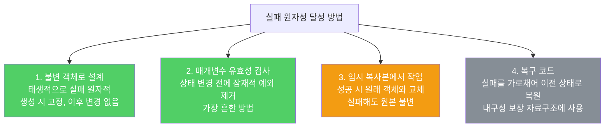

호출된 메서드가 실패하더라도 해당 객체는 메서드 호출 전 상태를 유지해야 합니다. 이 특성을 실패 원자성(failure-atomic)이라 합니다.

---

## 1. 실패 원자성이란

비유하자면 **ATM 기기**입니다. 돈을 인출하다 오류가 나도 잔액이 줄어선 안 됩니다. 오류 전 상태로 정확히 복원되어야 합니다.

```java
// 나쁜 예 — 실패 원자성 없음
// size를 먼저 줄이고 예외가 나면 size가 음수가 됨
public Object pop() {
    Object result = elements[--size];  // size를 먼저 변경
    elements[size] = null;
    return result;
    // 빈 스택에서 호출하면 ArrayIndexOutOfBoundsException + size = -1이 됨
}

// 좋은 예 — 실패 원자성 보장
public Object pop() {
    if (size == 0)
        throw new EmptyStackException();  // 상태 변경 전에 검사
    Object result = elements[--size];
    elements[size] = null;
    return result;
}
```

---

## 2. 실패 원자성을 달성하는 네 가지 방법

비유하자면 **공사 중 사고를 예방하는 방법들**입니다. 설계 단계에서 안전하게 만들거나, 착공 전 검사하거나, 모형으로 먼저 테스트하거나, 사고 발생 시 원상복구하는 방법이 있습니다.



**방법 3 — 임시 복사본 예시**: 정렬 메서드에서 원소를 배열로 복사한 뒤 정렬합니다. 정렬에 실패해도 원본 리스트는 변하지 않습니다.

```java
// 임시 복사본에서 작업
public void sort(List<E> list) {
    Object[] snapshot = list.toArray();  // 임시 복사본
    Arrays.sort(snapshot);               // 복사본에서 정렬
    // 성공하면 원본에 반영
    ListIterator<E> it = list.listIterator();
    for (Object e : snapshot) {
        it.next();
        it.set((E) e);
    }
    // 정렬 중 ClassCastException이 나도 원본 list는 변하지 않음
}
```

**방법 2 — TreeMap 예시**: 엉뚱한 타입의 원소를 추가하려 하면 트리를 변경하기 전에 `ClassCastException`이 납니다. 삽입 위치를 찾는 과정에서 예외가 발생하기 때문입니다.

---

## 3. 항상 가능한 것은 아니다

비유하자면 **두 사람이 동시에 같은 문서를 편집하는 경우**입니다. 동기화 없이 두 스레드가 같은 객체를 수정하면 일관성이 깨집니다. `ConcurrentModificationException`을 잡았더라도 그 객체가 여전히 쓸 수 있는 상태라고 가정하면 안 됩니다.

`Error`는 복구할 수 없으므로 `AssertionError`에 대해서는 실패 원자성을 달성하려는 시도 자체가 필요 없습니다.

---

## 4. 실패 원자성을 지키지 못한다면 문서화하라

메서드 명세에 기술한 예외라면 예외가 발생하더라도 객체 상태는 메서드 호출 전과 똑같이 유지되어야 합니다. 이 규칙을 지키지 못한다면 실패 시 객체 상태를 API 설명에 명시해야 합니다.

---

## 5. 요약

> 가능한 한 메서드를 실패 원자적으로 만드세요. 불변 객체 설계, 매개변수 유효성 검사, 임시 복사본 활용 순서로 적용을 고려하세요. 달성하기 어렵다면 실패 시 객체 상태를 문서화하세요.

---

> 참조: 이펙티브 자바 3/E — 조슈아 블로크
