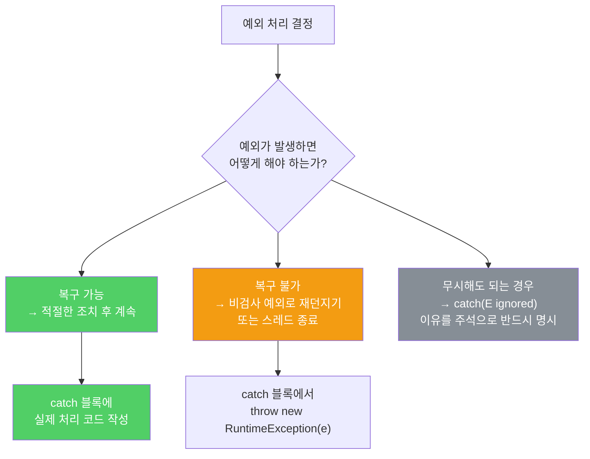

빈 catch 블록은 예외를 조용히 삼켜버립니다. 예외가 존재하는 이유를 없애버리는 것과 같습니다.

---

## 1. 빈 catch 블록의 위험성

비유하자면 **화재경보를 끄고 아무도 화재를 모르게 하는 것**입니다. 당장은 조용하지만 실제 불이 났을 때 아무도 대응하지 못합니다.

```java
// 절대 이렇게 하지 말 것 — 예외를 조용히 삼킴
try {
    doSomething();
} catch (SomeException e) {
    // 아무것도 하지 않음 — 예외가 존재할 이유를 없애버림
}
```

이 코드는 예외가 나도 프로그램이 아무 문제 없는 척 계속 실행됩니다. 그 결과로 나중에 관련 없어 보이는 곳에서 이상한 오류가 발생하고, 원인을 추적하기 매우 어려워집니다.

---

## 2. 예외를 무시해도 되는 드문 경우

비유하자면 **택배를 다 받았는데 포장지를 버릴 때 실수로 찢어진 경우**입니다. 목적(내용물 수령)은 이미 달성했으므로 포장지 손상은 무시해도 됩니다.

```java
// 괜찮은 예 — 입력 전용 스트림 닫기 실패는 무시 가능
// 이미 필요한 데이터를 다 읽었고, 상태 변경도 없었음
InputStream is = ...;
try {
    // 데이터 읽기
} finally {
    try {
        is.close();
    } catch (IOException e) {
        // 닫기 실패는 무시 가능 (읽기는 이미 완료)
        // 하지만 로그는 남기는 것이 좋음
    }
}
```

---

## 3. 무시하기로 했다면 반드시 표시하라

비유하자면 **"이 경보는 오작동이므로 의도적으로 무시합니다"라고 표지판을 붙이는 것**입니다. 다음 사람이 보고 의도적인 결정인지 실수인지 알 수 있어야 합니다.

```java
// 예외를 무시해야 한다면 — 변수 이름을 ignored로, 이유를 주석으로
Future<Integer> f = exec.submit(planarMap::chromaticNumber);
int numColors = 4;  // 기본 값 — 어떤 지도라도 이 값이면 충분하다
try {
    numColors = f.get(1L, TimeUnit.SECONDS);
} catch (TimeoutException | ExecutionException ignored) {
    // 기본 값을 사용한다.
    // 색상 수를 최소화하면 좋지만, 타임아웃이 나도 기본 값으로 충분히 동작한다.
}
```



---

## 4. 요약

> catch 블록을 비워두지 마세요. 예외를 무시하기로 했다면 변수 이름을 `ignored`로 바꾸고, 그렇게 결정한 이유를 주석으로 남기세요. 예외는 문제 상황에 대처하기 위해 존재하며, 무시하면 그 목적이 사라집니다.

---

> 참조: 이펙티브 자바 3/E — 조슈아 블로크
