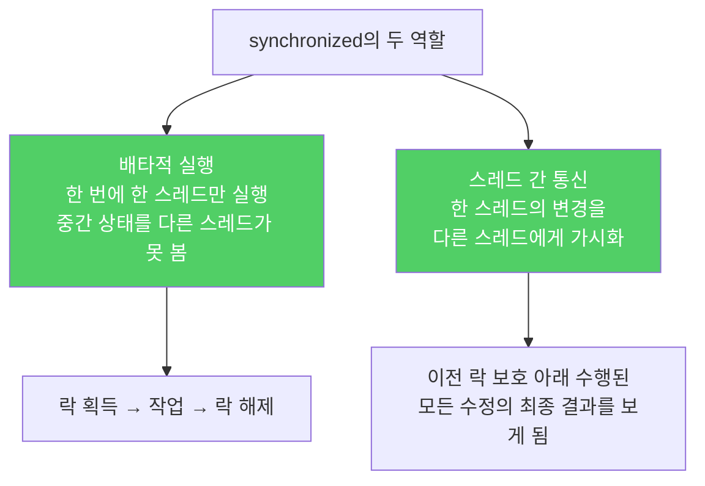

`synchronized`는 단순히 "한 번에 한 스레드만 실행"을 보장하는 게 아닙니다. 한 스레드가 만든 변화를 다른 스레드가 볼 수 있도록 보장하는 통신 역할도 합니다.

---

## 1. 동기화의 두 가지 역할

비유하자면 **화이트보드 공유 회의**입니다. 한 사람이 내용을 쓰는 동안 다른 사람이 지우지 못하게 막는 것(배타적 실행)과, 쓴 내용을 모든 참석자가 즉시 볼 수 있게 하는 것(가시성)이 모두 필요합니다.

자바 언어 명세는 스레드가 필드를 읽을 때 "수정이 완전히 반영된 값"을 얻는다고 보장합니다. 그러나 한 스레드가 저장한 값이 다른 스레드에게 "언제 보이는가"는 보장하지 않습니다. 자바 메모리 모델 때문입니다.



---

## 2. 동기화 없이 공유 가변 데이터를 쓰면 생기는 일

비유하자면 **교대 근무자가 메모를 남기지 않는 상황**입니다. 전 근무자가 상태를 바꿔 놓았어도 다음 근무자가 그 사실을 모르고 예전 상태로 작업합니다.

아래 프로그램은 1초 후 종료될 것 같지만 실제로는 영원히 실행됩니다.

```java
// 잘못된 코드 — 동기화 없이 가변 데이터를 공유
public class StopThread {
    private static boolean stopRequested;

    public static void main(String[] args) throws InterruptedException {
        Thread backgroundThread = new Thread(() -> {
            int i = 0;
            while (!stopRequested) {  // 이 값이 언제 갱신되는지 보장 없음
                i++;
            }
        });
        backgroundThread.start();

        TimeUnit.SECONDS.sleep(1);
        stopRequested = true;  // 메인 스레드가 true로 바꿨지만...
    }
}
```

JVM의 서버 VM은 아래와 같이 **끌어올리기(hoisting)** 최적화를 적용할 수 있습니다.

```java
// JVM이 최적화한 결과 — 응답 불가(liveness failure)
if (!stopRequested) {
    while (true) {  // 한 번 읽은 값을 캐시해 계속 사용
        i++;
    }
}
```

동기화가 없으면 JVM은 `stopRequested`를 매번 메인 메모리에서 읽지 않고 레지스터에 캐시해도 됩니다. 그 결과 백그라운드 스레드는 변경을 영원히 인식하지 못합니다.

---

## 3. 해결책 1 — 읽기와 쓰기 모두 동기화

비유하자면 **칠판에 쓰고 읽을 때 모두 순서표를 뽑는 것**입니다. 쓸 때만 순서표를 뽑고 읽을 때 뽑지 않으면 최신 내용을 보장할 수 없습니다.

```java
// 좋은 예 — 쓰기와 읽기 모두 동기화
public class StopThread {
    private static boolean stopRequested;

    private static synchronized void requestStop() {
        stopRequested = true;
    }

    private static synchronized boolean stopRequested() {
        return stopRequested;
    }

    public static void main(String[] args) throws InterruptedException {
        Thread backgroundThread = new Thread(() -> {
            int i = 0;
            while (!stopRequested()) {  // 동기화된 읽기
                i++;
            }
        });
        backgroundThread.start();
        TimeUnit.SECONDS.sleep(1);
        requestStop();  // 동기화된 쓰기
    }
}
```

쓰기 메서드만 동기화하고 읽기 메서드를 동기화하지 않으면 동작을 보장하지 않습니다. 둘 다 동기화해야 합니다.

---

## 4. 해결책 2 — volatile (가시성만 필요한 경우)

비유하자면 **공유 화면을 항상 실시간 스트리밍하는 것**입니다. 쓰기 권한을 한 명에게 주지는 않지만(배타적 실행 없음), 변경 사항은 즉시 모두에게 보입니다.

```java
// volatile — 가시성만 보장, 배타적 실행은 보장하지 않음
public class StopThread {
    private static volatile boolean stopRequested;

    public static void main(String[] args) throws InterruptedException {
        Thread backgroundThread = new Thread(() -> {
            int i = 0;
            while (!stopRequested) {
                i++;
            }
        });
        backgroundThread.start();
        TimeUnit.SECONDS.sleep(1);
        stopRequested = true;
    }
}
```

---

## 5. volatile의 함정 — 원자성 없음

비유하자면 **숫자판을 두 번 눌러야 완성되는 금고**입니다. 첫 번째 누름과 두 번째 누름 사이에 다른 사람이 끼어들 수 있습니다.

`++` 연산자는 코드상 하나지만 실제로는 읽기 + 쓰기 두 단계입니다. 두 스레드가 같은 값을 읽고 같은 결과를 저장하면 안전 실패(safety failure)가 됩니다.

```java
// 잘못된 코드 — volatile만으로는 부족
private static volatile int nextSerialNumber = 0;

public static int generateSerialNumber() {
    return nextSerialNumber++;  // 읽기 + 쓰기 두 단계, 원자적이지 않음
}
```

해결책은 `synchronized`를 붙이거나, `java.util.concurrent.atomic` 패키지를 사용하는 것입니다.

```java
// 좋은 예 — AtomicLong으로 락-프리 원자적 연산
private static final AtomicLong nextSerialNum = new AtomicLong();

public static long generateSerialNumber() {
    return nextSerialNum.getAndIncrement();  // 원자적 읽기+증가
}
```

`AtomicLong`은 `volatile`의 가시성과 `synchronized`의 원자성을 모두 제공하면서 성능도 더 우수합니다.

---

## 6. 가장 좋은 방법 — 가변 데이터를 공유하지 않기

비유하자면 **각자 자기 노트에만 쓰는 것**입니다. 공유 자원 자체가 없으면 동기화 문제도 없습니다.

가변 데이터는 단일 스레드에서만 사용하고, 불변 데이터 또는 사실상 불변인 객체만 공유하세요. 이 정책을 문서에 남겨 유지보수 과정에서도 지켜지게 해야 합니다.

객체를 안전하게 발행(safe publication)하려면 정적 필드, `volatile` 필드, `final` 필드, 또는 락을 통해 접근하는 필드에 저장하거나 동시성 컬렉션에 저장하세요.

---

## 7. 요약

> 여러 스레드가 가변 데이터를 공유한다면 읽기와 쓰기 모두 동기화해야 합니다. 동기화하지 않으면 응답 불가(liveness failure) 또는 안전 실패(safety failure)가 발생합니다. 배타적 실행 없이 가시성만 필요하면 `volatile`을 쓸 수 있지만, `++`처럼 복합 연산에는 충분하지 않습니다. 그럴 때는 `AtomicLong`을 사용하세요.

---

> 참조: 이펙티브 자바 3/E — 조슈아 블로크
