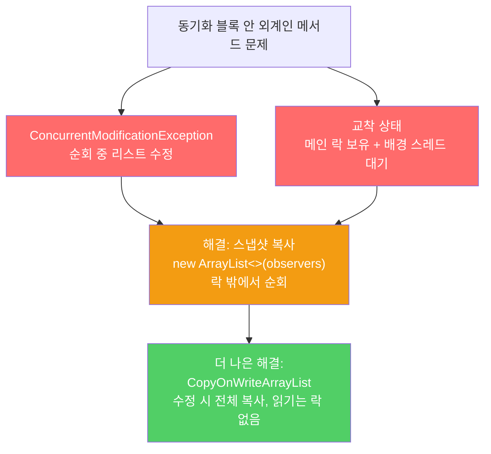

동기화 블록 안에서 외부 코드(외계인 메서드)를 호출하면 예외, 교착 상태, 데이터 훼손이 발생할 수 있습니다. 동기화 영역에서는 가능한 한 일을 적게 해야 합니다.

---

## 1. 외계인 메서드란

비유하자면 **회의실 문을 잠그고 회의 중에 외부인을 초청하는 것**입니다. 외부인이 회의실 안에서 무슨 행동을 할지 알 수 없습니다. 회의 내용을 유출하거나, 다른 문을 잠가버리거나, 아예 협박할 수도 있습니다.

동기화 블록 안에서 호출하면 안 되는 메서드는 두 종류입니다.

- 재정의할 수 있는 메서드
- 클라이언트가 넘겨준 함수 객체(람다, 콜백)

이 메서드들은 무슨 일을 할지 알 수도, 통제할 수도 없습니다.

---

## 2. 외계인 메서드가 ConcurrentModificationException을 일으키는 예

비유하자면 **명단을 읽으면서 동시에 명단에서 자신을 지우려는 상황**입니다. 명단을 순회하는 도중에 원소를 제거하면 예외가 발생합니다.

```java
// 잘못된 코드 — 동기화 블록 안에서 외계인 메서드 호출
public class ObservableSet<E> extends ForwardingSet<E> {
    private final List<SetObserver<E>> observers = new ArrayList<>();

    public void addObserver(SetObserver<E> observer) {
        synchronized (observers) {
            observers.add(observer);
        }
    }

    public boolean removeObserver(SetObserver<E> observer) {
        synchronized (observers) {
            return observers.remove(observer);
        }
    }

    private void notifyElementAdded(E element) {
        synchronized (observers) {
            for (SetObserver<E> observer : observers) {
                observer.added(this, element);  // 외계인 메서드 호출 — 위험!
            }
        }
    }
}
```

23이 추가되면 자신을 구독 해지하는 관찰자를 등록하면:

```java
set.addObserver(new SetObserver<>() {
    public void added(ObservableSet<Integer> s, Integer e) {
        System.out.println(e);
        if (e == 23) {
            s.removeObserver(this);  // 순회 중 리스트 수정 시도
        }
    }
});
```

`added` → `removeObserver` → `observers.remove`가 순회 도중 호출되어 `ConcurrentModificationException`이 발생합니다. 동기화 블록 안이어도 콜백을 통해 자기 자신이 리스트를 수정하는 것은 막을 수 없습니다.

---

## 3. 외계인 메서드가 교착 상태를 일으키는 예

비유하자면 **A가 문을 잠근 채 B에게 심부름을 시키는데, B가 그 문을 열어야 심부름을 할 수 있는 상황**입니다. A는 B를 기다리고 B는 A를 기다리며 영원히 멈춥니다.

```java
// 배경 스레드를 이용한 removeObserver — 교착 상태 발생
set.addObserver(new SetObserver<>() {
    public void added(ObservableSet<Integer> s, Integer e) {
        System.out.println(e);
        if (e == 23) {
            ExecutorService exec = Executors.newSingleThreadExecutor();
            try {
                exec.submit(() -> s.removeObserver(this)).get();  // 데드락
            } catch (ExecutionException | InterruptedException ex) {
                throw new AssertionError(ex);
            } finally {
                exec.shutdown();
            }
        }
    }
});
```

메인 스레드는 `observers` 락을 쥔 채 배경 스레드가 `removeObserver`를 완료하길 기다립니다. 배경 스레드는 `observers` 락을 얻을 수 없어 메인 스레드를 기다립니다. 교착 상태입니다.

---

## 4. 해결책 1 — 스냅샷으로 외계인 메서드를 동기화 블록 바깥으로 이동

비유하자면 **명단 사본을 만들어 회의실 밖으로 가져간 뒤 읽는 것**입니다. 원본 명단은 잠가두고, 사본으로 작업하면 충돌이 없습니다.

```java
// 개선된 코드 — 동기화 블록 바깥에서 외계인 메서드 호출
private void notifyElementAdded(E element) {
    List<SetObserver<E>> snapshot = null;
    synchronized (observers) {
        snapshot = new ArrayList<>(observers);  // 락 안에서는 복사만
    }
    for (SetObserver<E> observer : snapshot) {
        observer.added(this, element);  // 락 밖에서 외계인 메서드 호출
    }
}
```

동기화 영역 밖에서 호출하는 이런 방식을 **열린 호출(open call)**이라 합니다. 다른 스레드가 보호된 자원을 기다리는 시간이 없어져 동시성 효율도 크게 높아집니다.

---

## 5. 해결책 2 — CopyOnWriteArrayList (더 나은 방법)

비유하자면 **읽기용 복사본을 항상 최신으로 유지하는 도서관**입니다. 수정이 있을 때마다 전체 복사본을 새로 만들어 교체합니다. 읽기는 락 없이 복사본을 보면 되므로 매우 빠릅니다.

```java
// 최선의 코드 — CopyOnWriteArrayList 사용
private final List<SetObserver<E>> observers = new CopyOnWriteArrayList<>();

public void addObserver(SetObserver<E> observer) {
    observers.add(observer);  // 내부적으로 복사본 생성 후 교체
}

public boolean removeObserver(SetObserver<E> observer) {
    return observers.remove(observer);
}

private void notifyElementAdded(E element) {
    for (SetObserver<E> observer : observers) {  // 락 없이 안전하게 순회
        observer.added(this, element);
    }
}
```

`CopyOnWriteArrayList`는 수정 시 항상 새 배열을 복사해 교체합니다. 내부 배열이 절대 수정되지 않으므로 순회 중 락이 필요 없습니다. 수정은 드물고 순회가 빈번한 관찰자 리스트에 최적입니다.



---

## 6. 가변 클래스 설계 원칙

비유하자면 **동시에 여러 명이 쓰는 화장실을 설계하는 두 가지 방법**입니다. 각 칸을 독립적으로 잠그거나(내부 동기화), 아니면 화장실 전체 문을 잠그는 것을 사용자에게 맡기는(외부 동기화) 방법이 있습니다.

가변 클래스를 작성할 때 선택지는 두 가지입니다.

1. 동기화를 전혀 하지 않고 외부에서 동기화하게 한다. (`java.util` 방식: `ArrayList`, `HashMap` 등)
2. 내부에서 동기화해 스레드 안전 클래스로 만든다. (`java.util.concurrent` 방식)

단, 2번은 클라이언트가 외부에서 전체에 락을 거는 것보다 동시성을 월등히 개선할 수 있을 때만 선택해야 합니다. `StringBuffer`가 단일 스레드에서 거의 쓰이는데도 내부 동기화를 했고, 그 결과 `StringBuilder`(비동기화 버전)가 뒤늦게 등장한 이유입니다.

---

## 7. 요약

> 동기화 영역 안에서는 외계인 메서드를 절대 호출하지 마세요. 교착 상태나 `ConcurrentModificationException`이 발생합니다. 외계인 메서드 호출은 동기화 블록 밖으로 이동하고(열린 호출), 관찰자 리스트처럼 수정 드물고 순회가 잦은 경우는 `CopyOnWriteArrayList`를 사용하세요. 동기화 영역에서는 가능한 한 일을 적게 해야 합니다.

---

> 참조: 이펙티브 자바 3/E — 조슈아 블로크
