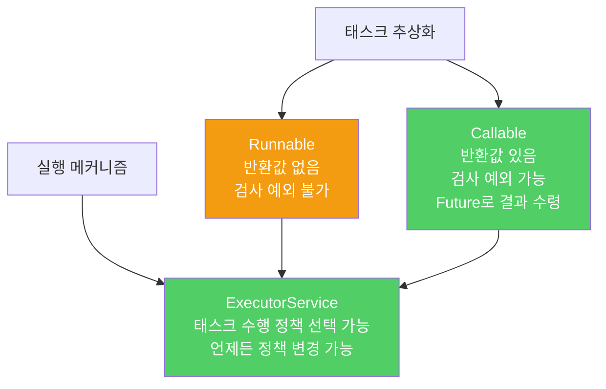

스레드를 직접 다루면 작업 정의와 실행 방법이 뒤엉킵니다. 실행자 프레임워크는 이 둘을 분리해 유연하고 안전한 동시성 프로그래밍을 가능하게 합니다.

---

## 1. 실행자 프레임워크란

비유하자면 **직접 배달하는 대신 배달 대행 서비스를 이용하는 것**입니다. 무엇을 배달할지(태스크)와 어떻게 배달할지(실행 메커니즘)를 분리하면, 물량이 늘어나도 배달 방식만 바꾸면 됩니다.

```java
// 단 한 줄로 작업 큐 생성
ExecutorService exec = Executors.newSingleThreadExecutor();

// 태스크 제출
exec.execute(runnable);

// 우아한 종료 — 이 작업이 실패하면 VM이 종료되지 않을 수 있음
exec.shutdown();
```

---

## 2. 실행자 서비스의 주요 기능

비유하자면 **배달 대행 앱의 다양한 옵션**입니다. 즉시 배달, 예약 배달, 배달 완료 알림, 여러 건 한꺼번에 등 요구에 맞게 선택할 수 있습니다.

```java
// 특정 태스크 완료 대기
exec.submit(callable).get();

// 태스크 여러 개 중 하나라도 완료되면 반환
exec.invokeAny(tasks);

// 모든 태스크 완료 대기
exec.invokeAll(tasks);

// 서비스 종료 완료 대기
exec.awaitTermination(10, TimeUnit.SECONDS);

// 주기적 실행
ScheduledExecutorService scheduler = Executors.newScheduledThreadPool(1);
scheduler.scheduleAtFixedRate(task, 0, 1, TimeUnit.SECONDS);
```

---

## 3. 스레드 풀 종류 선택

비유하자면 **배달 직원 수를 결정하는 방식**입니다. 항상 1명(단일 스레드), 고정 인원(고정 풀), 상황에 따라 유동적(캐시 풀) 중 서버 규모에 맞게 골라야 합니다.

```java
// 1. 단일 스레드 — 순서 보장이 필요할 때
ExecutorService single = Executors.newSingleThreadExecutor();

// 2. 고정 스레드 풀 — 무거운 프로덕션 서버에 적합
ExecutorService fixed = Executors.newFixedThreadPool(Runtime.getRuntime().availableProcessors());

// 3. 캐시 스레드 풀 — 소규모 프로그램에만 사용, 프로덕션 서버에는 위험
ExecutorService cached = Executors.newCachedThreadPool();
// 경고: 요청이 폭주하면 스레드를 무한히 생성 → CPU 100% → 서버 다운
```

`CachedThreadPool`을 무거운 서버에서 쓰면 태스크가 큐에 쌓이지 않고 즉시 새 스레드를 생성하므로, 트래픽 폭주 시 스레드 수가 폭발적으로 늘어납니다. 프로덕션 서버에는 `newFixedThreadPool` 또는 `ThreadPoolExecutor`를 직접 설정해 사용하세요.

---

## 4. 태스크: Runnable vs Callable

비유하자면 **결과 보고서 없이 작업만 하는 직원(Runnable)**과 **작업 후 보고서를 제출하는 직원(Callable)**의 차이입니다.

```java
// Runnable — 반환값 없음, 검사 예외 던질 수 없음
Runnable task = () -> System.out.println("작업 수행");

// Callable — 값 반환 가능, 검사 예외 던질 수 있음
Callable<Integer> callableTask = () -> {
    // 계산 후 결과 반환
    return 42;
};

Future<Integer> future = exec.submit(callableTask);
Integer result = future.get();  // 완료될 때까지 대기 후 결과 수령
```



---

## 5. 포크-조인 풀 — 병렬 분할 정복

비유하자면 **큰 프로젝트를 여러 팀이 나눠 맡고, 먼저 끝난 팀이 다른 팀 일을 가져와 돕는 것**입니다. 모든 팀이 쉬지 않고 일해 CPU를 최대한 활용합니다.

```java
// ForkJoinPool — 작업 훔치기(work-stealing) 방식
ForkJoinPool pool = new ForkJoinPool();

// ForkJoinTask: 큰 작업을 작은 하위 태스크로 분할
class SumTask extends RecursiveTask<Long> {
    private final long[] array;
    private final int start, end;

    @Override
    protected Long compute() {
        if (end - start <= THRESHOLD) {
            // 작은 작업은 직접 처리
            long sum = 0;
            for (int i = start; i < end; i++) sum += array[i];
            return sum;
        }
        int mid = (start + end) / 2;
        SumTask left = new SumTask(array, start, mid);
        SumTask right = new SumTask(array, mid, end);
        left.fork();          // 왼쪽 하위 태스크를 다른 스레드에 위임
        return right.compute() + left.join();  // 오른쪽 직접 처리 후 합산
    }
}
```

포크-조인 태스크를 직접 작성하기는 어렵지만, **병렬 스트림을 사용하면 포크-조인의 이점을 쉽게 얻을 수 있습니다.** 병렬 스트림은 내부적으로 `ForkJoinPool.commonPool()`을 사용합니다.

```java
// 병렬 스트림 — 포크-조인 풀 위에서 동작
long sum = LongStream.rangeClosed(1, 1_000_000)
    .parallel()
    .sum();
```

---

## 6. 요약

> 스레드를 직접 다루지 말고 실행자 프레임워크를 사용하세요. 태스크(Runnable/Callable)와 실행 메커니즘(ExecutorService)을 분리하면 실행 정책을 언제든 바꿀 수 있습니다. 프로덕션 서버에는 `CachedThreadPool` 대신 `FixedThreadPool`이나 `ThreadPoolExecutor`를 사용하세요. 병렬 분할 정복은 포크-조인 풀을, 간단한 경우는 병렬 스트림을 활용하세요.

---

> 참조: 이펙티브 자바 3/E — 조슈아 블로크
