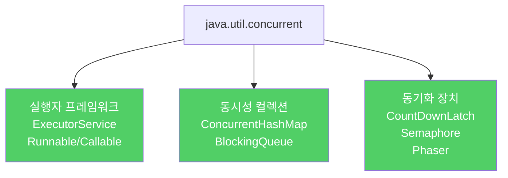

`wait`와 `notify`는 올바로 사용하기 매우 까다롭습니다. 자바 5부터 제공되는 고수준 동시성 유틸리티가 그 역할을 훨씬 안전하고 명확하게 대신합니다.

---

## 1. java.util.concurrent의 세 가지 범주

비유하자면 **수동 변속기(wait/notify)와 자동 변속기(고수준 유틸리티)**의 차이입니다. 수동 변속기를 잘 쓰면 세밀한 제어가 가능하지만, 초보자는 물론 전문가도 실수하기 쉽습니다. 자동 변속기는 내부 복잡성을 감추고 안전하게 동작합니다.



---

## 2. 동시성 컬렉션 — ConcurrentHashMap

비유하자면 **여러 창구가 동시에 운영되는 은행**입니다. 각 창구가 독립적으로 처리하므로 한 창구의 작업이 다른 창구를 막지 않습니다. 외부에서 전체 은행 문을 잠그면(외부 락 추가) 오히려 모든 창구가 멈춥니다.

`ConcurrentHashMap`은 외부에서 락을 추가하면 오히려 느려집니다. 대신 원자적 복합 연산 메서드를 제공합니다.

```java
// 기본 버전 — 경쟁 조건 가능
private static final ConcurrentMap<String, String> map = new ConcurrentHashMap<>();

public static String intern(String s) {
    String previousValue = map.putIfAbsent(s, s);
    return previousValue == null ? s : previousValue;
}

// 최적화 버전 — get으로 먼저 확인 (ConcurrentHashMap은 get에 최적화)
public static String intern(String s) {
    String result = map.get(s);
    if (result == null) {
        result = map.putIfAbsent(s, s);
        if (result == null) {
            result = s;
        }
    }
    return result;
}
```

`Collections.synchronizedMap`보다 `ConcurrentHashMap`이 훨씬 빠릅니다. 낡은 `synchronizedMap`을 `ConcurrentHashMap`으로 교체하는 것만으로도 동시성 애플리케이션 성능이 극적으로 개선됩니다.

---

## 3. BlockingQueue — 생산자-소비자 패턴

비유하자면 **식당 주방과 홀 직원 사이의 서빙대**입니다. 주방(생산자)이 음식을 서빙대에 올리고, 홀 직원(소비자)이 가져갑니다. 서빙대가 비어 있으면 홀 직원은 음식이 올라올 때까지 기다립니다.

```java
// BlockingQueue — 큐가 빌 때까지 take()가 차단(blocking)
BlockingQueue<Runnable> workQueue = new LinkedBlockingQueue<>();

// 생산자 스레드
workQueue.put(task);  // 꽉 찼으면 대기

// 소비자 스레드
Runnable task = workQueue.take();  // 비었으면 대기
```

`ThreadPoolExecutor`를 포함한 대부분의 `ExecutorService` 구현체가 내부적으로 `BlockingQueue`를 사용합니다.

---

## 4. CountDownLatch — 동시 실행 타이머

비유하자면 **출발선에서 모든 선수가 준비 완료를 알린 뒤 심판이 총을 쏘는 것**입니다. 한 명이라도 준비가 안 되면 총을 쏘지 않고, 모든 선수가 결승선을 통과한 순간 시간을 기록합니다.

```java
public static long time(Executor executor, int concurrency, Runnable action)
        throws InterruptedException {
    CountDownLatch ready = new CountDownLatch(concurrency);  // 준비 신호
    CountDownLatch start = new CountDownLatch(1);            // 출발 신호
    CountDownLatch done  = new CountDownLatch(concurrency);  // 완료 신호

    for (int i = 0; i < concurrency; i++) {
        executor.execute(() -> {
            ready.countDown();  // 타이머에게 준비 완료 알림
            try {
                start.await();  // 출발 신호 대기
                action.run();
            } catch (InterruptedException e) {
                Thread.currentThread().interrupt();
            } finally {
                done.countDown();  // 타이머에게 완료 알림
            }
        });
    }

    ready.await();               // 모든 작업자가 준비될 때까지 대기
    long startNanos = System.nanoTime();
    start.countDown();           // 출발 — 모든 작업자 동시 시작
    done.await();                // 모든 작업자 완료 대기
    return System.nanoTime() - startNanos;
}
```

시간 측정에는 `System.currentTimeMillis` 대신 `System.nanoTime`을 사용하세요. 더 정확하고 시스템 실시간 시계 보정에 영향받지 않습니다.

---

## 5. 레거시 코드에서 wait 사용하는 법

비유하자면 **자동문이 없던 시절의 회전문 조작법**입니다. 현대 코드에서는 쓸 일이 없지만, 오래된 코드를 유지보수할 때는 올바른 방법을 알아야 합니다.

```java
// wait 표준 관용구 — 반드시 while 루프 안에서 호출
synchronized (obj) {
    while (<조건이 충족되지 않았다>) {
        obj.wait();  // 락을 놓고 대기, 깨어나면 다시 락 획득
    }
    // 조건 충족 후 작업 수행
}
```

`if`가 아닌 `while`을 써야 하는 이유는 다음 상황 때문입니다.

- `notify` 호출 후 다른 스레드가 끼어들어 조건을 다시 거짓으로 만들 수 있습니다.
- 실수나 악의적인 `notify` 호출로 조건 없이 깨어날 수 있습니다.
- 허위 각성(spurious wakeup): `notify` 없이도 스레드가 깨어나는 현상이 드물게 발생합니다.

`notify`와 `notifyAll` 중 선택할 때는 일반적으로 `notifyAll`을 사용하세요. 관련 없는 스레드가 악의적으로 `notify`를 가로채 정작 깨어나야 할 스레드가 영원히 대기하는 상황을 방지합니다.

---

## 6. 요약

> `wait`와 `notify`는 동시성 어셈블리 언어입니다. 새 코드에서는 `java.util.concurrent`의 고수준 유틸리티를 사용하세요. `ConcurrentHashMap`은 `synchronizedMap`보다 빠르고, `CountDownLatch`는 복잡한 스레드 조율을 직관적으로 구현합니다. 레거시 코드에서 `wait`를 써야 한다면 반드시 `while` 루프 안에서 호출하고, `notify` 대신 `notifyAll`을 사용하세요.

---

> 참조: 이펙티브 자바 3/E — 조슈아 블로크
