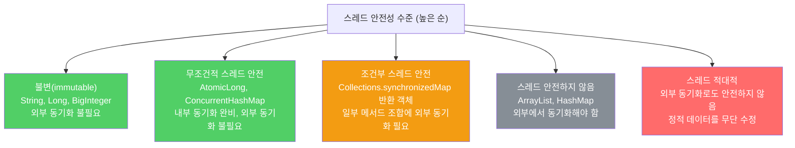

클래스가 멀티스레드 환경에서 어떻게 동작하는지 문서화하지 않으면, 사용자는 잘못된 가정으로 동기화를 빠뜨리거나 과하게 추가해 심각한 오류를 만듭니다.

---

## 1. synchronized는 문서가 아니다

비유하자면 **"이 방 잠금장치가 있으면 안전하다"고 가정하는 것**입니다. 잠금장치가 있더라도 어떻게 잠가야 하는지, 누구와 공유해야 하는지 모르면 소용이 없습니다.

자바독이 생성하는 API 문서에는 `synchronized` 한정자가 포함되지 않습니다. 따라서 `synchronized` 키워드의 유무로 스레드 안전성을 판단할 수 없습니다. 스레드 안전성 정보는 반드시 문서로 명시해야 합니다.

---

## 2. 스레드 안전성의 다섯 단계

비유하자면 **도로 위 차량의 안전 등급**입니다. 충돌이 절대 없는 무인 도로(불변), 모든 안전 장치가 내장된 자율주행차(무조건 안전), 운전자가 안전벨트를 직접 매야 하는 일반 차(조건부 안전), 조심해서 타야 하는 오래된 차(스레드 안전하지 않음), 타면 안 되는 차(스레드 적대적) 순서입니다.



---

## 3. 조건부 스레드 안전 클래스의 문서화

비유하자면 **"이 가전제품은 220V 전용입니다"처럼 사용 조건을 명시하는 것**입니다. 조건을 모르면 올바로 사용할 수 없습니다.

`Collections.synchronizedMap`이 반환한 맵을 순회할 때 어떤 락을 써야 하는지 반드시 명시해야 합니다.

```java
// Collections.synchronizedMap API 문서 내용 요약
// 컬렉션 뷰를 순회하려면 반드시 맵 자체를 락으로 사용해야 한다.
Map<K, V> m = Collections.synchronizedMap(new HashMap<>());
Set<K> s = m.keySet();

// 잘못된 사용 — 락 없이 순회
for (K key : s) { ... }  // ConcurrentModificationException 발생 가능

// 올바른 사용 — 맵(m)을 락으로 사용해 순회
synchronized (m) {
    for (K key : s) {
        key.f();
    }
}
```

---

## 4. 비공개 락 객체 — 서비스 거부 공격 방지

비유하자면 **자물쇠를 방 안에 숨겨두는 것**입니다. 열쇠를 밖에 걸어두면 아무나 가져가 방을 영구적으로 점거할 수 있습니다.

`synchronized` 메서드는 클래스의 인스턴스 자체가 락이 됩니다. 클라이언트가 이 락을 오래 쥐고 놓지 않는 서비스 거부 공격을 막으려면 비공개 락 객체를 사용하세요.

```java
// 잘못된 방법 — 공개된 락 (서비스 거부 공격에 취약)
public synchronized void foo() { ... }
// 클라이언트가 synchronized(instance) { 무한 루프 } 로 락을 영구 점거 가능

// 올바른 방법 — 비공개 락 객체
public class MyClass {
    private final Object lock = new Object();  // final로 선언 필수

    public void foo() {
        synchronized (lock) {
            // ...
        }
    }
}
```

`lock` 필드를 `final`로 선언하는 것이 중요합니다. 락 객체가 교체되면 이전 락을 기다리던 스레드가 영원히 깨어나지 못합니다.

비공개 락 객체는 **무조건적 스레드 안전 클래스**에만 적합합니다. 조건부 스레드 안전 클래스는 어떤 락을 획득해야 하는지 클라이언트에게 알려줘야 하므로 비공개 락을 쓸 수 없습니다.

---

## 5. 요약

> 모든 클래스는 스레드 안전성 수준을 문서에 명확히 기재해야 합니다. `synchronized` 키워드의 유무로는 판단할 수 없습니다. 조건부 스레드 안전 클래스는 어떤 순서로 호출할 때 어떤 락이 필요한지 정확히 명시하세요. 무조건적 스레드 안전 클래스를 작성할 때는 `synchronized` 메서드 대신 비공개 `final` 락 객체를 사용해 서비스 거부 공격을 방어하세요.

---

> 참조: 이펙티브 자바 3/E — 조슈아 블로크
