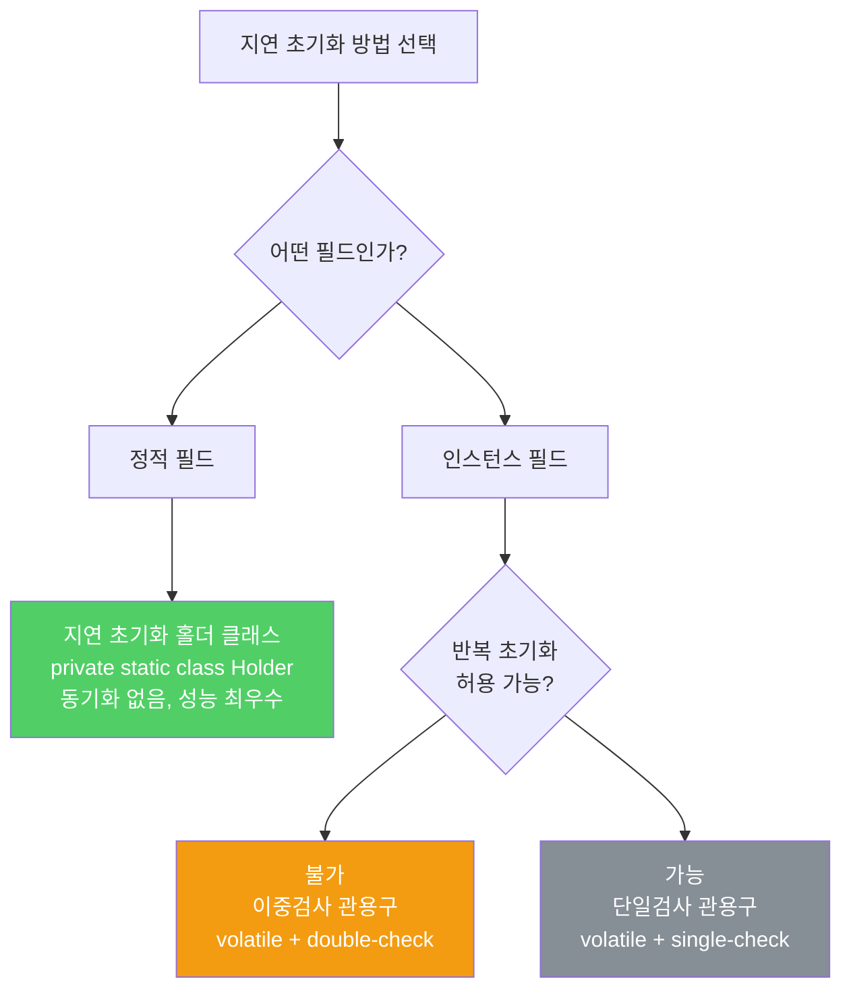

지연 초기화는 생성 비용을 줄여주지만 접근 비용을 높입니다. 멀티스레드 환경에서 잘못 사용하면 심각한 버그가 생깁니다. 대부분의 경우 즉시 초기화가 낫습니다.

---

## 1. 지연 초기화란, 그리고 언제 쓰는가

비유하자면 **손님이 주문할 때만 음식을 만드는 주문 제작 방식**입니다. 미리 만들어두면 낭비가 생길 수 있지만, 주문마다 만드는 과정도 시간이 걸립니다. 대부분의 손님이 주문하는 인기 메뉴라면 미리 준비하는 것이 더 빠릅니다.

지연 초기화가 실제로 도움이 되는 경우는 하나뿐입니다. 해당 필드를 사용하는 인스턴스 비율이 낮고, 그 필드를 초기화하는 비용이 클 때입니다. 성능을 측정해 확인하기 전까지는 지연 초기화를 쓰지 마세요.

---

## 2. 기본 방법 — 즉시 초기화

비유하자면 **아파트 입주 전에 인테리어를 모두 완성해 두는 것**입니다. 입주 후 추가 공사 없이 바로 쓸 수 있습니다.

```java
// 가장 단순하고 안전한 방법 — final로 즉시 초기화
private final FieldType field = computeFieldValue();
```

특별한 이유가 없다면 항상 이 방법을 사용하세요.

---

## 3. synchronized 접근자 방식 — 순환 의존 해결용

비유하자면 **처음 방에 들어갈 때만 자물쇠를 여는 절차를 밟는 것**입니다. 이후에는 절차 없이 자유롭게 드나들 수 있으면 더 좋겠지만, 이 방식은 매번 절차를 밟아야 합니다.

```java
// synchronized 접근자 — 초기화 순환성 해결에 사용
private FieldType field;

private synchronized FieldType getField() {
    if (field == null) {
        field = computeFieldValue();
    }
    return field;
}
```

매번 동기화 비용이 발생하므로 성능이 중요하다면 다른 방법을 고려해야 합니다.

---

## 4. 지연 초기화 홀더 클래스 — 정적 필드 지연 초기화

비유하자면 **별도 창고에 물건을 보관하다가, 누군가 처음 요청할 때 창고 문이 열리는 구조**입니다. 창고 자체는 요청 전까지 존재조차 하지 않습니다.

JVM은 클래스를 처음 사용할 때만 초기화합니다. 이 특성을 활용해 동기화 없이도 안전한 지연 초기화가 가능합니다.

```java
// 정적 필드용 지연 초기화 홀더 클래스 관용구
private static class FieldHolder {
    static final FieldType field = computeFieldValue();
    // FieldHolder 클래스가 처음 로드될 때 딱 한 번만 초기화됨
}

private static FieldType getField() {
    return FieldHolder.field;  // 동기화 없음, 성능 손실 없음
}
```

`getField()`가 처음 호출될 때 `FieldHolder` 클래스가 초기화되면서 `field`가 계산됩니다. 이후 호출에서는 JVM이 동기화 코드를 완전히 제거해 성능 손실이 없습니다. 정적 필드 지연 초기화에는 이 방법이 최선입니다.

---

## 5. 이중검사 관용구 — 인스턴스 필드 지연 초기화

비유하자면 **방에 불이 켜져 있는지 먼저 창문으로 확인하고, 확실하지 않을 때만 문을 열어 확인하는 것**입니다. 대부분의 경우(이미 초기화된 경우) 빠른 경로로 처리합니다.

```java
// 인스턴스 필드 지연 초기화용 이중검사 관용구
private volatile FieldType field;  // volatile 필수

private FieldType getField() {
    FieldType result = field;  // 지역 변수로 한 번만 읽기 (성능 최적화)

    if (result != null) {        // 첫 번째 검사 — 락 없음 (대부분 여기서 반환)
        return result;
    }

    synchronized (this) {
        if (field == null) {     // 두 번째 검사 — 락 사용 (경쟁 조건 방지)
            field = computeFieldValue();
        }
        return field;
    }
}
```

`field`를 `volatile`로 선언해야 하는 이유는 두 번째 검사 이후 동기화 없이 읽기 때문입니다. `volatile` 없이는 다른 스레드가 완전히 초기화되지 않은 객체를 볼 수 있습니다.

지역 변수 `result`는 이미 초기화된 경우 `volatile` 필드를 단 한 번만 읽도록 보장해 성능을 높입니다.



---

## 6. 단일검사 관용구 — 반복 초기화가 허용되는 경우

비유하자면 **여러 직원이 같은 보고서를 중복 작성해도 괜찮은 경우**입니다. 중복 작업이 낭비이기는 하지만 결과가 잘못되지는 않습니다.

```java
// 단일검사 관용구 — 초기화가 두 번 이상 일어날 수 있음
private volatile FieldType field;

private FieldType getField() {
    FieldType result = field;
    if (result == null) {
        field = result = computeFieldValue();  // 중복 초기화 가능성 있음
    }
    return result;
}
```

---

## 7. 요약

> 대부분의 필드는 즉시 초기화하세요. 성능 문제가 확인되거나 초기화 순환 의존을 깨야 할 때만 지연 초기화를 사용하세요. 정적 필드는 지연 초기화 홀더 클래스 관용구를, 인스턴스 필드는 `volatile`과 이중검사 관용구를 사용하세요.

---

> 참조: 이펙티브 자바 3/E — 조슈아 블로크
