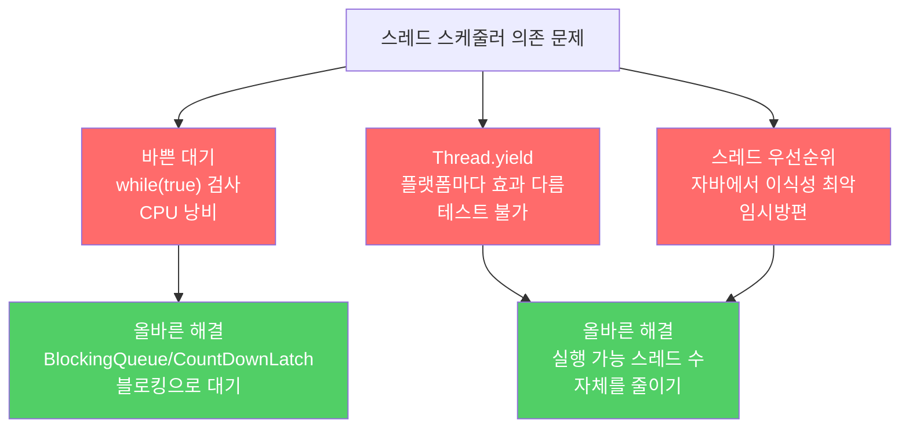

스케줄러가 스레드를 언제, 얼마나 오래 실행할지는 운영체제마다 다릅니다. 스케줄러의 정책에 의존하는 프로그램은 이식성이 없고, 성능도 보장할 수 없습니다.

---

## 1. 스레드 수를 프로세서 수에 맞춰라

비유하자면 **음식점에서 직원 수를 테이블 수에 맞추는 것**입니다. 직원이 너무 많으면 서로 자리를 차지하려 경쟁하고, 스케줄러가 누구를 먼저 배치할지 고민합니다. 테이블 수에 맞는 적절한 인원이면 스케줄러가 고민할 거리가 없습니다.

실행 준비된 스레드 수를 프로세서 수보다 지나치게 많아지지 않게 유지하면, 스케줄링 정책이 달라도 동작이 거의 같습니다. 대기 중인 스레드(블로킹된 상태)는 실행 가능한 스레드가 아니므로 수에 포함되지 않습니다.

실행자 프레임워크를 사용한다면 스레드 풀 크기를 적절히 설정하고 태스크는 짧게 유지하세요. 단, 너무 짧으면 태스크 분배 오버헤드가 오히려 성능을 낮춥니다.

---

## 2. 바쁜 대기(busy waiting)는 절대 금지

비유하자면 **버스가 올 때까지 매 초마다 창밖을 내다보는 것**입니다. 창밖을 아무리 자주 봐도 버스가 더 빨리 오지는 않고, 자신이 할 수 있는 다른 일을 못 하게 됩니다.

```java
// 끔찍한 바쁜 대기 — 절대 사용하지 말 것
public class SlowCountDownLatch {
    private int count;

    public void await() {
        while (true) {
            synchronized (this) {
                if (count == 0) {
                    return;
                }
                // count가 0이 될 때까지 CPU를 점유하며 반복 — 다른 작업 기회 박탈
            }
        }
    }

    public synchronized void countDown() {
        if (count != 0) count--;
    }
}
```

이 방식은 CPU를 낭비하고 다른 유용한 작업이 실행될 기회를 빼앗습니다. `java.util.concurrent.CountDownLatch`를 사용하면 스레드가 조건이 충족될 때까지 블로킹 상태로 대기해 CPU를 낭비하지 않습니다.

---

## 3. Thread.yield와 스레드 우선순위에 의존하지 말라

비유하자면 **교통 체증을 해결하려고 신호등 색을 바꾸는 것**입니다. 근본 원인(도로 설계)을 고치지 않은 채 신호 타이밍만 조작하면, 이 교차로는 나아지지만 다른 교차로가 막힙니다.

```java
// Thread.yield — 플랫폼마다 효과가 다름. 사용하지 말 것
Thread.yield();

// 스레드 우선순위 — 자바에서 이식성이 가장 나쁜 특성 중 하나
Thread.currentThread().setPriority(Thread.MAX_PRIORITY);
```

`Thread.yield`는 한 JVM에서 성능을 높여줘도 다른 JVM에서는 아무 효과가 없거나 오히려 느려집니다. 테스트할 수단도 없습니다. 스레드 우선순위도 마찬가지입니다.

응답 불가 문제를 `yield`나 우선순위로 해결하려 하면 원인을 가리기만 하고 같은 문제가 반복됩니다. 동시에 실행 가능한 스레드 수가 적어지도록 프로그램 구조 자체를 바꾸는 것이 올바른 해결책입니다.



---

## 4. 요약

> 프로그램의 정확성이나 성능을 스레드 스케줄러에 기대지 마세요. 실행 가능한 스레드 수를 프로세서 수에 가깝게 유지하고, 스레드가 할 일이 없을 때는 블로킹 상태로 대기하게 하세요. `Thread.yield`와 스레드 우선순위는 이식성이 없고 근본 문제를 가릴 뿐입니다.

---

> 참조: 이펙티브 자바 3/E — 조슈아 블로크
