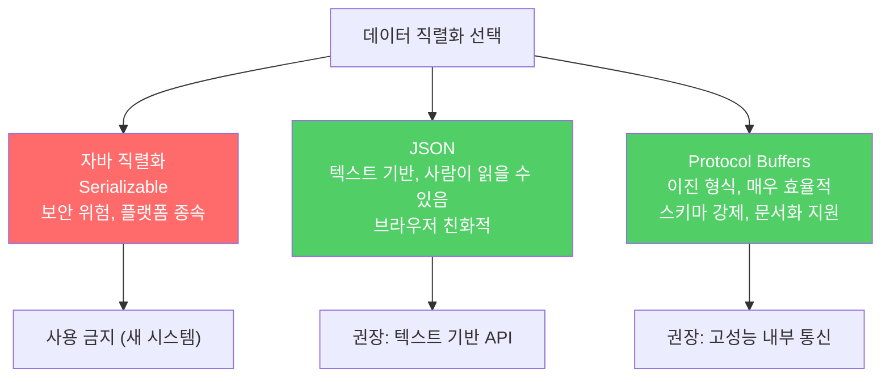

자바 직렬화는 공격 범위가 너무 넓어 방어하기 어렵습니다. 새 시스템에서는 JSON이나 프로토콜 버퍼 같은 크로스-플랫폼 대안을 사용하세요.

---

## 1. 직렬화의 근본적인 위험

비유하자면 **낯선 사람이 보낸 소포를 열었을 때 내용물이 무엇이든 자동으로 실행되는 것**입니다. 소포 발신자가 무슨 코드를 심었든 수신자의 시스템에서 그대로 실행됩니다.

`ObjectInputStream.readObject()`는 클래스패스에 있는 거의 모든 타입의 객체를 만들 수 있는 마법 같은 생성자입니다. 바이트 스트림을 역직렬화하는 과정에서 해당 타입들의 모든 코드를 수행할 수 있습니다.

```java
// 위험: 신뢰할 수 없는 바이트 스트림을 역직렬화
ObjectInputStream ois = new ObjectInputStream(untrustedInputStream);
Object obj = ois.readObject();  // 클래스패스의 어떤 코드든 실행될 수 있음
```

표준 라이브러리, 아파치 커먼즈 컬렉션 같은 서드파티 라이브러리, 심지어 자신의 클래스까지 모두 공격 범위에 포함됩니다. 2016년 샌프란시스코 시영 교통국 랜섬웨어 공격이 바로 이런 가젯 체인을 악용한 사례입니다.

---

## 2. 역직렬화 폭탄

비유하자면 **작은 파일 하나가 서버를 영원히 멈추게 만드는 것**입니다. 파일 크기는 수 킬로바이트에 불과하지만 처리 시간은 사실상 무한합니다.

```java
// 역직렬화 폭탄 — 5KB짜리 스트림이지만 역직렬화는 영원히 끝나지 않음
static byte[] bomb() {
    Set<Object> root = new HashSet<>();
    Set<Object> s1 = root;
    Set<Object> s2 = new HashSet<>();

    for (int i = 0; i < 100; i++) {
        Set<Object> t1 = new HashSet<>();
        Set<Object> t2 = new HashSet<>();
        t1.add("foo");
        s1.add(t1); s1.add(t2);
        s2.add(t1); s2.add(t2);
        s1 = t1;
        s2 = t2;
    }
    return serialize(root);
}
```

루트 `HashSet`의 역직렬화가 재귀적으로 원소의 해시코드를 계산하는데, 깊이 100단계로 중첩된 구조라 `hashCode`를 2^100번 이상 호출해야 합니다. 5,744바이트짜리 스트림이지만 처리가 사실상 불가능합니다.

---

## 3. 가장 좋은 해결책 — 직렬화를 쓰지 않기

비유하자면 **독이 든 음식을 해독제로 먹으려 하는 대신 처음부터 먹지 않는 것**입니다.

새로 작성하는 시스템에서는 자바 직렬화를 쓸 이유가 없습니다. 크로스-플랫폼 구조화 데이터 표현을 사용하세요.



JSON과 프로토콜 버퍼의 차이는 명확합니다. JSON은 텍스트 기반이라 사람이 읽을 수 있고 브라우저 친화적입니다. 프로토콜 버퍼는 이진 표현이라 효율이 훨씬 높고, 스키마로 데이터 구조를 강제하며 문서화도 제공합니다.

---

## 4. 레거시 코드에서 직렬화를 피할 수 없다면

비유하자면 **낡은 배관을 당장 교체할 수 없다면 물을 마시기 전 반드시 필터를 거치는 것**입니다.

신뢰할 수 없는 데이터는 절대 역직렬화하지 마세요. 역직렬화가 불가피하다면 `java.io.ObjectInputFilter`를 사용해 허용할 클래스를 화이트리스트로 제한하세요.

```java
// ObjectInputFilter로 역직렬화 범위 제한
ObjectInputFilter filter = ObjectInputFilter.Config.createFilter(
    "com.example.SafeClass;!*"  // SafeClass만 허용, 나머지 거부
);
ObjectInputStream ois = new ObjectInputStream(inputStream);
ois.setObjectInputFilter(filter);
```

블랙리스트 방식보다 화이트리스트 방식을 사용하세요. 블랙리스트는 알려진 위험만 막을 수 있지만, 화이트리스트는 알려지지 않은 공격도 차단합니다.

---

## 5. 요약

> 직렬화는 위험합니다. 새 시스템에는 JSON이나 프로토콜 버퍼 같은 크로스-플랫폼 대안을 사용하세요. 신뢰할 수 없는 데이터는 절대 역직렬화하지 마세요. 레거시 코드에서 역직렬화가 불가피하다면 `ObjectInputFilter`로 화이트리스트를 적용하세요.

---

> 참조: 이펙티브 자바 3/E — 조슈아 블로크
