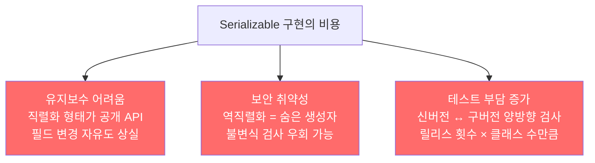

`Serializable`을 구현한다고 선언하기는 쉽지만, 그 대가는 클래스 전체 생애에 걸쳐 지속됩니다. 릴리스 이후 수정이 어려워지고, 버그와 보안 구멍이 생기며, 테스트 부담이 늘어납니다.

---

## 1. 직렬화 형태는 공개 API가 된다

비유하자면 **건물 내부 배관 구조가 공개 설계도에 포함되는 것**입니다. 한번 공개된 배관 구조는 마음대로 바꿀 수 없습니다. 입주자들이 이미 그 구조에 맞춰 자신의 설비를 연결했기 때문입니다.

`Serializable`을 구현하면 직렬화된 바이트 스트림 형태가 하나의 공개 API가 됩니다. `private`과 `package-private` 필드까지 API로 노출되어 캡슐화가 깨집니다.

```java
// Serializable 구현 → private 필드가 직렬화 형태로 외부에 노출됨
public class User implements Serializable {
    private String name;    // 직렬화 형태에 포함 → 사실상 공개 API
    private int age;        // 이름이나 타입을 바꾸면 역직렬화 호환성 깨짐
}
```

나중에 필드를 수정하면 기존 직렬화 형태와 달라져, 구버전으로 직렬화한 데이터를 신버전으로 역직렬화할 때 `InvalidClassException`이 발생합니다.

---

## 2. serialVersionUID — 자동 생성의 함정

비유하자면 **클래스 전체 내용의 지문을 자동으로 생성하는 것**입니다. 편의 메서드 하나만 추가해도 지문이 바뀌고, 이전 지문으로 만든 객체는 새 지문과 맞지 않아 거부됩니다.

```java
// serialVersionUID를 명시하지 않으면 컴파일러가 자동 생성
// 클래스 멤버가 조금만 바뀌어도 값이 달라져 InvalidClassException 발생
public class Order implements Serializable {
    // private static final long serialVersionUID = 1L;  // 명시해야 안전
    private String item;
    private int quantity;
}
```

직렬화 가능 클래스를 만든다면 `serialVersionUID`를 반드시 명시적으로 선언하세요. 자동 생성 값에 의존하면 메서드 하나 추가하는 것만으로도 호환성이 깨집니다.

---

## 3. Serializable의 세 가지 비용

비유하자면 **집을 임대할 때 서명하는 장기 계약서**입니다. 서명은 1분이지만 그 의무는 몇 년간 지속됩니다.



역직렬화는 일반 생성자의 모든 보호 장치를 우회하는 숨은 생성자입니다. 생성자에서 검증하는 불변식이 역직렬화 시에는 자동으로 검증되지 않습니다.

---

## 4. Serializable을 구현하면 안 되는 경우

비유하자면 **설명서가 없는 가전제품을 대여하는 것**입니다. 사용자가 잘못 쓸 가능성이 높고, 문제가 생겨도 누구 책임인지 불분명합니다.

상속용으로 설계된 클래스와 인터페이스는 대부분 `Serializable`을 구현하면 안 됩니다. 그 클래스를 확장하거나 구현하는 모든 하위 클래스/구현체에 직렬화 부담이 전가됩니다.

내부 클래스도 `Serializable`을 구현하면 안 됩니다. 컴파일러가 자동으로 추가하는 바깥 인스턴스 참조 필드와 지역변수 값들로 인해 기본 직렬화 형태가 불분명하기 때문입니다.

```java
// 내부 클래스 — Serializable 구현 금지
public class Outer {
    class Inner implements Serializable {  // 컴파일러 생성 필드 포함, 직렬화 형태 불명확
        // ...
    }

    static class StaticNested implements Serializable {  // 정적 멤버 클래스는 괜찮음
        // ...
    }
}
```

`Serializable`을 구현해도 되는 경우는 값 클래스(`BigInteger`, `Instant`)나 컬렉션처럼 전송/저장이 핵심 기능인 클래스입니다. 스레드 풀처럼 동작을 표현하는 클래스는 구현하지 않는 것이 원칙입니다.

---

## 5. 요약

> `Serializable` 구현은 선언하기 쉽지만 비용이 큽니다. 직렬화 형태가 공개 API가 되어 내부 구현을 자유롭게 바꿀 수 없고, 역직렬화는 불변식을 우회하는 숨은 생성자입니다. 상속용 클래스와 인터페이스, 내부 클래스는 `Serializable`을 구현하지 마세요. 꼭 구현해야 한다면 `serialVersionUID`를 명시하고 고품질의 직렬화 형태를 함께 설계하세요.

---

> 참조: 이펙티브 자바 3/E — 조슈아 블로크
