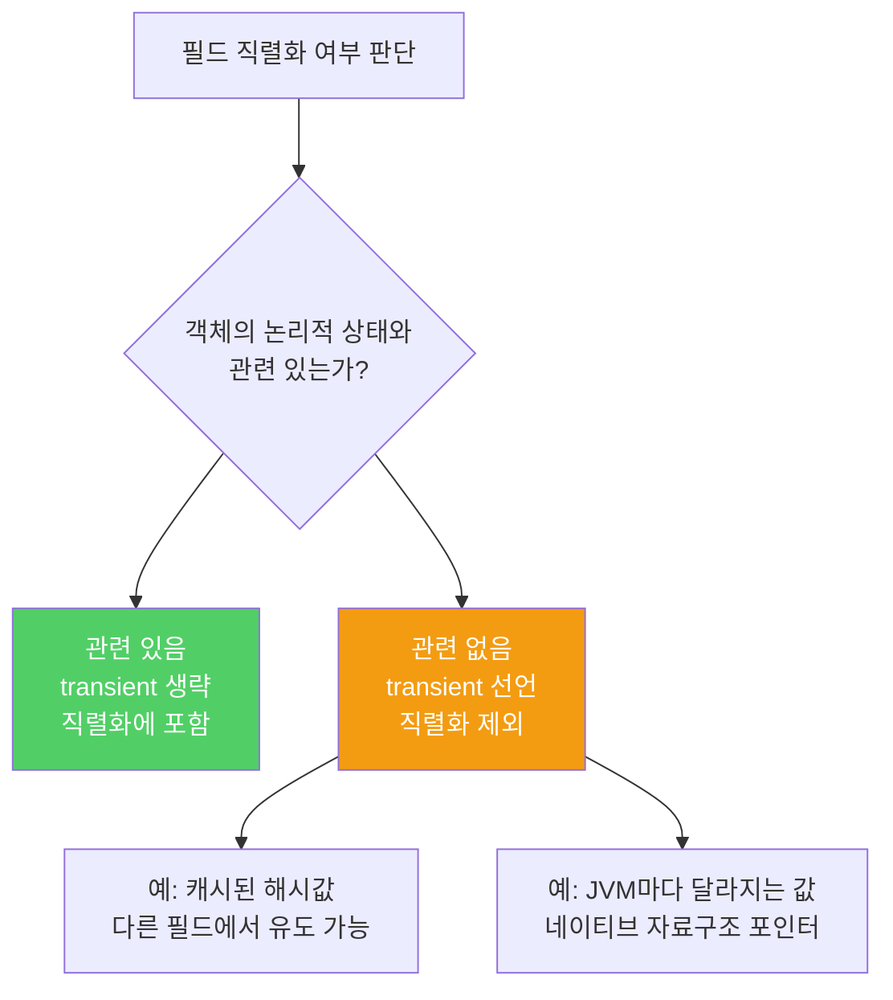

기본 직렬화 형태는 편리하지만, 클래스의 물리적 표현을 API로 고정시킵니다. 논리적 내용과 물리적 표현이 다르다면 반드시 커스텀 직렬화 형태를 설계해야 합니다.

---

## 1. 기본 직렬화가 적합한 경우

비유하자면 **사람의 이름을 성/이름/중간이름으로 저장하는 것**입니다. 논리적 구성(이름 세 부분)과 물리적 표현(세 개의 String 필드)이 일치하므로 기본 직렬화로 충분합니다.

```java
// 기본 직렬화가 적합한 클래스 — 논리적 표현 = 물리적 표현
public class Name implements Serializable {
    /**
     * 성. null이 아니어야 함.
     * @serial
     */
    private final String lastName;

    /**
     * 이름. null이 아니어야 함.
     * @serial
     */
    private final String firstName;

    /**
     * 중간이름. 중간이름이 없다면 null.
     * @serial
     */
    private final String middleName;
}
```

`private` 필드라도 직렬화 형태에 포함되는 공개 API이므로 `@serial` 태그로 문서화해야 합니다.

---

## 2. 기본 직렬화가 부적합한 경우

비유하자면 **문자열 목록을 저장하는데 내부 구현인 이중 연결 리스트의 포인터까지 모두 저장하는 것**입니다. 논리적으로는 "문자열 순서 있는 목록"이지만 물리적으로는 "노드 + 앞뒤 포인터"까지 모두 기록합니다.

```java
// 기본 직렬화가 부적합 — 논리적 표현(문자열 목록)과 물리적 표현(이중 연결 리스트) 다름
public final class StringList implements Serializable {
    private int size = 0;
    private Entry head = null;

    private static class Entry implements Serializable {
        String data;
        Entry next;      // 물리적 포인터 — 직렬화 형태에 포함될 이유 없음
        Entry previous;  // 물리적 포인터 — 직렬화 형태에 포함될 이유 없음
    }
}
```

기본 직렬화를 쓰면 네 가지 문제가 생깁니다.

- `Entry`(내부 구현)가 공개 API로 고정됩니다. 내부 구현을 바꿔도 역직렬화 호환성 때문에 연결 리스트 코드를 영원히 제거할 수 없습니다.
- 연결 정보까지 모두 기록해 직렬화 형태가 불필요하게 커집니다.
- 그래프를 재귀 순회하므로 시간이 오래 걸립니다.
- 객체 그래프 깊이가 깊으면 스택 오버플로가 발생합니다.

---

## 3. 커스텀 직렬화 형태 — 논리적 내용만 기록

비유하자면 **책의 목차를 저장할 때 책 제목과 쪽 번호만 기록하고 책의 바인딩 방식은 기록하지 않는 것**입니다.

```java
// 합리적인 커스텀 직렬화 형태 — 문자열 개수와 문자열만 기록
public final class StringList implements Serializable {
    private transient int size = 0;    // 직렬화 제외
    private transient Entry head = null; // 직렬화 제외

    private static class Entry {  // Serializable 제거
        String data;
        Entry next;
        Entry previous;
    }

    /**
     * @serialData 리스트 크기(int), 이어서 모든 원소(String)를 순서대로 기록
     */
    private void writeObject(ObjectOutputStream s) throws IOException {
        s.defaultWriteObject();  // 모든 필드가 transient여도 호출 필수
        s.writeInt(size);
        for (Entry e = head; e != null; e = e.next) {
            s.writeObject(e.data);
        }
    }

    private void readObject(ObjectInputStream s)
            throws IOException, ClassNotFoundException {
        s.defaultReadObject();  // 모든 필드가 transient여도 호출 필수
        int numElements = s.readInt();
        for (int i = 0; i < numElements; i++) {
            add((String) s.readObject());
        }
    }
}
```

`defaultWriteObject`와 `defaultReadObject`는 모든 필드가 `transient`라도 반드시 호출해야 합니다. 향후 릴리스에서 `transient`가 아닌 필드가 추가됐을 때 상위/하위 버전 간 호환성을 유지하기 위해서입니다.

이 커스텀 직렬화 형태는 기본 형태 대비 공간을 절반으로 줄이고, 스택 오버플로 위험도 없앱니다.

---

## 4. transient 사용 원칙

비유하자면 **이사할 때 가구는 가져가고 임시 포장재는 버리는 것**입니다. 논리적 상태(가구)는 직렬화하고, 물리적 세부사항(임시 구조)은 제외합니다.



기본 직렬화를 사용할 때 `transient` 필드는 역직렬화 시 기본값(참조 타입 `null`, 숫자 `0`, boolean `false`)으로 초기화됩니다. 기본값이 불적절하다면 `readObject`에서 복원하세요.

---

## 5. serialVersionUID와 동기화

직렬화 가능 클래스에는 `serialVersionUID`를 반드시 명시적으로 선언하세요.

```java
private static final long serialVersionUID = 1L;  // 임의의 long 값
```

자동 생성값에 의존하면 메서드 하나 추가만으로도 `InvalidClassException`이 발생합니다. 스레드 안전한 클래스에서 직렬화를 사용한다면 `writeObject`도 `synchronized`로 선언하세요.

---

## 6. 요약

> 클래스를 직렬화한다면 직렬화 형태를 신중히 설계하세요. 논리적 표현과 물리적 표현이 일치할 때만 기본 직렬화를 사용하고, 다르다면 커스텀 직렬화 형태를 고안하세요. 논리적 상태와 무관한 필드는 `transient`로 선언하고, `serialVersionUID`는 항상 명시적으로 선언하세요.

---

> 참조: 이펙티브 자바 3/E — 조슈아 블로크
