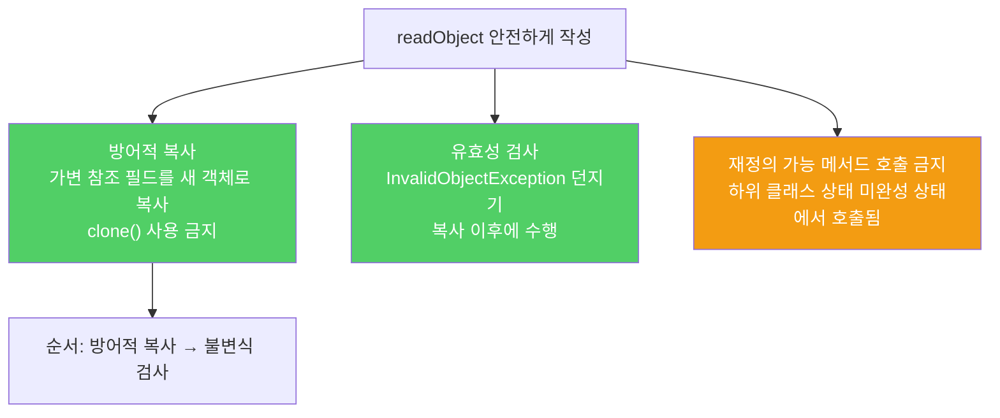

`readObject`는 바이트 스트림을 매개변수로 받는 또 하나의 생성자입니다. 생성자처럼 유효성 검사와 방어적 복사를 반드시 수행해야 합니다.

---

## 1. readObject가 숨은 생성자인 이유

비유하자면 **은행 창구가 아닌 비밀 통로로 계좌를 만드는 것**입니다. 정상 창구(생성자)에서는 신분증 확인과 서류 검토가 있지만, 비밀 통로(readObject)로 들어오면 이 절차를 건너뛸 수 있습니다.

`Period` 클래스는 생성자에서 "시작 시각 ≤ 종료 시각" 불변식을 검사합니다. 그러나 `implements Serializable`만 추가하고 `readObject`를 구현하지 않으면, 공격자가 조작한 바이트 스트림으로 불변식을 위반하는 객체를 만들 수 있습니다.

```java
// 불변 클래스 — 생성자는 불변식을 검사하지만 readObject는 검사하지 않음
public final class Period {
    private final Date start;
    private final Date end;

    public Period(Date start, Date end) {
        this.start = new Date(start.getTime());
        this.end   = new Date(end.getTime());
        if (this.start.compareTo(this.end) > 0)
            throw new IllegalArgumentException(start + "가 " + end + "보다 늦다.");
    }
}
// implements Serializable만 추가하면 → 조작된 바이트 스트림으로 종료 < 시작인 객체 생성 가능
```

---

## 2. 해결책 1 — 유효성 검사 추가

비유하자면 **비밀 통로에도 신분증 확인 절차를 설치하는 것**입니다.

```java
private void readObject(ObjectInputStream s)
        throws IOException, ClassNotFoundException {
    s.defaultReadObject();

    // 불변식 검사 — 생성자와 동일한 검증
    if (start.compareTo(end) > 0)
        throw new InvalidObjectException(start + "가 " + end + "보다 늦다.");
}
```

하지만 이것만으로는 충분하지 않습니다. 공격자가 바이트 스트림 끝에 `private Date` 필드로의 참조를 추가하면, 역직렬화 후에도 그 참조를 통해 내부 `Date` 객체를 수정할 수 있습니다.

---

## 3. 가변 공격 — 내부 객체 참조 탈취

비유하자면 **잠긴 금고 안의 물건을 복사하는 게 아니라, 금고 안으로 통하는 비밀 열쇠를 만드는 것**입니다. 금고(Period) 자체는 정상적으로 생성됐지만, 내부 물건(Date 객체)을 외부에서 수정할 수 있는 참조가 생깁니다.

```java
// 공격: 스트림 끝에 내부 Date 필드 참조를 추가
ObjectOutputStream out = new ObjectOutputStream(bos);
out.writeObject(new Period(new Date(), new Date()));

byte[] ref = { 0x71, 0, 0x72, 0, 5 };
bos.write(ref);  // start 필드 참조 추가
ref[4] = 4;
bos.write(ref);  // end 필드 참조 추가

// 역직렬화 후 start, end의 실제 Date 객체 참조를 탈취
Period p     = (Period) in.readObject();
Date   start = (Date)   in.readObject();  // Period 내부의 start와 같은 객체!
Date   end   = (Date)   in.readObject();  // Period 내부의 end와 같은 객체!

end.setYear(78);  // Period 내부 값이 바뀜 — 불변식 위반
```

---

## 4. 해결책 2 — 방어적 복사 + 유효성 검사

비유하자면 **비밀 통로를 통해 들어온 물건을 신품으로 교체한 뒤 검사하는 것**입니다. 외부에서 참조를 갖고 있더라도 복사본으로 교체했으므로 영향을 받지 않습니다.

```java
private void readObject(ObjectInputStream s)
        throws IOException, ClassNotFoundException {
    s.defaultReadObject();

    // 방어적 복사 — 유효성 검사보다 반드시 먼저 수행
    start = new Date(start.getTime());
    end   = new Date(end.getTime());

    // 불변식 검사
    if (start.compareTo(end) > 0)
        throw new InvalidObjectException(start + "가 " + end + "보다 늦다.");
}
```

방어적 복사가 유효성 검사보다 먼저여야 하는 이유는, 복사 전에 검사하면 멀티스레드 환경에서 검사와 복사 사이에 값이 바뀔 수 있기 때문입니다. 또한 `Date.clone()`은 사용하지 않는데, 공격자가 `clone()`을 재정의한 악의적인 서브클래스일 수 있기 때문입니다.

`final` 필드는 방어적 복사가 불가능하므로, `start`와 `end`에서 `final`을 제거해야 합니다.



---

## 5. 커스텀 readObject가 필요한지 판단하는 방법

비유하자면 **"이 정보를 아무 검증 없이 직접 입력받아도 안전한가?"라고 스스로 묻는 것**입니다.

`transient` 필드를 제외한 모든 필드를 매개변수로 받아 유효성 검사 없이 필드에 대입하는 `public` 생성자를 추가해도 괜찮은가? 답이 아니오라면 커스텀 `readObject`가 필요합니다.

```java
// 이런 생성자를 추가해도 안전한가? → 아니오 → 커스텀 readObject 필요
public Period(Date start, Date end) {
    this.start = start;  // 복사 없음, 검증 없음
    this.end   = end;
}
```

---

## 6. 요약

> `readObject`는 공개 생성자와 같은 수준으로 작성해야 합니다. 어떤 바이트 스트림이 넘어오더라도 유효한 인스턴스를 만들어야 합니다. `private`인 가변 객체 참조 필드는 방어적으로 복사하고(복사 후 불변식 검사), 불변식을 위반하면 `InvalidObjectException`을 던지세요. 재정의 가능 메서드는 호출하지 마세요.

---

> 참조: 이펙티브 자바 3/E — 조슈아 블로크
