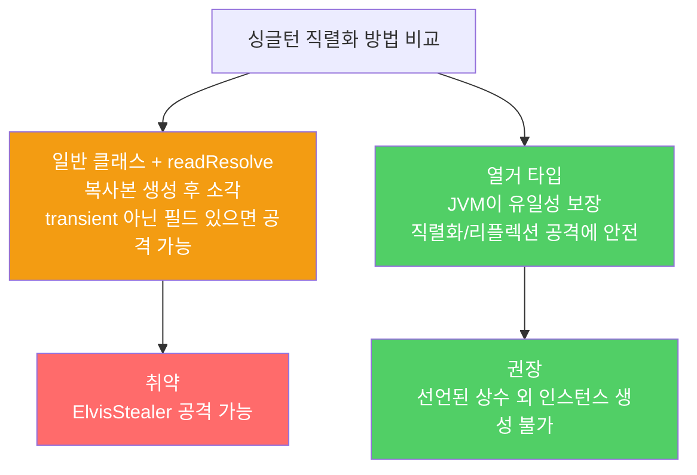

`Serializable`을 구현한 싱글턴은 역직렬화 시 새 인스턴스가 생겨 싱글턴 불변식이 깨집니다. `readResolve`로 막을 수 있지만 취약합니다. 열거 타입이 가장 안전한 해결책입니다.

---

## 1. Serializable을 구현하면 싱글턴이 깨진다

비유하자면 **"세상에 하나뿐인 도장"인데, 직렬화해서 보내면 받는 쪽에서 복제본이 생기는 것**입니다. 원본과 복제본, 두 개의 도장이 존재하게 됩니다.

```java
// 이 클래스에 implements Serializable을 추가하면 싱글턴이 아니게 됨
public class Elvis {
    public static final Elvis INSTANCE = new Elvis();
    private Elvis() { }
    public void leaveTheBuilding() { }
}
// 역직렬화할 때마다 새 Elvis 인스턴스 생성 → INSTANCE와 다른 객체
```

---

## 2. readResolve — 임시방편이지만 취약

비유하자면 **복제본이 생겼을 때 즉시 소각하는 것**입니다. 복제본이 생기는 것은 막지 못하지만, 최종적으로 원본만 반환합니다.

```java
// readResolve로 싱글턴 유지 — 하지만 완전하지 않음
public class Elvis implements Serializable {
    public static final Elvis INSTANCE = new Elvis();
    private Elvis() { }

    private Object readResolve() {
        return INSTANCE;  // 역직렬화된 새 객체 무시, 진짜 INSTANCE 반환
    }
}
```

`readResolve`가 동작하려면 객체 참조 타입의 인스턴스 필드가 모두 `transient`여야 합니다. 그렇지 않으면 아래와 같은 공격이 가능합니다.

---

## 3. readResolve의 취약점 — 도둑 클래스 공격

비유하자면 **소각장에 도달하기 전에 복제본의 지문을 채취하는 것**입니다. `readResolve`가 호출되기 전에 역직렬화된 인스턴스의 참조를 훔칩니다.

```java
// 잘못된 싱글턴 — transient가 아닌 참조 필드 존재
public class Elvis implements Serializable {
    public static final Elvis INSTANCE = new Elvis();
    private Elvis() { }

    private String[] favoriteSongs = {"Hound Dog", "Heartbreak Hotel"};
    // transient 없음 → 공격 가능

    private Object readResolve() {
        return INSTANCE;
    }
}

// 도둑 클래스 — readResolve 실행 전 Elvis 인스턴스 참조를 탈취
public class ElvisStealer implements Serializable {
    static Elvis impersonator;
    private Elvis payload;

    private Object readResolve() {
        impersonator = payload;  // readResolve 전의 Elvis 참조 저장
        return new String[]{"A Fool Such as I"};
    }
}
```

공격자가 조작한 바이트 스트림으로 역직렬화하면 `Elvis.INSTANCE`와 다른 두 번째 `Elvis` 인스턴스를 얻을 수 있습니다. 싱글턴 불변식이 깨집니다.

---

## 4. 올바른 해결책 — 열거 타입 싱글턴

비유하자면 **"세상에 하나뿐인 도장"을 법률로 명시해 복제 자체를 불법으로 만드는 것**입니다. JVM이 열거 타입 상수의 유일성을 언어 수준에서 보장합니다.

```java
// 열거 타입 싱글턴 — 직렬화, 리플렉션 공격에도 안전
public enum Elvis {
    INSTANCE;

    private String[] favoriteSongs = {"Hound Dog", "Heartbreak Hotel"};

    public void printFavorites() {
        System.out.println(Arrays.toString(favoriteSongs));
    }
}
```

열거 타입은 자바가 직렬화와 역직렬화를 특별하게 처리해 선언된 상수 외의 인스턴스가 생기지 않도록 보장합니다. `readResolve` 없이도 안전합니다.



---

## 5. readResolve가 여전히 필요한 경우

비유하자면 **아직 목록이 확정되지 않은 경우**입니다. 컴파일 타임에 어떤 인스턴스들이 있는지 알 수 없을 때는 열거 타입을 쓸 수 없습니다.

이런 경우 `readResolve`를 쓰되 모든 참조 타입 인스턴스 필드를 `transient`로 선언해야 합니다. `readResolve` 메서드의 접근 수준도 주의해야 합니다. `final` 클래스는 `private`, 상속 가능 클래스는 접근 수준을 신중히 결정하세요.

---

## 6. 요약

> 인스턴스 수를 통제해야 하는 직렬화 가능 클래스는 열거 타입으로 작성하세요. 열거 타입은 JVM이 유일성을 보장해 `readResolve` 없이도 안전합니다. 열거 타입을 쓸 수 없는 상황이라면 `readResolve`를 구현하고 모든 참조 타입 필드를 `transient`로 선언하세요.

---

> 참조: 이펙티브 자바 3/E — 조슈아 블로크
