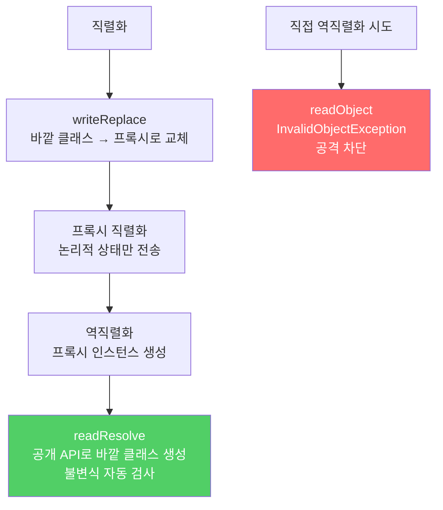

직렬화 프록시 패턴은 역직렬화를 공개 API를 통한 정상적인 객체 생성과 동일하게 만들어, 불변식 위반과 내부 참조 탈취 공격을 근본적으로 차단합니다.

---

## 1. 직렬화 프록시 패턴이란

비유하자면 **통관 절차**입니다. 짐을 직접 반입하는 대신 공식 통관 창구(프록시)를 거치게 합니다. 창구에서는 신고 내용만 기록하고, 반출 시 신고 내용을 바탕으로 정품을 새로 준비합니다. 조작된 짐이 들어올 방법이 없습니다.

패턴의 구조는 세 단계입니다.

1. 바깥 클래스의 논리적 상태를 표현하는 `private static` 중첩 클래스(직렬화 프록시)를 만들고 `Serializable`을 구현합니다.
2. 바깥 클래스에 `writeReplace`를 추가해 직렬화 시 프록시로 대체합니다.
3. 프록시에 `readResolve`를 추가해 역직렬화 시 바깥 클래스 인스턴스를 생성합니다.

---

## 2. Period 클래스에 적용하는 예

비유하자면 **계약서를 공증하는 과정**입니다. 원본 문서 대신 공증된 사본을 보내고, 받는 쪽에서는 공증 내용으로 새 원본을 생성합니다.

```java
public final class Period implements Serializable {
    private final Date start;
    private final Date end;

    public Period(Date start, Date end) {
        this.start = new Date(start.getTime());
        this.end   = new Date(end.getTime());
        if (this.start.compareTo(this.end) > 0)
            throw new IllegalArgumentException(start + "가 " + end + "보다 늦다.");
    }

    // Step 1: 직렬화 프록시 — 논리적 상태만 기록
    private static class SerializationProxy implements Serializable {
        private final Date start;
        private final Date end;

        SerializationProxy(Period p) {
            this.start = p.start;  // 단순 복사, 유효성 검사 불필요
            this.end   = p.end;
        }

        // Step 3: 역직렬화 시 공개 API로 바깥 클래스 인스턴스 생성
        private Object readResolve() {
            return new Period(start, end);  // 생성자의 불변식 검사가 자동 수행됨
        }

        private static final long serialVersionUID = 1L;
    }

    // Step 2: 직렬화 시 프록시로 대체
    private Object writeReplace() {
        return new SerializationProxy(this);
    }

    // 직접 역직렬화 시도를 차단 (공격 방어)
    private void readObject(ObjectInputStream stream) throws InvalidObjectException {
        throw new InvalidObjectException("프록시가 필요합니다");
    }
}
```

`readResolve`가 `new Period(start, end)`를 호출하므로 생성자의 불변식 검사가 자동으로 수행됩니다. `readObject`에서 별도의 유효성 검사나 방어적 복사를 작성할 필요가 없습니다.

---

## 3. 직렬화 프록시의 장점

비유하자면 **청사진으로 집을 짓는 것**입니다. 기존 집을 그대로 복사하는 대신, 청사진(프록시)을 전송하고 받는 쪽에서 청사진으로 새 집을 짓습니다. 새 집은 모든 건축 기준(불변식)을 자동으로 만족합니다.



item 88의 `readObject`에서 직접 방어적 복사를 하는 방식과 비교하면:
- `final` 필드를 제거하지 않아도 됩니다. 프록시 패턴은 `final` 필드를 그대로 유지할 수 있습니다.
- 가짜 바이트 스트림 공격과 내부 참조 탈취 공격을 모두 막습니다.
- 불변식 검사 코드의 중복이 없습니다.

---

## 4. 다른 구현체로 역직렬화 — EnumSet 사례

비유하자면 **보관 방식이 다른 창고로 옮겨 받는 것**입니다. 64개짜리 박스에서 보냈지만, 내용물이 65개 이상이 됐다면 큰 창고로 옮겨 받습니다.

`EnumSet`은 원소 수에 따라 `RegularEnumSet`(64개 이하) 또는 `JumboEnumSet`(65개 초과)을 반환합니다. 직렬화 프록시 패턴 덕분에 64개짜리로 직렬화했다가 5개를 추가한 뒤 역직렬화하면 자동으로 `JumboEnumSet`으로 생성됩니다. 직렬화된 인스턴스와 역직렬화된 인스턴스의 클래스가 달라도 정상 동작합니다.

---

## 5. 직렬화 프록시의 한계

비유하자면 **통관 창구가 일부 상황을 처리하지 못하는 것**입니다.

- 클라이언트가 확장할 수 있는 클래스에는 적용할 수 없습니다.
- 순환 참조가 있는 클래스에는 적용할 수 없습니다. `readResolve` 안에서 바깥 클래스 메서드를 호출하려 하면 아직 실제 객체가 완성되지 않았으므로 `ClassCastException`이 발생합니다.
- `readObject`에서 방어적 복사를 하는 방식보다 약 14% 느립니다.

---

## 6. 요약

> 제3자가 확장할 수 없는 직렬화 가능 클래스라면 직렬화 프록시 패턴을 사용하세요. `writeReplace`로 직렬화 시 프록시로 대체하고, 프록시의 `readResolve`에서 공개 생성자로 인스턴스를 생성하면 불변식 검사가 자동으로 수행됩니다. 이것이 불변식을 안정적으로 직렬화하는 가장 안전하고 간단한 방법입니다.

---

> 참조: 이펙티브 자바 3/E — 조슈아 블로크
